<div align="center">

# 🌍 Kansas Frontier Matrix — **Tabular Intake FAIR+CARE Logs**  
`data/work/staging/tabular/tmp/intake/logs/faircare/`

### *“Ethics, transparency, and equity — encoded in every dataset’s DNA.”*

**Purpose:**  
This directory stores **FAIR+CARE audit logs** generated during tabular dataset validation.  
Each record evaluates a dataset’s compliance with **FAIR (Findable, Accessible, Interoperable, Reusable)**  
and **CARE (Collective Benefit, Authority to Control, Responsibility, Ethics)** principles, ensuring ethical and open data stewardship.

[](../../../../../../../../docs/architecture/repo-focus.md)
[](../../../../../../../../LICENSE)
[]()
[]()
[]()

</div>

---

## 🧭 Overview

The **FAIR+CARE Logs** record the results of automated and manual audits designed to assess the openness, accessibility, and ethical standing of incoming tabular datasets.  
They ensure that all data entering the Kansas Frontier Matrix complies with **open science standards**, proper **licensing**, and **community governance ethics**.  

FAIR+CARE evaluations occur after schema validation and checksum verification but **before promotion to normalized datasets**, acting as the final ethical review step in the **Intake TMP Layer**.

---

## 🗂️ Directory Layout

```plaintext
data/work/staging/tabular/tmp/intake/logs/faircare/
├── faircare-audit-ks_hydro_1874.jsonl       # FAIR+CARE compliance log
├── faircare-audit-ks_population_1890.jsonl  # Example audit file
├── batch-faircare-2025-10-26.log            # Combined batch report
└── README.md                                # This document
````

---

## 🧱 Log Schema (JSONL Format)

Each FAIR+CARE audit log contains JSON Lines entries documenting compliance status across eight evaluation dimensions.

```json
{
  "timestamp": "2025-10-26T14:01:35Z",
  "dataset": "ks_hydro_1874",
  "validator": "fair-audit",
  "criteria": "FAIR:Findable",
  "metric": "Metadata completeness",
  "description": "Dataset includes complete descriptive metadata and identifiers.",
  "score": 1.0,
  "status": "passed",
  "reviewer": "@kfm-curation",
  "run_id": "faircare-2025-10-26-1401Z",
  "trace_id": "ac45b6f8-9a73-4f91-9250-81d52db7a0f4"
}
```

---

## 🌐 FAIR+CARE Criteria & Scoring

| Category | Principle            | Metric                         | Description                                                  | Weight | Pass Threshold |
| -------- | -------------------- | ------------------------------ | ------------------------------------------------------------ | ------ | -------------- |
| **FAIR** | Findable             | Metadata completeness          | Dataset includes unique ID, description, and keywords.       | 0.25   | ≥ 0.9          |
| **FAIR** | Accessible           | Open licensing & accessibility | Data is available under SPDX license and public link.        | 0.25   | ≥ 1.0          |
| **FAIR** | Interoperable        | Open formats                   | Uses non-proprietary file formats (CSV, JSON, GeoJSON).      | 0.25   | ≥ 0.95         |
| **FAIR** | Reusable             | Provenance and citation        | Source citation and checksum are documented.                 | 0.25   | ≥ 0.9          |
| **CARE** | Collective Benefit   | Ethical community value        | Data benefits relevant Kansas communities.                   | 0.25   | ≥ 0.8          |
| **CARE** | Authority to Control | Governance representation      | Data sources credited, Indigenous or local rights respected. | 0.25   | ≥ 0.9          |
| **CARE** | Responsibility       | Stewardship evidence           | Data managers and custodians clearly listed.                 | 0.25   | ≥ 0.9          |
| **CARE** | Ethics               | Ethical use and sensitivity    | No PII/PHI or culturally sensitive data exposed.             | 0.25   | ≥ 1.0          |

---

## 🧪 Example FAIR+CARE Log Entries

**File:** `faircare-audit-ks_hydro_1874.jsonl`

```json
{"timestamp":"2025-10-26T14:01:35Z","dataset":"ks_hydro_1874","criteria":"FAIR:Findable","metric":"Metadata completeness","score":1.0,"status":"passed"}
{"timestamp":"2025-10-26T14:01:36Z","dataset":"ks_hydro_1874","criteria":"FAIR:Accessible","metric":"License verification","score":1.0,"status":"passed"}
{"timestamp":"2025-10-26T14:01:37Z","dataset":"ks_hydro_1874","criteria":"CARE:Ethics","metric":"Sensitive data check","score":1.0,"status":"passed"}
```

---

## 🧩 FAIR+CARE Audit Workflow

```mermaid
flowchart TD
    A["📥 Intake Dataset\n(CSV + meta + license)"] --> B["🧾 Schema Validation"]
    B --> C["🔒 Checksum Verification"]
    C --> D["🌍 FAIR+CARE Compliance Audit"]
    D --> E["🏛 Governance Ledger Registration"]
```



---

## 🧮 Commands

```bash
# Run FAIR+CARE audit on all intake datasets
make fair-report

# Run audit for one dataset
make fair-report dataset=ks_hydro_1874

# View all audit scores
grep '"score"' logs/faircare/*.jsonl | jq '.score'

# Validate FAIR+CARE log schema
make validate-logs
```

---

## 🧯 Troubleshooting

| Issue                           | Cause                                  | Solution                                                |
| ------------------------------- | -------------------------------------- | ------------------------------------------------------- |
| **Low FAIR+CARE score**         | Missing license or provenance metadata | Update `.meta.json` and re-run `make fair-report`       |
| **License not SPDX-compliant**  | Non-standard license string            | Replace with SPDX code (`CC-BY-4.0`, `MIT`, `PDDL-1.0`) |
| **Ethical warning issued**      | Possible sensitive or restricted data  | Move dataset to `quarantine/` and alert curator         |
| **FAIR+CARE log not generated** | Pipeline skipped or failed             | Check `logs/etl/` and rerun FAIR+CARE module            |

---

## 🧾 Governance Ledger Integration

Every FAIR+CARE result is appended to the **Tabular Intake Provenance Ledger** (`governance/tabular_intake_ledger.jsonld`):

```json
{
  "dataset": "ks_hydro_1874",
  "faircare_log": "logs/faircare/faircare-audit-ks_hydro_1874.jsonl",
  "faircare_score": 1.0,
  "faircare_passed": true,
  "timestamp": "2025-10-26T14:02:11Z",
  "curator": "@kfm-curation"
}
```

---

## ☑️ FAIR+CARE Quality Checklist

* [x] SPDX license validated
* [x] Metadata complete and public
* [x] Data stored in open, non-proprietary format
* [x] Provenance and citation verified
* [x] CARE ethical guidelines observed
* [x] FAIR+CARE score ≥ 0.9
* [x] Log entry appended to Governance Ledger

---

## 🪶 Version History

| Version    | Date       | Author              | Notes                                                                                     |
| ---------- | ---------- | ------------------- | ----------------------------------------------------------------------------------------- |
| **v9.0.1** | 2025-10-26 | `@kfm-architecture` | Initial release — FAIR+CARE scoring criteria, schema, and governance integration defined. |

---

<div align="center">

### 🜂 Kansas Frontier Matrix — *Openness · Equity · Accountability*

**“Data that respects its origins serves its future.”**

[]()
[]()
[]()
[]()

[⬆ Back to Top](#-kansas-frontier-matrix--tabular-intake-faircare-logs)

</div>
```

