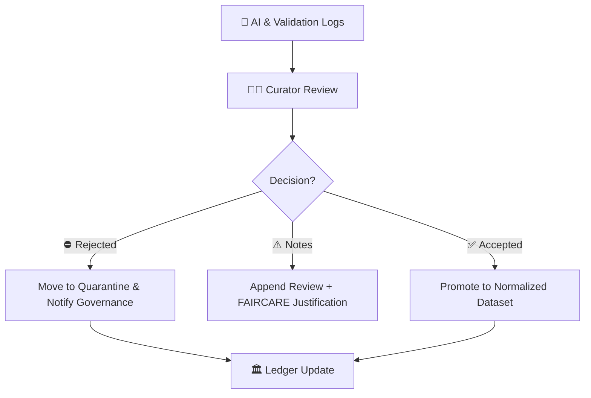

<div align="center">

# 🧑‍💼 Kansas Frontier Matrix — **Tabular Intake Review Logs**  
`data/work/staging/tabular/tmp/intake/logs/review/`

### *“Human judgment is the final checkpoint before truth enters the Matrix.”*

**Purpose:**  
The **Review Logs Directory** houses manual curation, verification, and approval records for tabular datasets during the **Intake TMP validation process**.  
Each entry documents human curator actions—review decisions, anomaly resolutions, FAIR+CARE sign-offs, and final dataset acceptance or rejection.

[](../../../../../../../../docs/architecture/repo-focus.md)
[](../../../../../../../../LICENSE)
[]()
[]()
[]()

</div>

---

## 🧭 Overview

**Review Logs** represent the human layer of accountability in the data intake pipeline.  
While automated validation and AI checks ensure precision and consistency, curator review ensures **contextual integrity, ethical soundness, and semantic accuracy**.

Every dataset promoted to the normalized layer must have a corresponding **signed-off review log** located here.

Review logs serve multiple purposes:
- Record human decisions on AI anomaly flags and FAIR+CARE compliance.  
- Document rationale for overrides or quarantines.  
- Provide timestamped, attributable signatures for governance and reproducibility.  
- Act as human-verifiable audit trails linked to provenance ledger entries.

---

## 🗂️ Directory Layout

```plaintext
data/work/staging/tabular/tmp/intake/logs/review/
├── review-ks_hydro_1874.log         # Curator decision log for dataset
├── review-ks_population_1890.log    # Example of another review log
├── batch-review-2025-10-26.log      # Combined daily curator session
└── README.md                        # This document
````

---

## 🧱 Log Format

Review logs are in **plaintext Markdown-style** for human readability, but can be parsed programmatically.
Each log captures curator identity, timestamp, decision, confidence, and supporting notes.

```text
───────────────────────────────────────────────
📄 Dataset: ks_hydro_1874
🕓 Reviewed: 2025-10-26T14:08:33Z
👤 Curator: @kfm-curation
🏷️ Role: Data Steward
📋 Review Type: Final Acceptance
───────────────────────────────────────────────
✅ Decision: ACCEPTED
🔍 AI Confidence: 0.94
🧮 FAIR+CARE Score: 1.00
🧾 Notes:
- Schema validation passed.
- No anomalies remain unresolved.
- Source license: CC-BY-4.0 verified.
- Metadata completeness confirmed.

📚 Linked Logs:
- `../ai/ai-anomalies-ks_hydro_1874.jsonl`
- `../validation/validate-ks_hydro_1874.jsonl`
- `../faircare/faircare-audit-ks_hydro_1874.jsonl`

🔐 Provenance Ledger Entry: `governance/tabular_intake_ledger.jsonld#ks_hydro_1874`
───────────────────────────────────────────────
```

---

## 🧩 Review Decision Codes

| Code                       | Meaning                  | Description                                                    |
| -------------------------- | ------------------------ | -------------------------------------------------------------- |
| ✅ **ACCEPTED**             | Fully validated dataset  | Meets schema, checksum, and FAIR+CARE requirements.            |
| ⚠️ **APPROVED-WITH-NOTES** | Minor issues noted       | Small inconsistencies documented but acceptable for promotion. |
| 🚧 **REVIEW-NEEDED**       | Pending curator check    | Flagged for secondary review before approval.                  |
| ⛔ **REJECTED**             | Failed or unethical data | Violates schema, licensing, or ethical standards.              |
| 🧯 **ROLLED-BACK**         | Reverted post-promotion  | Dataset removed from normalized layer due to discovered issue. |

---

## ⚙️ Review Workflow



---

## 🧮 Commands

```bash
# Create a new review log template for a dataset
make review-init dataset=ks_hydro_1874

# Record final approval (interactive)
make review-approve dataset=ks_hydro_1874 curator=@kfm-curation

# List all pending reviews
make review-status

# Archive all completed review logs
make archive-reviews
```

---

## 🧠 Review Guidelines

| Step | Action                                   | Responsible    | Tool                                   |
| ---- | ---------------------------------------- | -------------- | -------------------------------------- |
| 1️⃣  | Verify schema & checksum validation      | Data Engineer  | `make validate-tabular`                |
| 2️⃣  | Review AI anomaly and confidence metrics | Curator        | `logs/ai/ai-anomalies-*.jsonl`         |
| 3️⃣  | Confirm FAIR+CARE compliance             | Ethics Officer | `logs/faircare/faircare-audit-*.jsonl` |
| 4️⃣  | Record review decision and rationale     | Curator        | `make review-approve`                  |
| 5️⃣  | Append decision to governance ledger     | Automation     | Ledger sync job                        |

> 🧩 *All manual reviews must reference linked log files and be timestamped to ensure reproducibility.*

---

## 🧾 Governance Integration

Once signed and committed, review logs are appended to the **Governance Ledger** for traceability:

```json
{
  "dataset": "ks_hydro_1874",
  "review_log": "logs/review/review-ks_hydro_1874.log",
  "decision": "ACCEPTED",
  "reviewer": "@kfm-curation",
  "timestamp": "2025-10-26T14:08:33Z",
  "linked_reports": [
    "logs/validation/validate-ks_hydro_1874.jsonl",
    "logs/ai/ai-anomalies-ks_hydro_1874.jsonl",
    "logs/faircare/faircare-audit-ks_hydro_1874.jsonl"
  ],
  "status": "approved"
}
```

---

## ☑️ Curator Checklist

* [x] Schema & checksum validation passed
* [x] FAIR+CARE compliance verified
* [x] All anomalies reviewed or justified
* [x] License validated and SPDX-compliant
* [x] Human decision logged with rationale
* [x] Ledger updated and merged
* [x] Telemetry ping confirmed

---

## 🧯 Troubleshooting

| Issue                  | Cause                                   | Resolution                                       |
| ---------------------- | --------------------------------------- | ------------------------------------------------ |
| **Missing review log** | Curator not assigned or skipped review  | Run `make review-init` to generate template      |
| **Ledger mismatch**    | Review not synced to ledger             | Run `make sync-ledger`                           |
| **Duplicate decision** | Multiple curators reviewed same dataset | Merge entries manually or mark one as superseded |
| **Audit discrepancy**  | FAIR+CARE score disagreement            | Escalate to governance council                   |

---

## 🪶 Version History

| Version    | Date       | Author              | Notes                                                                                   |
| ---------- | ---------- | ------------------- | --------------------------------------------------------------------------------------- |
| **v9.0.1** | 2025-10-26 | `@kfm-architecture` | Initial release — defines manual review logs, curator workflow, and ledger integration. |

---

<div align="center">

### 🜂 Kansas Frontier Matrix — *Ethics · Accountability · Human Oversight*

**“Automation verifies data; humans validate truth.”**

[]()
[]()
[]()
[]()

[⬆ Back to Top](#-kansas-frontier-matrix--tabular-intake-review-logs)

</div>
```
