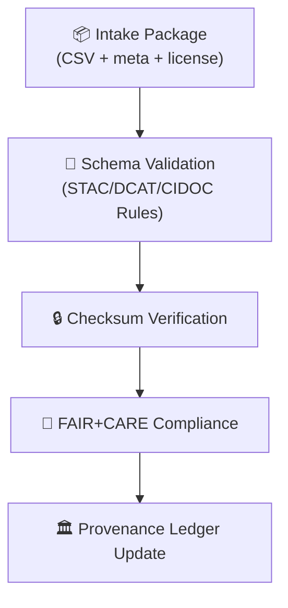

<div align="center">

# 🧾✅ Kansas Frontier Matrix — **Tabular Intake Validation Logs**  
`data/work/staging/tabular/tmp/intake/logs/validation/`

### *“Trust is earned one validation at a time.”*

**Purpose:**  
The **Validation Logs Directory** stores results from automated schema checks, checksum verifications, and FAIR+CARE audits for all tabular datasets entering the **Intake TMP layer**.  
Each log entry documents how a dataset conforms to STAC/DCAT/CIDOC standards and whether it passes internal reproducibility gates.

[](../../../../../../../../docs/architecture/repo-focus.md)
[](../../../../../../../../LICENSE)
[]()
[]()
[]()

</div>

---

## 🧭 Overview

This directory contains **machine-generated validation logs** for each dataset that passes through the **Tabular Intake TMP** process.  
Logs capture schema conformity results, checksum verification, and FAIR+CARE assessment outputs.  
All entries are immutable once written and are linked to the **governance ledger** and **telemetry system** for audit reproducibility.

Validation logs are vital for proving compliance with:
- **STAC/DCAT 1.0+** metadata standards  
- **CIDOC CRM / OWL-Time** ontology mapping  
- **FAIR+CARE** principles (Findable, Accessible, Interoperable, Reusable)  
- **MCP-DL v6.3** documentation-first requirements  

---

## 🗂️ Directory Layout

```plaintext
data/work/staging/tabular/tmp/intake/logs/validation/
├── validate-ks_hydro_1874.jsonl          # Schema + checksum results for dataset
├── validate-ks_population_1890.jsonl     # Example validation report
├── faircare-audit-ks_hydro_1874.jsonl    # FAIR+CARE compliance results
├── batch-validation-2025-10-26.log       # Combined daily log summary
└── README.md                             # This document
````

---

## 🧾 Log Schema (JSONL Format)

Each line of a validation log represents a discrete validation event.

```json
{
  "timestamp": "2025-10-26T13:51:32Z",
  "dataset": "ks_hydro_1874",
  "stage": "validation",
  "validator": "stac-validate",
  "schema_version": "tabular-intake-v13",
  "component": "schema_check",
  "message": "STAC/DCAT structure verified successfully.",
  "status": "passed",
  "duration_ms": 912,
  "checksum_verified": true,
  "checksum": "4c4925bbf65b9e1a5f8e7f0b67d7b5e9a8a8a2c1c7f7a0f0...",
  "run_id": "validate-2025-10-26-1351Z",
  "trace_id": "0bf3e99d-4db3-41a3-a51f-12183f77bfa2"
}
```

---

## ⚙️ Validation Categories

| Type                      | Description                                                            | Tool / Schema                     | Output Pattern              |
| ------------------------- | ---------------------------------------------------------------------- | --------------------------------- | --------------------------- |
| **Schema Validation**     | Ensures STAC/DCAT/CIDOC compliance and tabular integrity.              | `stac-validate`, `jsonschema-cli` | `validate-*.jsonl`          |
| **Checksum Verification** | Confirms file integrity via SHA-256 digests.                           | `make checksums`                  | `validate-*-checksum.jsonl` |
| **FAIR+CARE Review**      | Verifies ethical compliance, metadata completeness, and accessibility. | `fair-audit.yml`                  | `faircare-audit-*.jsonl`    |
| **Semantic Validation**   | Confirms alignment with ontology constraints (CIDOC CRM, OWL-Time).    | `graph-lint`                      | `validate-semantic-*.jsonl` |

---

## 🧪 Example Validation Logs

**File:** `validate-ks_hydro_1874.jsonl`

```json
{"timestamp":"2025-10-26T13:51:32Z","dataset":"ks_hydro_1874","validator":"stac-validate","message":"STAC item schema valid (1.0.0).","status":"passed"}
{"timestamp":"2025-10-26T13:52:05Z","dataset":"ks_hydro_1874","validator":"checksum","message":"All SHA-256 hashes matched.","status":"passed"}
{"timestamp":"2025-10-26T13:52:37Z","dataset":"ks_hydro_1874","validator":"fair-audit","message":"FAIR+CARE compliance verified: score 100%.","status":"passed"}
```

**File:** `faircare-audit-ks_hydro_1874.jsonl`

```json
{"timestamp":"2025-10-26T13:52:37Z","dataset":"ks_hydro_1874","component":"FAIR+CARE","criteria":["Findable","Accessible","Interoperable","Reusable"],"score":1.0,"status":"passed"}
```

---

## 📜 FAIR+CARE Compliance Scoring

| Principle         | Metric                             | Description                                    | Weight | Pass Threshold |
| ----------------- | ---------------------------------- | ---------------------------------------------- | ------ | -------------- |
| **Findable**      | Metadata completeness              | Dataset has descriptive metadata + STAC record | 0.25   | 0.9            |
| **Accessible**    | Open licensing & link availability | Dataset license is SPDX-compliant              | 0.25   | 1.0            |
| **Interoperable** | Format & schema adherence          | Uses open formats (CSV, GeoJSON, etc.)         | 0.25   | 0.95           |
| **Reusable**      | Provenance and citation quality    | Proper attribution & checksum trace            | 0.25   | 0.9            |

> 🧩 *All four dimensions must score ≥ threshold for full compliance.*

---

## 🧩 Validation Workflow Context



---

## 🧮 Commands

```bash
# Run validation for all incoming datasets
make validate-tabular

# Run validation for one dataset
make validate-tabular dataset=ks_hydro_1874

# Generate FAIR+CARE summary
make fair-report

# Check validation logs for failures
grep -E '"status":"(failed|error)"' logs/validation/*.jsonl
```

---

## 🧯 Troubleshooting

| Issue                          | Description                                                | Resolution                                           |
| ------------------------------ | ---------------------------------------------------------- | ---------------------------------------------------- |
| **“Schema validation failed”** | Dataset missing required fields or invalid JSON structure. | Fix `meta.json` and re-run validation.               |
| **Checksum mismatch**          | File modified after intake.                                | Re-run `make checksums` and confirm hash integrity.  |
| **FAIR+CARE score < 0.9**      | Metadata incomplete or license missing.                    | Update metadata fields and re-run `fair-audit.yml`.  |
| **Semantic validation errors** | Ontology mapping mismatch.                                 | Review CIDOC class relations in `graph-lint` output. |

---

## 🧾 Governance Integration

Validated results are appended to the **Tabular Intake Governance Ledger** (`governance/tabular_intake_ledger.jsonld`):

```json
{
  "dataset": "ks_hydro_1874",
  "validation_ref": "logs/validation/validate-ks_hydro_1874.jsonl",
  "checksum_verified": true,
  "faircare_score": 1.0,
  "semantic_passed": true,
  "timestamp": "2025-10-26T13:53:12Z",
  "status": "validated"
}
```

---

## ☑️ Validation Quality Checklist

* [x] STAC/DCAT schema validated
* [x] Checksum verified
* [x] FAIR+CARE score ≥ 0.9
* [x] CIDOC CRM alignment confirmed
* [x] Ledger updated with validation record
* [x] No unresolved warnings or errors

---

## 🪶 Version History

| Version    | Date       | Author              | Notes                                                                                 |
| ---------- | ---------- | ------------------- | ------------------------------------------------------------------------------------- |
| **v9.0.1** | 2025-10-26 | `@kfm-architecture` | Initial release — structured validation log format and FAIR+CARE audit documentation. |

---

<div align="center">

### 🜂 Kansas Frontier Matrix — *Validation · Trust · Transparency*

**“Validation is not the end of data’s journey, but its beginning.”**

[]()
[]()
[]()
[]()

[⬆ Back to Top](#-kansas-frontier-matrix--tabular-intake-validation-logs)

</div>
```

