<div align="center">

# 🚨 Kansas Frontier Matrix — **Intake Quarantine**  
`data/work/staging/tabular/tmp/intake/quarantine/`

### *“Every error has a home until it’s understood, documented, and fixed.”*

**Purpose:**  
This directory functions as the **primary containment zone** for datasets that fail validation during tabular intake into the Kansas Frontier Matrix (KFM).  
It centralizes all **non-conforming, incomplete, or anomalous tabular data** flagged by schema, checksum, FAIR+CARE, and AI-based validation systems.  
All quarantined datasets remain isolated, versioned, and traceable until successfully remediated and revalidated.

[](../../../../../../../../../docs/architecture/repo-focus.md)  
[](../../../../../../../../../LICENSE)  
[]()  
[]()  
[]()

</div>

---

## 🧭 Overview

The **Intake Quarantine Layer** provides a structured, auditable environment for containing and managing datasets that do not meet KFM’s rigorous validation standards.  
It ensures that data issues are never lost or ignored — they are systematically tracked, explained, and corrected.  

Each dataset in quarantine:
- Is stored with complete metadata and provenance.  
- Has a linked entry in the **Governance Ledger** for accountability.  
- Is classified under one or more error categories (schema, checksum, FAIR+CARE, AI anomaly, etc.).  
- Is reviewed by both **automated remediation agents** and **human curators**.  

Quarantine ensures integrity of the KFM ecosystem while maintaining traceability and ethical handling of all data artifacts.

---

## 🗂️ Directory Layout

```text
data/work/staging/tabular/tmp/intake/quarantine/
├── ai_anomalies/                 # AI-detected irregularities and pattern deviations
├── checksum_mismatches/          # Integrity mismatches between computed and manifest checksums
├── faircare_incomplete/          # Datasets with missing or incomplete FAIR+CARE metadata
├── faircare_violations/          # Ethical or governance compliance breaches
├── schema_failures/              # Invalid or non-conforming schema structures
├── remediation_logs/             # Logs and proofs of dataset correction
├── reports/                      # Quarantine-wide summaries, metrics, and audit outputs
└── README.md                     # This document
````

---

## 🔁 Quarantine Workflow

```mermaid
flowchart TD
    A["Dataset Fails Validation"] --> B["Move Dataset to Intake Quarantine"]
    B --> C["Classify by Failure Type (Schema / Checksum / FAIR+CARE / AI)"]
    C --> D["Record Provenance Entry → Governance Ledger"]
    D --> E["AI Diagnostics & Auto-Remediation Suggestions"]
    E --> F["Curator Review + Ethical Oversight"]
    F --> G{"Issue Fixed?"}
    G -- "Yes ✅" --> H["Revalidate Dataset → Promote to Normalized Layer"]
    G -- "No 🚫" --> I["Retain in Quarantine for Historical Record"]
```



---

## 🧩 Quarantine Classification Matrix

| Category                 | Description                                                            | Example Issue                                        | Responsible System      |
| ------------------------ | ---------------------------------------------------------------------- | ---------------------------------------------------- | ----------------------- |
| **Schema Failures**      | Violations of schema rules, datatype mismatches, or structural errors. | Missing `checksum` field in metadata.                | JSON Schema Validator   |
| **Checksum Mismatches**  | File integrity verification failures.                                  | SHA-256 mismatch due to UTF-8/UTF-16 encoding drift. | Checksum Verifier       |
| **FAIR+CARE Incomplete** | Missing license, provenance, or community governance metadata.         | Absent `license` and `community_authority` fields.   | FAIR+CARE Validator     |
| **FAIR+CARE Violations** | Noncompliance with ethical governance principles.                      | Missing consent or cultural attribution.             | FAIR+CARE Ethics Engine |
| **AI Anomalies**         | AI-detected semantic, statistical, or contextual irregularities.       | Outlier in population density value.                 | AI Anomaly Detector     |
| **Remediation Logs**     | Documentation of completed or pending fixes.                           | Recorded checksum regeneration event.                | Governance Agent        |

---

## 🤖 AI Governance Modules

| Module                           | Function                                                      | Output                                         |
| -------------------------------- | ------------------------------------------------------------- | ---------------------------------------------- |
| **AI Validator**                 | Detects, classifies, and scores anomalies and irregularities. | `ai_anomalies/`                                |
| **Schema Analyzer**              | Interprets validation errors and schema misalignments.        | `schema_failures/`                             |
| **FAIR+CARE Auditor**            | Evaluates metadata compliance and ethical completeness.       | `faircare_incomplete/`, `faircare_violations/` |
| **Checksum Engine**              | Ensures cryptographic integrity and detects data drift.       | `checksum_mismatches/`                         |
| **Auto-Remediator**              | Suggests or applies automated fixes where deterministic.      | `remediation_logs/`                            |
| **Governance Ledger Integrator** | Registers every quarantine event for audit traceability.      | `reports/`, `ledger.jsonld`                    |

> 🧠 *AI tools enhance accuracy but never replace human curation — each action remains verifiable, ethical, and reversible.*

---

## ⚙️ Curator Workflow

Curators and data governance officers should:

1. Review quarantine directories daily for new datasets or unresolved issues.
2. Prioritize remediation based on severity and dataset importance.
3. Use AI-suggested fixes documented in `remediation_logs/` as guidance.
4. Validate remediations by running:

   ```bash
   make revalidate-flagged
   ```
5. Upon successful verification, promote the dataset to its corresponding normalized or processed directory.
6. Record closure notes in governance ledger and update FAIR+CARE status.

---

## 📈 Monitoring Metrics

| Metric                             | Description                             | Target     |
| ---------------------------------- | --------------------------------------- | ---------- |
| **Validation Error Rate**          | % of datasets entering quarantine       | < 2%       |
| **Average Remediation Time**       | Mean time to fix and revalidate         | < 24 hours |
| **AI Detection Accuracy**          | Confidence of AI anomaly classification | ≥ 0.9      |
| **Governance Record Completeness** | Quarantine entries linked to ledger     | 100%       |
| **FAIR+CARE Compliance Score**     | Post-remediation compliance target      | ≥ 0.95     |

---

## 🧾 Compliance Matrix

| Standard               | Scope                                         | Validator       |
| ---------------------- | --------------------------------------------- | --------------- |
| **FAIR+CARE**          | Ethical open-science and data stewardship     | `fair-audit`    |
| **MCP-DL v6.3**        | Documentation-first data lifecycle compliance | `docs-validate` |
| **CIDOC CRM / PROV-O** | Provenance traceability for quarantined data  | `graph-lint`    |
| **ISO 19115 / 19157**  | Data quality and metadata lineage tracking    | `geojson-lint`  |
| **STAC / DCAT 3.0**    | Metadata interoperability for open datasets   | `stac-validate` |

---

## 🪶 Version History

| Version | Date       | Author              | Notes                                                                                         |
| ------- | ---------- | ------------------- | --------------------------------------------------------------------------------------------- |
| v9.0.0  | 2025-10-26 | `@kfm-architecture` | Initial creation of Intake Quarantine documentation under Diamond⁹ Ω / Crown∞Ω certification. |

---

<div align="center">

### 🜂 Kansas Frontier Matrix — *Containment · Transparency · Restoration*

**“Quarantine isn’t a failure — it’s proof that we take validation seriously.”**

[]()
[]()
[]()
[]()

<br><br> <a href="#-kansas-frontier-matrix--intake-quarantine-validation-containment-layer--diamond⁹-Ω--crown∞Ω-certified">⬆ Back to Top</a>

</div>
