<div align="center">

# 🤖 Kansas Frontier Matrix — **AI Anomalies (Intake Quarantine Sub-Layer)**  
`data/work/staging/tabular/tmp/intake/quarantine/ai_anomalies/`

### *“The model learns through its mistakes — governance learns by documenting them.”*

**Purpose:**  
This subdirectory contains **AI-detected anomalies and outliers** discovered during the KFM tabular intake process.  
Each flagged record represents a dataset instance where the **AI validation engine** detected statistical, semantic, or contextual irregularities requiring curator review before reintegration into the main workflow.

[](../../../../../../../../../../../../../../../docs/architecture/repo-focus.md)  
[](../../../../../../../../../../../../../../../LICENSE)  
[]()  
[]()  
[]()

</div>

---

## 🧭 Overview

The **AI Anomalies Quarantine Sub-Layer** collects all datasets or records that the AI validation models have classified as **anomalous or inconsistent** within the intake phase.  
These anomalies are not errors by definition but **signals** — indicators of potential irregularities that warrant deeper inspection by governance teams.

AI anomaly types include:
- **Statistical Outliers:** Values outside learned data distributions.  
- **Semantic Conflicts:** Field misclassifications, ontology drift, or inconsistent labeling.  
- **Temporal Drift:** Deviations from expected historical or chronological trends.  
- **Ethical or Provenance Alerts:** AI-flagged inconsistencies with FAIR+CARE metadata.  

All anomalies are documented with their AI model context, reasoning summary, and remediation status.

---

## 🗂️ Directory Layout

```text
data/work/staging/tabular/tmp/intake/quarantine/ai_anomalies/
├── global_ai_anomalies_manifest.json     # Registry of all AI anomalies detected at intake
├── ai_reasoning_log.json                 # Natural-language model explanations for anomaly detections
├── anomaly_clusters.json                 # Grouped anomalies by statistical or semantic similarity
├── ai_drift_report.json                  # Model drift or concept drift analysis report
├── examples/                             # Sample evidence of AI-detected irregularities
│   ├── ai_outlier_case_001.csv
│   ├── ai_semantic_conflict_002.json
│   └── ai_temporal_drift_003.csv
├── curator_review.log                    # Curator notes, verification results, and oversight decisions
└── README.md                             # This document
````

---

## 🔁 Detection & Containment Workflow

```mermaid
flowchart TD
    A["AI Validation Engine Runs on Intake Data"] --> B["Detects Anomalies (Statistical / Semantic / Temporal)"]
    B --> C["Move Flagged Records → Intake Quarantine / ai_anomalies/"]
    C --> D["Generate Reasoning Log → ai_reasoning_log.json"]
    D --> E["Cluster Anomalies → anomaly_clusters.json"]
    E --> F["Curator Review + Governance Evaluation"]
    F --> G{"Resolved?"}
    G -- "Yes ✅" --> H["Revalidate Dataset and Promote"]
    G -- "No 🚫" --> I["Retain Entry for Model Retraining / Audit Archive"]
```



---

## 🧩 Manifest Schema

| Field            | Description                      | Example                                              |
| ---------------- | -------------------------------- | ---------------------------------------------------- |
| `dataset_id`     | Dataset associated with anomaly  | `ks_population_1890`                                 |
| `record_id`      | Unique ID of anomalous record    | `rec_002193`                                         |
| `anomaly_type`   | Type of anomaly                  | `Temporal Drift`                                     |
| `field_name`     | Field affected                   | `year_recorded`                                      |
| `detected_value` | Value triggering anomaly         | `2150`                                               |
| `expected_range` | Normalized expected range        | `1850–1900`                                          |
| `ai_model`       | Detection model used             | `IsolationForest_v3.1`                               |
| `ai_confidence`  | Confidence score (0–1)           | `0.984`                                              |
| `ai_explanation` | LLM summary of anomaly rationale | `"Detected future date outside historical context."` |
| `timestamp`      | UTC detection time               | `2025-10-26T16:04:58Z`                               |

---

## 🤖 AI Anomaly Detection Modules

| Module                                           | Function                                                   | Output                                                 |
| ------------------------------------------------ | ---------------------------------------------------------- | ------------------------------------------------------ |
| **Anomaly Detector (Isolation Forest / DBSCAN)** | Detects outliers and deviations from learned distributions | `global_ai_anomalies_manifest.json`                    |
| **Semantic Analyzer (LLM Reasoner)**             | Identifies logical or contextual conflicts                 | `ai_reasoning_log.json`                                |
| **Drift Monitor**                                | Tracks data drift or schema evolution over time            | `ai_drift_report.json`                                 |
| **Cluster Profiler**                             | Groups related anomalies for batch remediation             | `anomaly_clusters.json`                                |
| **Governance Mapper**                            | Links AI-detected anomalies to the FAIR+CARE ledger        | `tabular_intake_quarantine_ai_anomalies_ledger.jsonld` |

> 🧠 *All AI detections include human-readable justifications and are cross-verified by curators before any model retraining occurs.*

---

## ⚙️ Curator Workflow

Curators are expected to:

1. Review AI anomaly records in `global_ai_anomalies_manifest.json`.
2. Examine reasoning explanations in `ai_reasoning_log.json`.
3. Verify anomaly validity and annotate findings in `curator_review.log`.
4. Apply remediation actions or mark as false positive.
5. Run revalidation commands:

   ```bash
   make revalidate-ai-anomalies
   ```
6. If anomaly is genuine, document corrective steps in governance ledger.

---

## 📈 Monitoring Metrics

| Metric                              | Description                                    | Target |
| ----------------------------------- | ---------------------------------------------- | ------ |
| **AI Detection Accuracy**           | % of valid anomalies detected by model         | ≥ 90%  |
| **False Positive Rate**             | % of anomalies marked invalid by curators      | < 5%   |
| **Curator Review Coverage**         | % of anomalies reviewed by humans              | 100%   |
| **Retraining Feedback Utilization** | % of valid anomalies used in model improvement | ≥ 80%  |

---

## 🧾 Compliance Matrix

| Standard               | Scope                                                | Validator       |
| ---------------------- | ---------------------------------------------------- | --------------- |
| **FAIR+CARE**          | Ethical and provenance traceability for AI processes | `fair-audit`    |
| **MCP-DL v6.3**        | Explainable AI validation framework                  | `docs-validate` |
| **ISO/IEC 23053:2022** | Lifecycle governance for AI models                   | `ai-validate`   |
| **CIDOC CRM / PROV-O** | Provenance linkage of anomaly records                | `graph-lint`    |
| **STAC / DCAT 3.0**    | Metadata standardization of AI event logs            | `stac-validate` |

---

## 🪶 Version History

| Version | Date       | Author              | Notes                                                                                                      |
| ------- | ---------- | ------------------- | ---------------------------------------------------------------------------------------------------------- |
| v9.0.0  | 2025-10-26 | `@kfm-architecture` | Initial creation of Intake Quarantine AI Anomalies documentation under Diamond⁹ Ω / Crown∞Ω certification. |

---

<div align="center">

### 🜂 Kansas Frontier Matrix — *Detection · Interpretation · Governance*

**“AI anomalies aren’t errors — they’re the breadcrumbs of understanding.”**

[]()
[]()
[]()
[]()
[]()

<br><br> <a href="#-kansas-frontier-matrix--ai-anomalies-intake-quarantine-sub-layer--diamond⁹-Ω--crown∞Ω-certified">⬆ Back to Top</a>

</div>
