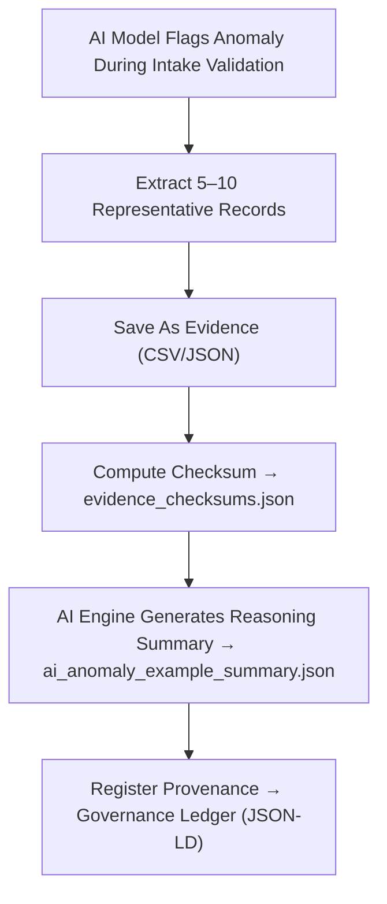

<div align="center">

# 🧠 Kansas Frontier Matrix — **AI Anomaly Evidence Examples**  
`data/work/staging/tabular/tmp/intake/quarantine/ai_anomalies/examples/`

### *“Understanding anomalies begins with observing their context.”*

**Purpose:**  
This directory contains **evidence samples and explainability artifacts** representing AI-detected anomalies within quarantined intake datasets in the Kansas Frontier Matrix (KFM).  
These examples demonstrate **statistical, semantic, and temporal irregularities** flagged by KFM’s AI Validation Engine during data ingestion.  
Each file provides interpretable, reproducible evidence for curators, auditors, and model developers.

[](../../../../../../../../../../../../../../../../../docs/architecture/repo-focus.md)  
[](../../../../../../../../../../../../../../../../../LICENSE)  
[]()  
[]()  
[]()

</div>

---

## 🧭 Overview

The **AI Anomaly Evidence Examples Sub-Layer** provides curated, checksum-verified evidence of anomalies identified by the KFM AI engine.  
Each example includes:
- The anomalous record or dataset excerpt  
- AI reasoning summary explaining detection  
- Provenance linkage to the corresponding ledger entry  
- Remediation notes and curator verification results  

This evidence supports explainable AI (XAI) standards under **MCP-DL v6.3**, ensuring that every AI detection is both **auditable** and **interpretable**.

---

## 🗂️ Directory Layout

```text
data/work/staging/tabular/tmp/intake/quarantine/ai_anomalies/examples/
├── ai_outlier_case_001.csv               # Statistical outlier in tabular record
├── ai_semantic_conflict_002.json         # Semantic misclassification example
├── ai_temporal_drift_003.csv             # Time-based or seasonal anomaly
├── ai_anomaly_example_summary.json       # AI-generated summaries and metadata for evidence
├── evidence_checksums.json               # SHA-256 validation for reproducibility
└── README.md                             # This document
````

---

## 🔁 Evidence Extraction Workflow



---

## 📄 Evidence Metadata Schema

Each example entry in `ai_anomaly_example_summary.json` includes structured interpretability data:

| Field              | Description                          | Example                                                                          |
| ------------------ | ------------------------------------ | -------------------------------------------------------------------------------- |
| `case_id`          | Unique anomaly case identifier       | `ai_semantic_conflict_002`                                                       |
| `dataset_id`       | Source dataset name                  | `ks_population_1890`                                                             |
| `anomaly_type`     | Type of detected irregularity        | `Semantic Mismatch`                                                              |
| `field_name`       | Affected column or variable          | `county_name`                                                                    |
| `detected_value`   | Anomalous or inconsistent entry      | `"Wichita"`                                                                      |
| `expected_pattern` | Expected schema or ontology mapping  | `"City → E53 Place (CRM Entity)"`                                                |
| `ai_confidence`    | Model detection confidence (0–1)     | `0.981`                                                                          |
| `ai_explanation`   | Human-readable reasoning summary     | `"Entity 'Wichita' classified incorrectly as 'County' based on schema context."` |
| `checksum`         | SHA-256 hash verifying evidence file | `e94bcf72f1a0876ad3421...`                                                       |
| `timestamp`        | Time of extraction (UTC)             | `2025-10-26T16:07:45Z`                                                           |

---

## 🤖 AI Explainability Modules

| Module                                   | Function                                        | Output                            |
| ---------------------------------------- | ----------------------------------------------- | --------------------------------- |
| **Outlier Detector (Isolation Forest)**  | Identifies abnormal numerical values.           | `ai_outlier_case_001.csv`         |
| **Semantic Validator (LLM Reasoner)**    | Detects contextual or labeling inconsistencies. | `ai_semantic_conflict_002.json`   |
| **Temporal Drift Monitor**               | Flags time-based deviations or shifts.          | `ai_temporal_drift_003.csv`       |
| **Explainability Reporter (XAI Engine)** | Produces human-readable anomaly reasoning.      | `ai_anomaly_example_summary.json` |
| **Checksum Verifier**                    | Ensures cryptographic integrity of evidence.    | `evidence_checksums.json`         |

> 🧠 *All AI-generated reasoning adheres to MCP-DL interpretability guidelines, ensuring explainable, reproducible validation events.*

---

## ⚙️ Curator Workflow

Curators should:

1. Review anomaly evidence and AI reasoning in `ai_anomaly_example_summary.json`.
2. Verify file integrity via:

   ```bash
   make checksum-verify
   ```
3. Confirm whether flagged anomalies are valid or false positives.
4. Log curator review decisions in `curator_review.log`.
5. Approve for retraining feedback if anomaly is genuine:

   ```bash
   make ai-feedback-register
   ```

---

## 📈 Example Anomaly Cases

| Case    | Type                | Description                                 | Resolution                           |
| ------- | ------------------- | ------------------------------------------- | ------------------------------------ |
| **001** | Statistical Outlier | Population density exceeds threshold by 10× | Verify via historical record         |
| **002** | Semantic Mismatch   | Entity labeled incorrectly (City → County)  | Correct ontology mapping             |
| **003** | Temporal Drift      | Event timestamp outside logical range       | Adjust metadata; flag for retraining |

---

## 🧾 Compliance Matrix

| Standard               | Scope                                             | Validator       |
| ---------------------- | ------------------------------------------------- | --------------- |
| **FAIR+CARE**          | Ethical data handling and audit transparency      | `fair-audit`    |
| **MCP-DL v6.3**        | Explainable AI governance and documentation       | `docs-validate` |
| **ISO/IEC 23053:2022** | AI lifecycle and accountability management        | `ai-validate`   |
| **CIDOC CRM / PROV-O** | Provenance and semantic traceability              | `graph-lint`    |
| **STAC / DCAT 3.0**    | Metadata interoperability for AI anomaly evidence | `stac-validate` |

---

## 🪶 Version History

| Version | Date       | Author              | Notes                                                                                                    |
| ------- | ---------- | ------------------- | -------------------------------------------------------------------------------------------------------- |
| v9.0.0  | 2025-10-26 | `@kfm-architecture` | Initial creation of AI Anomaly Evidence Examples documentation under Diamond⁹ Ω / Crown∞Ω certification. |

---

<div align="center">

### 🜂 Kansas Frontier Matrix — *Interpretation · Transparency · Improvement*

**“Every anomaly is a lesson — and every lesson deserves evidence.”**

[]()
[]()
[]()
[]()
[]()

<br><br> <a href="#-kansas-frontier-matrix--ai-anomaly-evidence-examples-intake-quarantine-layer--diamond⁹-Ω--crown∞Ω-certified">⬆ Back to Top</a>

</div>
