<div align="center">

# 🔐 Kansas Frontier Matrix — **Checksum Mismatches (Intake Quarantine Sub-Layer)**  
`data/work/staging/tabular/tmp/intake/quarantine/checksum_mismatches/`

### *“Integrity without verification is faith — checksum validation makes it fact.”*

**Purpose:**  
This subdirectory stores **datasets and validation logs** where computed checksums failed to match the stored manifest or provenance records during KFM’s tabular intake process.  
Checksum mismatches are treated as **critical integrity failures** that require immediate review, remediation, and provenance re-verification before the dataset can re-enter the workflow.

[](../../../../../../../../../../../../../../../docs/architecture/repo-focus.md)  
[](../../../../../../../../../../../../../../../LICENSE)  
[]()  
[]()  
[]()

</div>

---

## 🧭 Overview

The **Checksum Mismatches Quarantine Sub-Layer** captures and documents datasets where **file-level cryptographic integrity failed** during intake verification.  
These mismatches indicate potential:
- File corruption during transfer or compression  
- Encoding drift (UTF-8 → UTF-16)  
- Unauthorized or untracked edits  
- Outdated manifests referencing old file hashes  

Every checksum anomaly is logged with:
- The original and computed hash values  
- File path and size at validation time  
- AI-generated reasoning for possible causes  
- Curator oversight and remediation status  

---

## 🗂️ Directory Layout

```text
data/work/staging/tabular/tmp/intake/quarantine/checksum_mismatches/
├── checksum_mismatch_manifest.json      # Registry of failed integrity validations
├── ai_integrity_diagnostics.json        # AI reasoning explaining mismatch causes
├── diff_analysis.json                   # Bit-level or encoding delta analysis
├── remediation_plan.json                # AI and curator-approved remediation instructions
├── examples/                            # Evidence files and representative mismatches
│   ├── ks_population_1890_example.json
│   ├── ks_treaty_1851_example.csv
│   └── ks_agriculture_1870_example.csv
├── curator_notes.log                    # Human oversight and fix validation log
└── README.md                            # This document
````

---

## 🔁 Integrity Verification Workflow

```mermaid
flowchart TD
    A["File Ingested into Intake System"] --> B["Compute SHA-256 / SHA-512 Hash"]
    B --> C["Compare Against Manifest or Provenance Record"]
    C --> D{"Checksums Match?"}
    D -- "No ❌" --> E["Move File to Quarantine/checksum_mismatches/"]
    E --> F["Record Original vs Computed Hash → checksum_mismatch_manifest.json"]
    F --> G["Run AI Integrity Diagnostics → ai_integrity_diagnostics.json"]
    G --> H["Generate Remediation Plan + Curator Review"]
    H --> I["Revalidate Fixed Dataset Before Reintegration"]
```



---

## 🧩 Manifest Schema

| Field                | Description                         | Example                                                                |
| -------------------- | ----------------------------------- | ---------------------------------------------------------------------- |
| `dataset_id`         | Dataset identifier                  | `ks_population_1890`                                                   |
| `file_path`          | Path to the affected file           | `data/raw/ks_population_1890.csv`                                      |
| `expected_checksum`  | Manifest checksum                   | `8d8b59b5a4f...`                                                       |
| `computed_checksum`  | Checksum computed during validation | `8d8b59b5a4fXXXX`                                                      |
| `hash_algorithm`     | Algorithm used                      | `SHA-256`                                                              |
| `file_size_bytes`    | File size recorded                  | `948217`                                                               |
| `ai_explanation`     | AI reasoning summary                | `"Encoding difference detected; possible UTF-8 to UTF-16 conversion."` |
| `remediation_status` | Current remediation phase           | `Pending Fix`                                                          |
| `timestamp`          | Time of detection (UTC)             | `2025-10-26T16:10:38Z`                                                 |

---

## 🤖 AI Integrity Modules

| Module                     | Function                                                               | Output                                                        |
| -------------------------- | ---------------------------------------------------------------------- | ------------------------------------------------------------- |
| **Binary Diff Engine**     | Detects byte-level differences between source and manifest versions    | `diff_analysis.json`                                          |
| **AI Integrity Explainer** | Summarizes likely causes (encoding, corruption, drift, or manual edit) | `ai_integrity_diagnostics.json`                               |
| **Checksum Validator**     | Performs cryptographic integrity checks across intake datasets         | `checksum_mismatch_manifest.json`                             |
| **Auto-Remediator**        | Suggests recovery or re-ingest actions                                 | `remediation_plan.json`                                       |
| **Governance Mapper**      | Registers integrity failures in provenance ledger                      | `tabular_intake_quarantine_checksum_mismatches_ledger.jsonld` |

> 🧠 *AI diagnostic outputs are paired with curator verification logs for explainable and reversible governance workflows.*

---

## ⚙️ Curator Workflow

Curators must:

1. Review mismatch entries in `checksum_mismatch_manifest.json`.
2. Validate AI findings in `ai_integrity_diagnostics.json`.
3. Recompute checksum manually for confirmation:

   ```bash
   sha256sum <filename>
   ```
4. Apply remediations documented in `remediation_plan.json`.
5. Revalidate post-fix dataset integrity:

   ```bash
   make checksums-verify
   ```
6. Record closure actions and governance sync status in `curator_notes.log`.

---

## 📈 Integrity Monitoring Metrics

| Metric                       | Description                               | Target  |
| ---------------------------- | ----------------------------------------- | ------- |
| **Checksum Match Rate**      | % of files verified successfully          | ≥ 99.5% |
| **Checksum Drift Incidence** | % of mismatched hashes detected           | < 0.5%  |
| **AI Diagnostic Confidence** | Accuracy of AI-explained root causes      | ≥ 0.9   |
| **Curator Oversight Rate**   | % of anomalies manually verified          | 100%    |
| **Ledger Sync Completeness** | % of issues recorded to governance ledger | 100%    |

---

## 🧾 Compliance Matrix

| Standard                 | Scope                                   | Validator         |
| ------------------------ | --------------------------------------- | ----------------- |
| **SHA-256 / FIPS 180-4** | Cryptographic verification standard     | `checksum-verify` |
| **FAIR+CARE**            | Provenance and ethical traceability     | `fair-audit`      |
| **MCP-DL v6.3**          | Documentation-based governance protocol | `docs-validate`   |
| **CIDOC CRM / PROV-O**   | Provenance linkage of checksum records  | `graph-lint`      |
| **ISO 19115 / 19157**    | Metadata lineage and integrity quality  | `geojson-lint`    |

---

## 🪶 Version History

| Version | Date       | Author              | Notes                                                                                                             |
| ------- | ---------- | ------------------- | ----------------------------------------------------------------------------------------------------------------- |
| v9.0.0  | 2025-10-26 | `@kfm-architecture` | Initial creation of Intake Quarantine Checksum Mismatches documentation under Diamond⁹ Ω / Crown∞Ω certification. |

---

<div align="center">

### 🜂 Kansas Frontier Matrix — *Verification · Accountability · Trust*

**“A mismatch isn’t failure — it’s the system proving that integrity still works.”**

[]()
[]()
[]()
[]()
[]()

<br><br> <a href="#-kansas-frontier-matrix--checksum-mismatches-intake-quarantine-sub-layer--diamond⁹-Ω--crown∞Ω-certified">⬆ Back to Top</a>

</div>
