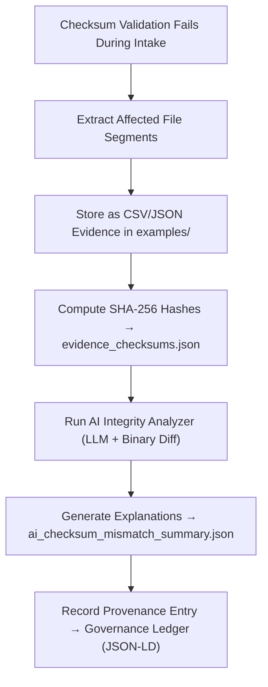

<div align="center">

# 📁 Kansas Frontier Matrix — **Checksum Mismatch Evidence Examples**  
`data/work/staging/tabular/tmp/intake/quarantine/checksum_mismatches/examples/`

### *“Integrity isn’t lost when mismatches occur — only when they go undocumented.”*

**Purpose:**  
This directory contains **verifiable checksum mismatch examples** detected during tabular intake validation within the Kansas Frontier Matrix (KFM).  
Each example demonstrates where computed checksums diverged from manifest or provenance entries, providing transparent forensic evidence for auditors and curators.

[](../../../../../../../../../../../../../../../../../docs/architecture/repo-focus.md)  
[](../../../../../../../../../../../../../../../../../LICENSE)  
[]()  
[]()  
[]()

</div>

---

## 🧭 Overview

The **Checksum Mismatch Evidence Examples Layer** provides reproducible, verifiable cases of file integrity failures.  
Each case includes:
- The dataset file excerpt or manifest section showing the mismatch.  
- AI and human reasoning explaining probable causes.  
- Bitwise diff metadata (size delta, encoding drift, truncation, or corruption type).  
- Cryptographic validation of evidence files through SHA-256 hashes.  

All examples are **checksum-verified**, **ledger-linked**, and compliant with **MCP-DL v6.3** reproducibility standards.

---

## 🗂️ Directory Layout

```text
data/work/staging/tabular/tmp/intake/quarantine/checksum_mismatches/examples/
├── ks_population_1890_example.json         # Evidence of UTF-8 to UTF-16 encoding drift
├── ks_agriculture_1870_example.csv         # Example showing partial file truncation
├── ks_treaty_1851_example.csv              # Manifest referencing outdated checksum
├── ai_checksum_mismatch_summary.json       # AI reasoning and anomaly classification summary
├── evidence_checksums.json                 # SHA-256 hashes verifying example authenticity
└── README.md                               # This document
````

---

## 🔁 Evidence Extraction Workflow



---

## 📄 Evidence Metadata Schema

Each example entry in `ai_checksum_mismatch_summary.json` includes structured details:

| Field               | Description                                | Example                                                                     |
| ------------------- | ------------------------------------------ | --------------------------------------------------------------------------- |
| `dataset_id`        | Dataset identifier                         | `ks_population_1890`                                                        |
| `file_path`         | Path to the file under validation          | `data/raw/ks_population_1890.csv`                                           |
| `expected_checksum` | Hash from manifest                         | `ad52efb4a9e3c0...`                                                         |
| `computed_checksum` | Hash computed during intake                | `ad52efb4a9e3d5...`                                                         |
| `discrepancy_type`  | Type of integrity failure                  | `Encoding Drift / Byte Offset`                                              |
| `ai_commentary`     | AI explanation of cause                    | `"UTF-8 BOM inserted during file export caused byte-level checksum drift."` |
| `checksum`          | SHA-256 hash of this example evidence file | `d8b4f21aa37193ef...`                                                       |
| `timestamp`         | UTC extraction time                        | `2025-10-26T16:12:19Z`                                                      |

---

## 🤖 AI Integrity Evidence Modules

| Module                   | Function                                                            | Output                                                               |
| ------------------------ | ------------------------------------------------------------------- | -------------------------------------------------------------------- |
| **Binary Diff Analyzer** | Examines byte-level deltas between expected and actual file hashes  | `ai_checksum_mismatch_summary.json`                                  |
| **AI Reasoner**          | Interprets root cause (encoding change, corruption, manifest drift) | `ai_checksum_mismatch_summary.json`                                  |
| **Checksum Validator**   | Confirms authenticity and SHA-256 consistency of evidence files     | `evidence_checksums.json`                                            |
| **Governance Mapper**    | Integrates checksum anomaly data into provenance graph              | `tabular_intake_quarantine_checksum_mismatch_examples_ledger.jsonld` |

> 🧠 *All AI explanations follow MCP-DL’s explainability requirements, ensuring accountability and reproducibility.*

---

## ⚙️ Curator Workflow

Curators should:

1. Review AI reasoning in `ai_checksum_mismatch_summary.json`.
2. Verify cryptographic integrity using:

   ```bash
   make checksum-verify
   ```
3. Investigate and confirm whether the mismatch is due to corruption, manifest drift, or transformation.
4. Document human-reviewed notes in `curator_notes.log`.
5. Run remediation validation when resolved:

   ```bash
   make revalidate-flagged
   ```

---

## 📈 Example Mismatch Scenarios

| Type                   | Description                               | Example                         | Resolution                                |
| ---------------------- | ----------------------------------------- | ------------------------------- | ----------------------------------------- |
| **Encoding Drift**     | File encoding changed post-export         | UTF-8 → UTF-16                  | Normalize encoding and recompute checksum |
| **Manifest Drift**     | Manifest references outdated file version | Old checksum retained           | Update manifest entry                     |
| **Partial Truncation** | File truncated during upload              | 2.5 MB expected → 2.3 MB actual | Restore archived version                  |
| **Unauthorized Edit**  | File modified outside version control     | Metadata header changed         | Revert to verified commit                 |

---

## 🧾 Compliance Matrix

| Standard                 | Scope                                                      | Validator         |
| ------------------------ | ---------------------------------------------------------- | ----------------- |
| **SHA-256 / FIPS 180-4** | Cryptographic validation of file integrity                 | `checksum-verify` |
| **FAIR+CARE**            | Ethical documentation and transparency of integrity events | `fair-audit`      |
| **MCP-DL v6.3**          | Documentation-first provenance and integrity protocol      | `docs-validate`   |
| **CIDOC CRM / PROV-O**   | Provenance linkage of validation evidence                  | `graph-lint`      |
| **ISO 19115 / 19157**    | Metadata lineage and integrity compliance                  | `geojson-lint`    |

---

## 🪶 Version History

| Version | Date       | Author              | Notes                                                                                                           |
| ------- | ---------- | ------------------- | --------------------------------------------------------------------------------------------------------------- |
| v9.0.0  | 2025-10-26 | `@kfm-architecture` | Initial creation of Checksum Mismatch Evidence Examples documentation under Diamond⁹ Ω / Crown∞Ω certification. |

---

<div align="center">

### 🜂 Kansas Frontier Matrix — *Forensics · Verification · Governance*

**“The difference between failure and integrity is documentation.”**

[]()
[]()
[]()
[]()
[]()

<br><br> <a href="#-kansas-frontier-matrix--checksum-mismatch-evidence-examples-intake-quarantine-sub-layer--diamond⁹-Ω--crown∞Ω-certified">⬆ Back to Top</a>

</div>
