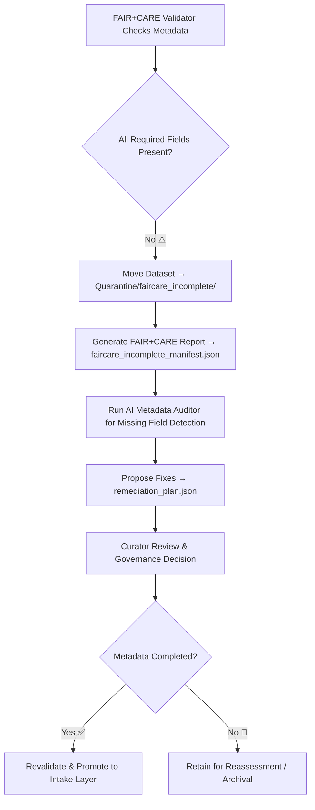

<div align="center">

# 🌿 Kansas Frontier Matrix — **FAIR+CARE Incomplete (Intake Quarantine Sub-Layer)**  
`data/work/staging/tabular/tmp/intake/quarantine/faircare_incomplete/`

### *“Ethical data is never missing — it’s just waiting to be completed.”*

**Purpose:**  
This directory holds datasets that **partially comply with FAIR (Findable, Accessible, Interoperable, Reusable)** and **CARE (Collective Benefit, Authority to Control, Responsibility, Ethics)** standards.  
Each dataset here has **missing or incomplete metadata elements**, preventing full ethical certification until verified, supplemented, or corrected.

[](../../../../../../../../../../../../../../../docs/architecture/repo-focus.md)  
[](../../../../../../../../../../../../../../../LICENSE)  
[]()  
[]()  
[]()

</div>

---

## 🧭 Overview

The **FAIR+CARE Incomplete Quarantine Sub-Layer** is dedicated to datasets missing one or more key ethical or metadata components.  
Incomplete metadata can include missing fields such as:
- `license` — reuse permissions not declared  
- `checksum` — missing integrity traceability  
- `community_authority` — governance or ownership undefined  
- `provenance_link` — absent lineage or derivation record  
- `curator_contact` — incomplete responsibility assignment  

Datasets remain quarantined here until these fields are corrected or validated by curators and governance reviewers.

---

## 🗂️ Directory Layout

```text
data/work/staging/tabular/tmp/intake/quarantine/faircare_incomplete/
├── faircare_incomplete_manifest.json     # Index of all FAIR+CARE-incomplete datasets
├── ai_faircare_analysis.json             # AI-generated reasoning on missing fields
├── remediation_plan.json                 # Suggested metadata completion plan
├── examples/                             # Sample evidence of incomplete datasets
│   ├── ks_agriculture_1885_example.json
│   ├── ks_treaty_1851_example.csv
│   └── ks_population_1890_example.json
├── curator_notes.log                     # Human governance review and resolution log
└── README.md                             # This document
````

---

## 🔁 FAIR+CARE Validation Workflow



---

## 🧩 Manifest Schema

| Field                | Description                 | Example                                                               |
| -------------------- | --------------------------- | --------------------------------------------------------------------- |
| `dataset_id`         | Dataset identifier          | `ks_agriculture_1885`                                                 |
| `missing_fields`     | Absent metadata components  | `["license", "community_authority", "checksum"]`                      |
| `fair_score`         | FAIR compliance score (0–1) | `0.77`                                                                |
| `care_score`         | CARE compliance score (0–1) | `0.81`                                                                |
| `ai_commentary`      | AI summary of metadata gap  | `"License missing; governance authority undefined; checksum absent."` |
| `remediation_action` | Proposed fix                | `"Add CC-BY 4.0 license; populate checksum; verify authority entry."` |
| `timestamp`          | Time of detection (UTC)     | `2025-10-26T16:14:59Z`                                                |

---

## 🤖 AI FAIR+CARE Metadata Engine

| Module                          | Function                                             | Output                                                        |
| ------------------------------- | ---------------------------------------------------- | ------------------------------------------------------------- |
| **AI Metadata Auditor**         | Scans metadata and identifies incomplete fields      | `faircare_incomplete_manifest.json`                           |
| **Ethical Compliance Analyzer** | Scores FAIR and CARE completeness                    | `ai_faircare_analysis.json`                                   |
| **Auto-Remediator**             | Suggests metadata updates and ethical justifications | `remediation_plan.json`                                       |
| **Governance Mapper**           | Logs incomplete datasets into FAIR+CARE ledger       | `tabular_intake_quarantine_faircare_incomplete_ledger.jsonld` |

> 🧠 *Each AI-generated recommendation includes confidence scores and provenance context, aligning with MCP-DL interpretability standards.*

---

## ⚙️ Curator Workflow

Curators and data governance officers should:

1. Review `faircare_incomplete_manifest.json` for incomplete metadata elements.
2. Validate AI recommendations in `ai_faircare_analysis.json`.
3. Update metadata using the remediation plan:

   ```bash
   make faircare-complete
   ```
4. Record decisions and human oversight notes in `curator_notes.log`.
5. Re-run FAIR+CARE compliance validation:

   ```bash
   make faircare-validate
   ```
6. Promote dataset back to validated intake layer upon passing threshold (≥ 0.95 FAIR/CARE score).

---

## 📈 Compliance Targets

| Metric                       | Description                                          | Target |
| ---------------------------- | ---------------------------------------------------- | ------ |
| **FAIR Score Threshold**     | Minimum acceptable FAIR compliance                   | ≥ 0.90 |
| **CARE Score Threshold**     | Minimum acceptable CARE compliance                   | ≥ 0.90 |
| **Governance Review Rate**   | % of incomplete datasets reviewed by curators        | 100%   |
| **Remediation Success Rate** | % of datasets successfully completed and revalidated | ≥ 95%  |

---

## 🧾 Compliance Matrix

| Standard                      | Scope                                        | Validator        |
| ----------------------------- | -------------------------------------------- | ---------------- |
| **FAIR Principles (GO-FAIR)** | Open metadata transparency and reuse         | `fair-audit`     |
| **CARE Principles (GIDA)**    | Ethical and governance compliance            | `faircare-audit` |
| **MCP-DL v6.3**               | Documentation-driven ethical reproducibility | `docs-validate`  |
| **CIDOC CRM / PROV-O**        | Provenance linkage of incomplete metadata    | `graph-lint`     |
| **ISO 19115 / 19157**         | Metadata completeness and quality            | `geojson-lint`   |

---

## 🪶 Version History

| Version | Date       | Author              | Notes                                                                                                              |
| ------- | ---------- | ------------------- | ------------------------------------------------------------------------------------------------------------------ |
| v9.0.0  | 2025-10-26 | `@kfm-architecture` | Initial creation of Intake Quarantine FAIR+CARE Incomplete documentation under Diamond⁹ Ω / Crown∞Ω certification. |

---

<div align="center">

### 🜂 Kansas Frontier Matrix — *Completeness · Ethics · Accountability*

**“Metadata gaps aren’t failures — they’re opportunities to uphold responsibility.”**

[]()
[]()
[]()
[]()
[]()

<br><br> <a href="#-kansas-frontier-matrix--faircare-incomplete-intake-quarantine-sub-layer--diamond⁹-Ω--crown∞Ω-certified">⬆ Back to Top</a>

</div>
