<div align="center">

# 🌾 Kansas Frontier Matrix — **FAIR+CARE Incomplete Examples**  
`data/work/staging/tabular/tmp/intake/quarantine/faircare_incomplete/examples/`

### *“Transparency means showing what’s missing, not just what’s complete.”*

**Purpose:**  
This directory provides **real-world evidence examples** of datasets that were quarantined for **incomplete FAIR+CARE compliance** during intake validation.  
Each example illustrates missing metadata, ethical governance gaps, or incomplete provenance documentation, providing reference material for auditors, curators, and governance reviewers.

[](../../../../../../../../../../../../../../../../../docs/architecture/repo-focus.md)  
[](../../../../../../../../../../../../../../../../../LICENSE)  
[]()  
[]()  
[]()

</div>

---

## 🧭 Overview

The **FAIR+CARE Incomplete Evidence Layer** holds example cases extracted from quarantined datasets, representing common patterns of missing or partially filled metadata fields.  
These examples act as **teaching and auditing resources**, supporting both AI and human reviewers to strengthen metadata completeness standards.  

Each case includes:
- Dataset fragment with incomplete or missing metadata fields  
- AI commentary summarizing gaps  
- Remediation recommendations  
- Verification checksums for reproducibility  

---

## 🗂️ Directory Layout

```text
data/work/staging/tabular/tmp/intake/quarantine/faircare_incomplete/examples/
├── ks_agriculture_1885_example.json      # Missing license and community_authority fields
├── ks_treaty_1851_example.csv            # Absent provenance and checksum data
├── ks_population_1890_example.json       # Incomplete metadata on curator contact and access URL
├── ai_faircare_incomplete_summary.json   # AI interpretation and remediation reasoning
├── evidence_checksums.json               # SHA-256 hashes confirming evidence file integrity
└── README.md                             # This document
````

---

## 🔁 Evidence Extraction Workflow

```mermaid
flowchart TD
    A["Dataset Fails FAIR+CARE Validation"] --> B["Extract 5–10 Relevant Metadata Records"]
    B --> C["Save as CSV/JSON in examples/"]
    C --> D["Compute SHA-256 Checksums → evidence_checksums.json"]
    D --> E["Run AI Metadata Auditor for Explanation"]
    E --> F["Store AI Explanations → ai_faircare_incomplete_summary.json"]
    F --> G["Register Provenance → FAIR+CARE Governance Ledger"]
```



---

## 📄 Example Metadata Schema

Each record in `ai_faircare_incomplete_summary.json` provides FAIR+CARE compliance context:

| Field                    | Description                                  | Example                                                                       |
| ------------------------ | -------------------------------------------- | ----------------------------------------------------------------------------- |
| `dataset_id`             | Dataset name                                 | `ks_agriculture_1885`                                                         |
| `file_path`              | Path to example evidence file                | `examples/ks_agriculture_1885_example.json`                                   |
| `missing_fields`         | Metadata elements not provided               | `["license", "community_authority", "checksum"]`                              |
| `fair_score`             | FAIR compliance score (0–1)                  | `0.76`                                                                        |
| `care_score`             | CARE compliance score (0–1)                  | `0.81`                                                                        |
| `ai_explanation`         | AI-generated description of missing metadata | `"License, checksum, and community governance authority absent."`             |
| `remediation_suggestion` | Recommended correction or action             | `"Add CC-BY license, populate checksum, record community authority contact."` |
| `checksum`               | SHA-256 hash verifying the example           | `f7a94a1bc66de0f03e2b...`                                                     |
| `timestamp`              | Time of extraction (UTC)                     | `2025-10-26T16:17:20Z`                                                        |

---

## 🤖 AI FAIR+CARE Compliance Modules

| Module                       | Function                                                     | Output                                                                 |
| ---------------------------- | ------------------------------------------------------------ | ---------------------------------------------------------------------- |
| **AI Metadata Auditor**      | Detects missing or incomplete FAIR+CARE metadata fields      | `ai_faircare_incomplete_summary.json`                                  |
| **FAIR Metrics Evaluator**   | Computes FAIR scoring values for each dataset                | `ai_faircare_incomplete_summary.json`                                  |
| **CARE Governance Analyzer** | Evaluates ethical responsibility and governance completeness | `ai_faircare_incomplete_summary.json`                                  |
| **Checksum Verifier**        | Confirms cryptographic evidence file integrity               | `evidence_checksums.json`                                              |
| **Governance Linker**        | Maps examples to FAIR+CARE provenance records                | `tabular_intake_quarantine_faircare_incomplete_examples_ledger.jsonld` |

> 🧠 *All AI reasoning outputs include ethical transparency metadata and curator-verifiable justifications under the MCP-DL documentation contract.*

---

## ⚙️ Curator Workflow

Curators are expected to:

1. Review AI interpretations in `ai_faircare_incomplete_summary.json`.
2. Confirm that missing fields align with schema and governance expectations.
3. Verify example file integrity:

   ```bash
   make checksum-verify
   ```
4. Record metadata restoration or governance approval steps in `curator_notes.log`.
5. Trigger revalidation once corrections are complete:

   ```bash
   make faircare-validate
   ```

---

## 📈 Common Incompleteness Patterns

| Type                      | Description                       | Example                            | Resolution                        |
| ------------------------- | --------------------------------- | ---------------------------------- | --------------------------------- |
| **License Omission**      | Missing `license` field           | No SPDX or CC license declared     | Add `"license": "CC-BY 4.0"`      |
| **Checksum Missing**      | Integrity verification incomplete | No SHA-256 checksum                | Generate hash and update manifest |
| **Authority Undefined**   | Governance contact not recorded   | Absent `community_authority`       | Add responsible entity metadata   |
| **Provenance Gap**        | Lineage information missing       | No `source_id` or `wasDerivedFrom` | Add provenance linkage            |
| **Accessibility Unclear** | Broken or absent access URL       | `url` missing                      | Add working HTTP/HTTPS endpoint   |

---

## 🧾 Compliance Matrix

| Standard                      | Scope                                              | Validator        |
| ----------------------------- | -------------------------------------------------- | ---------------- |
| **FAIR Principles (GO-FAIR)** | Metadata completeness and accessibility            | `fair-audit`     |
| **CARE Principles (GIDA)**    | Ethical responsibility and governance transparency | `faircare-audit` |
| **MCP-DL v6.3**               | Documentation-first ethical reproducibility        | `docs-validate`  |
| **CIDOC CRM / PROV-O**        | Provenance tracking and governance mapping         | `graph-lint`     |
| **ISO 19115 / 19157**         | Metadata lineage and data quality                  | `geojson-lint`   |

---

## 🪶 Version History

| Version | Date       | Author              | Notes                                                                                                    |
| ------- | ---------- | ------------------- | -------------------------------------------------------------------------------------------------------- |
| v9.0.0  | 2025-10-26 | `@kfm-architecture` | Initial creation of FAIR+CARE Incomplete Example documentation under Diamond⁹ Ω / Crown∞Ω certification. |

---

<div align="center">

### 🜂 Kansas Frontier Matrix — *Completeness · Accountability · Stewardship*

**“To fix what’s missing, we must first see it clearly.”**

[]()
[]()
[]()
[]()
[]()

<br><br> <a href="#-kansas-frontier-matrix--faircare-incomplete-examples-intake-quarantine-evidence-layer--diamond⁹-Ω--crown∞Ω-certified">⬆ Back to Top</a>

</div>
