<div align="center">

# 🩺 Kansas Frontier Matrix — **Remediation Logs (Intake Quarantine Sub-Layer)**  
`data/work/staging/tabular/tmp/intake/quarantine/remediation_logs/`

### *“Validation protects data. Remediation redeems it.”*

**Purpose:**  
This directory stores the **official remediation and correction records** for datasets within the **Intake Quarantine Layer** of the Kansas Frontier Matrix (KFM).  
Each entry documents the actions taken — by AI, curators, or governance teams — to restore data integrity, ethical completeness, or schema compliance.

[](../../../../../../../../../../../../../../../docs/architecture/repo-focus.md)  
[](../../../../../../../../../../../../../../../LICENSE)  
[]()  
[]()  
[]()

</div>

---

## 🧭 Overview

The **Remediation Logs Quarantine Sub-Layer** serves as a permanent audit trail of all **data fixes, ethical completions, and schema restorations** performed within the quarantine environment.  
Each remediation entry ensures:
- **Traceability:** All changes linked to specific datasets and ledger records.  
- **Transparency:** Documentation of both AI and human interventions.  
- **Reproducibility:** Revalidation logs and checksums for each fix.  
- **Ethical Accountability:** Actions reviewed under FAIR+CARE governance.  

These logs confirm that quarantined data was never altered silently — all modifications are documented, justified, and verified.

---

## 🗂️ Directory Layout

```text
data/work/staging/tabular/tmp/intake/quarantine/remediation_logs/
├── remediation_manifest.json             # Canonical record of all remediation events
├── ai_remediation_summary.json            # AI-generated fix recommendations and execution outcomes
├── curator_actions.log                    # Human-readable curator intervention notes
├── remediation_diff_records.json          # Before-and-after comparisons (checksums and fields)
├── verification_results.json              # Results confirming validation after remediation
├── examples/                              # Representative remediation evidence
│   ├── schema_fix_case_001.json
│   ├── checksum_repair_case_002.json
│   └── faircare_completion_case_003.json
└── README.md                              # This document
````

---

## 🔁 Remediation & Verification Workflow

```mermaid
flowchart TD
    A["Dataset Fails Validation"] --> B["Move to Intake Quarantine"]
    B --> C["AI or Curator Applies Remediation"]
    C --> D["Log Fix in remediation_manifest.json"]
    D --> E["Compute Diff & Revalidation Reports"]
    E --> F["Record Integrity Proof → verification_results.json"]
    F --> G["Update Governance Ledger with Provenance Entry"]
```



---

## 🧩 Manifest Schema

| Field                  | Description                        | Example                                                                        |
| ---------------------- | ---------------------------------- | ------------------------------------------------------------------------------ |
| `dataset_id`           | Dataset identifier                 | `ks_population_1890`                                                           |
| `issue_type`           | Category of issue remediated       | `Checksum Mismatch`                                                            |
| `error_summary`        | Description of issue               | `"SHA-256 mismatch due to encoding drift (UTF-8 to UTF-16)."`                  |
| `fix_action`           | Corrective measure applied         | `"Re-encoded file to UTF-8, recomputed checksum."`                             |
| `applied_by`           | Agent performing remediation       | `AI Integrity Agent v3.0`                                                      |
| `fix_timestamp`        | Time remediation was applied (UTC) | `2025-10-26T16:23:45Z`                                                         |
| `validation_result`    | Revalidation outcome               | `Passed`                                                                       |
| `governance_reference` | Link to provenance ledger entry    | `governance/tabular_intake_quarantine_remediation_logs_ledger.jsonld#case-002` |

---

## 🤖 AI & Human Remediation Modules

| Module                    | Function                                                  | Output                                                     |
| ------------------------- | --------------------------------------------------------- | ---------------------------------------------------------- |
| **AI Auto-Remediator**    | Detects and fixes deterministic schema or metadata issues | `ai_remediation_summary.json`                              |
| **Checksum Rebuilder**    | Recomputes and verifies data integrity hashes             | `remediation_diff_records.json`                            |
| **FAIR+CARE Completer**   | Adds missing ethical or provenance fields                 | `ai_remediation_summary.json`                              |
| **Schema Validator**      | Re-runs post-fix schema validation                        | `verification_results.json`                                |
| **Governance Integrator** | Updates FAIR+CARE ledger with remediation trace           | `tabular_intake_quarantine_remediation_logs_ledger.jsonld` |

> 🧠 *All AI interventions are transparent, reversible, and logged with deterministic signatures to meet FAIR+CARE documentation standards.*

---

## ⚙️ Curator Workflow

Curators should:

1. Review automated entries in `ai_remediation_summary.json`.
2. Confirm human-led corrections or metadata completions in `curator_actions.log`.
3. Validate before-and-after state using:

   ```bash
   make remediation-diff
   ```
4. Confirm revalidation success by running:

   ```bash
   make revalidate-flagged
   ```
5. Record governance approval or re-audit requests in `remediation_manifest.json`.
6. Sync remediation metadata to provenance ledger:

   ```bash
   make governance-update
   ```

---

## 📈 Remediation Performance Metrics

| Metric                          | Description                                      | Target |
| ------------------------------- | ------------------------------------------------ | ------ |
| **Remediation Success Rate**    | % of issues successfully fixed                   | ≥ 95%  |
| **AI Fix Accuracy**             | Agreement rate between AI and curator validation | ≥ 0.9  |
| **Revalidation Pass Rate**      | % of datasets passing post-remediation checks    | ≥ 98%  |
| **Ledger Linkage Completeness** | % of fixes registered in governance ledger       | 100%   |
| **FAIR+CARE Re-approval Time**  | Average time for ethical validation review       | ≤ 24h  |

---

## 🧾 Compliance Matrix

| Standard               | Scope                                          | Validator       |
| ---------------------- | ---------------------------------------------- | --------------- |
| **FAIR+CARE**          | Ethical and transparent correction tracking    | `fair-audit`    |
| **MCP-DL v6.3**        | Documentation-based reproducibility            | `docs-validate` |
| **CIDOC CRM / PROV-O** | Provenance and change lineage                  | `graph-lint`    |
| **ISO 19115 / 19157**  | Metadata quality and revision integrity        | `geojson-lint`  |
| **STAC / DCAT 3.0**    | Metadata interoperability and schema alignment | `stac-validate` |

---

## 🪶 Version History

| Version | Date       | Author              | Notes                                                                                                          |
| ------- | ---------- | ------------------- | -------------------------------------------------------------------------------------------------------------- |
| v9.0.0  | 2025-10-26 | `@kfm-architecture` | Initial creation of Intake Quarantine Remediation Logs documentation under Diamond⁹ Ω / Crown∞Ω certification. |

---

<div align="center">

### 🜂 Kansas Frontier Matrix — *Repair · Verification · Provenance*

**“Integrity isn’t the absence of errors — it’s the discipline of fixing them transparently.”**

[]()
[]()
[]()
[]()
[]()

<br><br> <a href="#-kansas-frontier-matrix--remediation-logs-intake-quarantine-sub-layer--diamond⁹-Ω--crown∞Ω-certified">⬆ Back to Top</a>

</div>
