<div align="center">

# 🧾 Kansas Frontier Matrix — **Remediation Log Examples**  
`data/work/staging/tabular/tmp/intake/quarantine/remediation_logs/examples/`

### *“Every fix is a story — every story deserves evidence.”*

**Purpose:**  
This directory preserves **evidence samples of dataset remediations** performed within the Intake Quarantine environment of the Kansas Frontier Matrix (KFM).  
Each example provides traceable documentation of how a data issue was identified, fixed, verified, and revalidated under FAIR+CARE and MCP-DL governance protocols.

[](../../../../../../../../../../../../../../../../../docs/architecture/repo-focus.md)  
[](../../../../../../../../../../../../../../../../../LICENSE)  
[]()  
[]()  
[]()

</div>

---

## 🧭 Overview

The **Remediation Log Evidence Layer** provides concrete examples of corrective actions taken within KFM’s quarantine workflows.  
Each example demonstrates how validation issues — checksum mismatches, schema failures, FAIR+CARE incompleteness, or AI anomalies — were **identified, fixed, and verified** in alignment with FAIR+CARE and governance standards.

Each case contains:
- The original error context  
- The remediation action applied (AI or curator-led)  
- Before-and-after integrity comparisons  
- Governance ledger and checksum proof  

---

## 🗂️ Directory Layout

```text
data/work/staging/tabular/tmp/intake/quarantine/remediation_logs/examples/
├── schema_fix_case_001.json             # Example of schema field restoration
├── checksum_repair_case_002.json        # Example of checksum mismatch correction
├── faircare_completion_case_003.json    # Example of FAIR+CARE metadata remediation
├── ai_remediation_case_004.json         # Example of AI-initiated data correction
├── evidence_checksums.json              # SHA-256 hashes verifying example authenticity
└── README.md                            # This document
````

---

## 🔁 Evidence Recording Workflow

```mermaid
flowchart TD
    A["Dataset Error Detected in Quarantine"] --> B["AI or Curator Applies Fix"]
    B --> C["Generate Example Case File in examples/"]
    C --> D["Compute Checksum → evidence_checksums.json"]
    D --> E["Run Revalidation → Verification Results Logged"]
    E --> F["Register Remediation Event in Governance Ledger"]
```



---

## 📄 Example Metadata Schema

Each case file (e.g., `checksum_repair_case_002.json`) follows a standardized metadata schema:

| Field                | Description                                | Example                                              |
| -------------------- | ------------------------------------------ | ---------------------------------------------------- |
| `case_id`            | Unique remediation case identifier         | `checksum_repair_case_002`                           |
| `dataset_id`         | Dataset involved                           | `ks_population_1890`                                 |
| `issue_type`         | Nature of issue resolved                   | `Checksum Mismatch`                                  |
| `original_error`     | Description of initial failure             | `"SHA-256 mismatch caused by UTF-16 encoding drift"` |
| `remediation_action` | Fix performed                              | `"Re-encoded to UTF-8 and recomputed checksum"`      |
| `applied_by`         | Responsible system or curator              | `AI Integrity Agent v3.0`                            |
| `validation_result`  | Post-fix verification outcome              | `Passed`                                             |
| `checksum`           | SHA-256 checksum of the case evidence file | `d4a8b3e0a7f1c8b15...`                               |
| `timestamp`          | UTC time of remediation completion         | `2025-10-26T16:26:22Z`                               |

---

## 🤖 AI & Human Collaboration Modules

| Module                    | Function                                               | Output                                                             |
| ------------------------- | ------------------------------------------------------ | ------------------------------------------------------------------ |
| **AI Auto-Remediator**    | Detects and applies automated schema or checksum fixes | `ai_remediation_case_004.json`                                     |
| **FAIR+CARE Completer**   | Adds missing metadata and governance fields            | `faircare_completion_case_003.json`                                |
| **Checksum Rebuilder**    | Recomputes and validates cryptographic hashes          | `checksum_repair_case_002.json`                                    |
| **Schema Corrector**      | Restores required fields and datatype consistency      | `schema_fix_case_001.json`                                         |
| **Governance Integrator** | Links remediation to provenance records                | `tabular_intake_quarantine_remediation_log_examples_ledger.jsonld` |

> 🧠 *All AI remediations are reversible, logged, and approved under human supervision — ensuring accountability and ethical stewardship.*

---

## ⚙️ Curator Workflow

Curators and reviewers must:

1. Review remediation case files for accuracy and completeness.
2. Verify example file integrity via:

   ```bash
   make checksum-verify
   ```
3. Confirm post-fix schema and checksum validation results.
4. Record human oversight and ethical justification in `curator_notes.log`.
5. Sync ledger metadata for transparency:

   ```bash
   make governance-update
   ```

---

## 📈 Example Fix Scenarios

| Case    | Issue Type           | Description                              | Resolution                                  |
| ------- | -------------------- | ---------------------------------------- | ------------------------------------------- |
| **001** | Schema Failure       | Missing required metadata field          | Added field per schema v13; revalidated     |
| **002** | Checksum Mismatch    | Encoding drift caused hash mismatch      | Normalized encoding and recomputed hash     |
| **003** | FAIR+CARE Incomplete | Missing license and provenance info      | Added CC-BY 4.0 license and provenance link |
| **004** | AI Anomaly           | False positive detected in AI validation | Adjusted model thresholds and retrained     |

---

## 🧾 Compliance Matrix

| Standard               | Scope                                           | Validator       |
| ---------------------- | ----------------------------------------------- | --------------- |
| **FAIR+CARE**          | Ethical and transparent correction tracking     | `fair-audit`    |
| **MCP-DL v6.3**        | Documentation-first remediation reproducibility | `docs-validate` |
| **CIDOC CRM / PROV-O** | Provenance and change lineage                   | `graph-lint`    |
| **ISO 19115 / 19157**  | Metadata quality and lineage assurance          | `geojson-lint`  |
| **STAC / DCAT 3.0**    | Metadata interoperability post-fix              | `stac-validate` |

---

## 🪶 Version History

| Version | Date       | Author              | Notes                                                                                                                  |
| ------- | ---------- | ------------------- | ---------------------------------------------------------------------------------------------------------------------- |
| v9.0.0  | 2025-10-26 | `@kfm-architecture` | Initial creation of Intake Quarantine Remediation Log Examples documentation under Diamond⁹ Ω / Crown∞Ω certification. |

---

<div align="center">

### 🜂 Kansas Frontier Matrix — *Correction · Accountability · Restoration*

**“Integrity is restored when documentation proves it.”**

[]()
[]()
[]()
[]()
[]()

<br><br> <a href="#-kansas-frontier-matrix--remediation-log-examples-intake-quarantine-evidence-layer--diamond⁹-Ω--crown∞Ω-certified">⬆ Back to Top</a>

</div>
