<div align="center">

# 📊 Kansas Frontier Matrix — **Quarantine Reports**  
`data/work/staging/tabular/tmp/intake/quarantine/reports/`

### *“Governance isn’t complete until every exception is accounted for.”*

**Purpose:**  
This directory contains all **summary, audit, and telemetry reports** related to the Intake Quarantine environment of the Kansas Frontier Matrix (KFM).  
It provides centralized documentation of quarantined dataset activity — including failure classifications, remediation progress, FAIR+CARE audit outcomes, and governance ledger synchronization.

[](../../../../../../../../../../../../../../../docs/architecture/repo-focus.md)  
[](../../../../../../../../../../../../../../../LICENSE)  
[]()  
[]()  
[]()

</div>

---

## 🧭 Overview

The **Quarantine Reports Layer** serves as the **oversight and analytics hub** for all datasets temporarily contained within the KFM Intake Quarantine system.  
These reports enable data governance teams to track validation outcomes, analyze patterns, assess remediation efficiency, and confirm that each dataset follows the FAIR+CARE and MCP-DL governance model.

Reports include:
- Validation summaries of quarantined datasets  
- Issue distribution across schema, checksum, FAIR+CARE, and AI categories  
- Remediation performance tracking  
- FAIR+CARE compliance scoring post-correction  
- AI diagnostic accuracy audits  

---

## 🗂️ Directory Layout

```text
data/work/staging/tabular/tmp/intake/quarantine/reports/
├── quarantine_summary_report.json          # Overall quarantine dataset and issue statistics
├── schema_failure_report.json              # Report of schema validation breakdowns
├── checksum_mismatch_report.json           # Cryptographic integrity report
├── faircare_audit_report.json              # FAIR+CARE ethical compliance report
├── ai_anomaly_audit_report.json            # AI anomaly and drift detection summary
├── remediation_progress_report.json        # Log of dataset fixes and curator activity
├── governance_audit_report.json            # Provenance and ledger trace consistency review
├── telemetry_metrics.json                  # Performance and throughput statistics
└── README.md                               # This document
````

---

## 🔁 Quarantine Reporting Workflow

```mermaid
flowchart TD
    A["Dataset Validation Fails"] --> B["Move to Intake Quarantine"]
    B --> C["Record Failure Type and Metadata"]
    C --> D["Aggregate Validation Results → quarantine_summary_report.json"]
    D --> E["Generate Specialized Reports (Schema / Checksum / FAIR+CARE / AI)"]
    E --> F["Monitor Fix Progress → remediation_progress_report.json"]
    F --> G["Update Governance Ledger and Audit Trail"]
```



---

## 🧩 Report Overview

| Report                               | Description                                                 | Output Example                                              |
| ------------------------------------ | ----------------------------------------------------------- | ----------------------------------------------------------- |
| **quarantine_summary_report.json**   | Global summary of quarantined datasets and issue categories | `"Total: 74, Schema Failures: 31, Checksum Mismatches: 12"` |
| **schema_failure_report.json**       | Consolidated view of schema validation errors               | `"Missing required fields: license, checksum"`              |
| **checksum_mismatch_report.json**    | Tracks mismatched hash verifications and drift trends       | `"3 mismatches detected; 2 resolved via re-encoding"`       |
| **faircare_audit_report.json**       | Measures ethical completeness and compliance                | `"FAIR Score: 0.91, CARE Score: 0.88"`                      |
| **ai_anomaly_audit_report.json**     | Summarizes AI anomaly detection performance                 | `"Precision: 0.92, Recall: 0.86"`                           |
| **remediation_progress_report.json** | Records fixes, validation success, and pending issues       | `"Checksum Mismatch Case #12 - Fixed"`                      |
| **governance_audit_report.json**     | Cross-checks provenance trace with ledger                   | `"All 74 quarantine records linked to governance entries"`  |
| **telemetry_metrics.json**           | System throughput, validation latency, and anomaly rates    | `"Avg. Validation Time: 1.7s; Anomaly Rate: 1.8%"`          |

---

## 🤖 AI & Analytics Integration

| Module                         | Function                                                          | Output                          |
| ------------------------------ | ----------------------------------------------------------------- | ------------------------------- |
| **AI Governance Analyzer**     | Identifies recurrent error patterns and predicts remediation time | `telemetry_metrics.json`        |
| **Schema Diagnostics Engine**  | Aggregates schema validation failures                             | `schema_failure_report.json`    |
| **Checksum Integrity Monitor** | Detects recurring checksum drift or corruption clusters           | `checksum_mismatch_report.json` |
| **FAIR+CARE Ethics Evaluator** | Generates compliance scoring across datasets                      | `faircare_audit_report.json`    |
| **AI Drift Detector**          | Audits anomaly detection performance over multiple intake cycles  | `ai_anomaly_audit_report.json`  |
| **Governance Auditor**         | Ensures ledger and quarantine entries remain synchronized         | `governance_audit_report.json`  |

> 🧠 *Each report is versioned, checksum-verified, and synchronized with the KFM Governance Ledger for complete traceability.*

---

## ⚙️ Curator & Governance Workflow

Curators and governance teams should:

1. Review `quarantine_summary_report.json` for high-level quarantine status.
2. Investigate individual error domains using specialized reports.
3. Confirm FAIR+CARE completeness and ethical compliance in `faircare_audit_report.json`.
4. Track fixes and curator actions in `remediation_progress_report.json`.
5. Verify all ledger entries and governance integrity:

   ```bash
   make governance-audit
   ```
6. Export monthly summaries for governance dashboards:

   ```bash
   make export-reports
   ```

---

## 📈 Key Metrics Monitored

| Metric                               | Description                                        | Target               |
| ------------------------------------ | -------------------------------------------------- | -------------------- |
| **Total Datasets Quarantined**       | Active files in quarantine                         | ≤ 5% of total intake |
| **Schema Correction Rate**           | Datasets revalidated successfully after schema fix | ≥ 95%                |
| **Checksum Resolution Rate**         | Integrity issues corrected and reverified          | ≥ 98%                |
| **FAIR+CARE Post-Remediation Score** | Combined ethical and metadata completeness score   | ≥ 0.95               |
| **AI Detection Accuracy**            | AI precision/recall on anomaly classification      | ≥ 0.9                |
| **Governance Traceability**          | Ledger-linked quarantine records                   | 100%                 |

---

## 🧾 Compliance Matrix

| Standard               | Scope                                                     | Validator       |
| ---------------------- | --------------------------------------------------------- | --------------- |
| **FAIR+CARE**          | Ethical and governance transparency in validation reports | `fair-audit`    |
| **MCP-DL v6.3**        | Documentation-driven reporting for reproducibility        | `docs-validate` |
| **CIDOC CRM / PROV-O** | Provenance-linked reporting of quarantine actions         | `graph-lint`    |
| **ISO 19115 / 19157**  | Metadata completeness and data lineage reporting          | `geojson-lint`  |
| **STAC / DCAT 3.0**    | Metadata structure and interoperability for reports       | `stac-validate` |

---

## 🪶 Version History

| Version | Date       | Author              | Notes                                                                                                 |
| ------- | ---------- | ------------------- | ----------------------------------------------------------------------------------------------------- |
| v9.0.0  | 2025-10-26 | `@kfm-architecture` | Initial creation of Intake Quarantine Reports documentation under Diamond⁹ Ω / Crown∞Ω certification. |

---

<div align="center">

### 🜂 Kansas Frontier Matrix — *Visibility · Accountability · Integrity*

**“The difference between chaos and governance is documentation.”**

[]()
[]()
[]()
[]()

<br><br> <a href="#-kansas-frontier-matrix--quarantine-reports-validation-oversight-layer--diamond⁹-Ω--crown∞Ω-certified">⬆ Back to Top</a>

</div>
