<div align="center">

# 🧱 Kansas Frontier Matrix — **Schema Failures (Intake Quarantine Sub-Layer)**  
`data/work/staging/tabular/tmp/intake/quarantine/schema_failures/`

### *“When structure breaks, documentation rebuilds.”*

**Purpose:**  
This directory contains datasets that **failed schema validation** during intake into the Kansas Frontier Matrix (KFM).  
These schema failures represent structural, datatype, or enumerated value mismatches detected by the validation engine, often requiring remediation before revalidation and promotion.

[](../../../../../../../../../../../../../../../docs/architecture/repo-focus.md)  
[](../../../../../../../../../../../../../../../LICENSE)  
[]()  
[]()  
[]()

</div>

---

## 🧭 Overview

The **Schema Failures Quarantine Sub-Layer** is where datasets that violate schema definitions are automatically contained and documented.  
These violations prevent datasets from entering normalized or processed layers until correction is verified.  

Common schema failure causes:
- Missing required fields (e.g., `license`, `checksum`)  
- Invalid datatypes or structural inconsistencies  
- Enum or regex violations  
- Broken JSON Schema references (`$ref` errors)  
- Semantic misalignments with CIDOC CRM or OWL-Time mappings  

This directory ensures schema compliance integrity across all tabular data processed within KFM.

---

## 🗂️ Directory Layout

```text
data/work/staging/tabular/tmp/intake/quarantine/schema_failures/
├── schema_failure_manifest.json          # Registry of all validation failure reports
├── ai_schema_diagnostics.json            # AI reasoning summaries of failure causes
├── remediation_plan.json                 # Schema correction and revalidation actions
├── examples/                             # Evidence snippets showing schema failures
│   ├── ks_census_1890_example.json
│   ├── ks_agriculture_1880_example.json
│   └── ks_treaty_1854_example.csv
├── curator_notes.log                     # Human governance and review documentation
└── README.md                             # This document
````

---

## 🔁 Validation & Containment Workflow

```mermaid
flowchart TD
    A["Dataset Fails Schema Validation"] --> B["Move Dataset → Quarantine/schema_failures/"]
    B --> C["Record Error Context → schema_failure_manifest.json"]
    C --> D["AI Schema Diagnostics Generate Explanations"]
    D --> E["Propose Remediation Actions → remediation_plan.json"]
    E --> F["Curator Reviews & Validates Fix"]
    F --> G{"Schema Corrected?"}
    G -- "Yes ✅" --> H["Revalidate Dataset → Intake Normalized"]
    G -- "No 🚫" --> I["Retain for Historical Audit + Governance Entry"]
```



---

## 🧩 Manifest Schema

| Field                    | Description                  | Example                                                                             |
| ------------------------ | ---------------------------- | ----------------------------------------------------------------------------------- |
| `dataset_id`             | Dataset identifier           | `ks_census_1890`                                                                    |
| `schema_version`         | Schema used for validation   | `v13`                                                                               |
| `error_type`             | Nature of schema failure     | `Missing Required Field`                                                            |
| `schema_path`            | JSON path to offending node  | `$.properties.license`                                                              |
| `error_message`          | Raw validation error message | `"Required property 'license' missing."`                                            |
| `ai_summary`             | AI diagnostic summary        | `"Dataset missing mandatory metadata field 'license' per schema v13 requirements."` |
| `remediation_suggestion` | Proposed fix                 | `"Add 'license' field; revalidate JSON schema."`                                    |
| `timestamp`              | Failure detection time (UTC) | `2025-10-26T16:19:48Z`                                                              |

---

## 🤖 AI Schema Diagnostics Modules

| Module                                 | Function                                                          | Output                                                    |
| -------------------------------------- | ----------------------------------------------------------------- | --------------------------------------------------------- |
| **Schema Validator (JSON Schema v13)** | Validates dataset structure and types                             | `schema_failure_manifest.json`                            |
| **AI Diagnostics Engine**              | Converts validation stack traces into human-readable explanations | `ai_schema_diagnostics.json`                              |
| **Schema Auto-Remediator**             | Proposes field, datatype, or enum fixes                           | `remediation_plan.json`                                   |
| **CIDOC / OWL-Time Validator**         | Ensures ontology and temporal mapping correctness                 | `ai_schema_diagnostics.json`                              |
| **Governance Mapper**                  | Links schema failure entries to provenance ledger                 | `tabular_intake_quarantine_schema_failures_ledger.jsonld` |

> 🧠 *AI diagnostics convert machine errors into governance insights — making schema validation interpretable and actionable.*

---

## ⚙️ Curator Workflow

Curators should:

1. Review schema failure entries in `schema_failure_manifest.json`.
2. Analyze AI interpretations in `ai_schema_diagnostics.json` for context and root cause.
3. Implement or approve corrections per `remediation_plan.json`.
4. Document remediation outcomes in `curator_notes.log`.
5. Re-run validation commands:

   ```bash
   make revalidate-schema
   ```
6. Promote dataset back into validated intake upon passing schema checks.

---

## 📈 Schema Integrity Metrics

| Metric                         | Description                                             | Target |
| ------------------------------ | ------------------------------------------------------- | ------ |
| **Schema Pass Rate**           | % of datasets meeting schema standards                  | ≥ 98%  |
| **AI Diagnostic Confidence**   | Accuracy of AI error interpretations                    | ≥ 0.9  |
| **Remediation Success Rate**   | % of corrected schema failures successfully revalidated | ≥ 95%  |
| **Curator Oversight Coverage** | % of reviewed schema issues with documented action      | 100%   |

---

## 🧾 Compliance Matrix

| Standard                 | Scope                                      | Validator       |
| ------------------------ | ------------------------------------------ | --------------- |
| **JSON Schema Draft-07** | Structural validation rules                | `jsonschema`    |
| **CIDOC CRM / OWL-Time** | Semantic and temporal ontology validation  | `graph-lint`    |
| **FAIR+CARE**            | Documentation-first validation alignment   | `fair-audit`    |
| **MCP-DL v6.3**          | Governance documentation standard          | `docs-validate` |
| **ISO 19115 / 19157**    | Metadata completeness and lineage tracking | `geojson-lint`  |

---

## 🪶 Version History

| Version | Date       | Author              | Notes                                                                                                         |
| ------- | ---------- | ------------------- | ------------------------------------------------------------------------------------------------------------- |
| v9.0.0  | 2025-10-26 | `@kfm-architecture` | Initial creation of Intake Quarantine Schema Failures documentation under Diamond⁹ Ω / Crown∞Ω certification. |

---

<div align="center">

### 🜂 Kansas Frontier Matrix — *Structure · Compliance · Restoration*

**“A failed schema is just data asking for structure.”**

[]()
[]()
[]()
[]()
[]()

<br><br> <a href="#-kansas-frontier-matrix--schema-failures-intake-quarantine-sub-layer--diamond⁹-Ω--crown∞Ω-certified">⬆ Back to Top</a>

</div>

