<div align="center">

# 📘 Kansas Frontier Matrix — **Schema Failure Evidence Examples**  
`data/work/staging/tabular/tmp/intake/quarantine/schema_failures/examples/`

### *“Broken structure is an opportunity for clearer definitions.”*

**Purpose:**  
This directory preserves **evidence of schema validation failures** that occurred during tabular intake into the Kansas Frontier Matrix (KFM).  
Each example file captures a dataset fragment, AI diagnostic summary, and validation trace to aid curators, developers, and governance officers in correcting schema-level issues.

[](../../../../../../../../../../../../../../../../../docs/architecture/repo-focus.md)  
[](../../../../../../../../../../../../../../../../../LICENSE)  
[]()  
[]()  
[]()

</div>

---

## 🧭 Overview

The **Schema Failure Evidence Examples Layer** provides traceable, checksum-verified documentation of datasets that failed validation against JSON Schema, STAC/DCAT definitions, or CIDOC CRM semantic alignment.  
Each example highlights:
- The validation error (missing field, invalid type, or broken reference)  
- The AI-generated interpretability report summarizing root causes  
- The proposed remediation or schema correction  
- Cross-linked provenance information and checksum proof  

---

## 🗂️ Directory Layout

```text
data/work/staging/tabular/tmp/intake/quarantine/schema_failures/examples/
├── ks_census_1890_example.json            # Missing required field 'checksum'
├── ks_agriculture_1880_example.json       # Invalid enum and datatype errors
├── ks_treaty_1854_example.csv             # Missing license and malformed schema reference
├── ai_schema_failure_summary.json         # AI diagnostic and remediation reasoning
├── evidence_checksums.json                # SHA-256 hashes verifying evidence authenticity
└── README.md                              # This document
````

---

## 🔁 Evidence Extraction Workflow

```mermaid
flowchart TD
    A["Schema Validator Fails Dataset"] --> B["Extract Offending Dataset Fragment"]
    B --> C["Save Evidence as CSV/JSON"]
    C --> D["Compute File Hashes → evidence_checksums.json"]
    D --> E["AI Diagnostic Engine Generates Root-Cause Summary"]
    E --> F["Store Context → ai_schema_failure_summary.json"]
    F --> G["Link Example Provenance → Governance Ledger"]
```



---

## 📄 Example Metadata Schema

Each record in `ai_schema_failure_summary.json` documents failure metadata and remediation context:

| Field                    | Description                            | Example                                                                |
| ------------------------ | -------------------------------------- | ---------------------------------------------------------------------- |
| `dataset_id`             | Dataset identifier                     | `ks_census_1890`                                                       |
| `file_path`              | Example evidence file                  | `examples/ks_census_1890_example.json`                                 |
| `schema_path`            | JSON Schema pointer to failed property | `$.properties.checksum`                                                |
| `error_message`          | Raw validation error                   | `"Required property 'checksum' missing."`                              |
| `error_type`             | Type of validation failure             | `Missing Required Field`                                               |
| `ai_explanation`         | AI reasoning summary                   | `"Checksum field absent in dataset header per schema v13 compliance."` |
| `remediation_suggestion` | Corrective action                      | `"Add 'checksum' field to metadata and revalidate schema."`            |
| `checksum`               | SHA-256 verification hash              | `b3a82ef99146a5de5a1f...`                                              |
| `timestamp`              | Detection time (UTC)                   | `2025-10-26T16:21:58Z`                                                 |

---

## 🤖 AI Schema Interpretation Modules

| Module                    | Function                                                      | Output                                                            |
| ------------------------- | ------------------------------------------------------------- | ----------------------------------------------------------------- |
| **Schema Validator**      | Identifies schema compliance errors and structural mismatches | `ai_schema_failure_summary.json`                                  |
| **AI Diagnostics Engine** | Translates technical errors into human-readable explanations  | `ai_schema_failure_summary.json`                                  |
| **Auto-Remediator**       | Suggests field and schema corrections for curators            | `ai_schema_failure_summary.json`                                  |
| **Checksum Validator**    | Confirms authenticity of evidence files                       | `evidence_checksums.json`                                         |
| **Governance Mapper**     | Links validation failures to ledger provenance entries        | `tabular_intake_quarantine_schema_failure_examples_ledger.jsonld` |

> 🧠 *Each AI explanation is version-controlled, transparent, and cross-referenced to human validation notes under the MCP-DL v6.3 compliance framework.*

---

## ⚙️ Curator Workflow

Curators should:

1. Review `ai_schema_failure_summary.json` to understand schema violation patterns.
2. Inspect example fragments to confirm AI diagnostics.
3. Apply corrections per suggested remediation paths.
4. Verify file integrity using:

   ```bash
   make checksum-verify
   ```
5. Re-run validation to confirm schema correction:

   ```bash
   make revalidate-schema
   ```
6. Record human judgment and governance ledger linkage in `curator_notes.log`.

---

## 📈 Common Schema Failure Patterns

| Category                | Description                      | Example                                    | Recommended Fix                    |
| ----------------------- | -------------------------------- | ------------------------------------------ | ---------------------------------- |
| **Missing Field**       | Required schema property missing | Missing `license` field                    | Add required field and revalidate  |
| **Invalid Type**        | Datatype mismatch                | `"year": "1880A"`                          | Change to integer (`"year": 1880`) |
| **Enum Violation**      | Value not matching enum          | `"license": "CC-0.5"`                      | Update to `"CC-BY 4.0"`            |
| **Bad Reference**       | Schema `$ref` not found          | `$ref: metadata.schema.json` invalid       | Correct reference path             |
| **CIDOC Mapping Error** | Ontological misalignment         | `E7 Activity` missing `P14 carried out by` | Add correct relationship mapping   |

---

## 🧾 Compliance Matrix

| Standard                 | Scope                                                  | Validator       |
| ------------------------ | ------------------------------------------------------ | --------------- |
| **JSON Schema Draft-07** | Structural and field-level validation                  | `jsonschema`    |
| **STAC 1.0 / DCAT 3.0**  | Metadata standard alignment                            | `stac-validate` |
| **CIDOC CRM / OWL-Time** | Semantic and temporal ontology conformance             | `graph-lint`    |
| **FAIR+CARE**            | Ethical and governance transparency                    | `fair-audit`    |
| **MCP-DL v6.3**          | Documentation-based reproducibility and explainability | `docs-validate` |

---

## 🪶 Version History

| Version | Date       | Author              | Notes                                                                                                        |
| ------- | ---------- | ------------------- | ------------------------------------------------------------------------------------------------------------ |
| v9.0.0  | 2025-10-26 | `@kfm-architecture` | Initial creation of Schema Failure Evidence Examples documentation under Diamond⁹ Ω / Crown∞Ω certification. |

---

<div align="center">

### 🜂 Kansas Frontier Matrix — *Structure · Understanding · Integrity*

**“When schemas fail, governance learns how to make them stronger.”**

[]()
[]()
[]()
[]()
[]()

<br><br> <a href="#-kansas-frontier-matrix--schema-failure-evidence-examples-intake-quarantine-evidence-layer--diamond⁹-Ω--crown∞Ω-certified">⬆ Back to Top</a>

</div>
