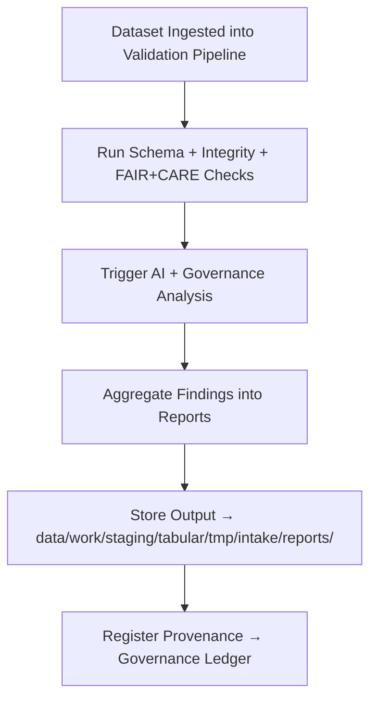

<div align="center">

# 📊 Kansas Frontier Matrix — **Tabular Intake Reports**  
`data/work/staging/tabular/tmp/intake/reports/`

### *“Validation without documentation is just a guess — reporting makes it science.”*

**Purpose:**  
This directory contains the **automated and human-verified reports** generated during the tabular intake validation process within the Kansas Frontier Matrix (KFM).  
Each report aggregates findings from schema checks, checksum verifications, AI anomaly detection, FAIR+CARE audits, and governance scoring, forming the operational backbone of the validation intelligence system.

[](../../../../../../../../../docs/architecture/repo-focus.md)  
[](../../../../../../../../../LICENSE)  
[]()  
[]()  
[]()

</div>

---

## 🧭 Overview

The **Tabular Intake Reports Layer** is the primary reporting hub for all data validation results produced during KFM tabular intake workflows.  
Reports here summarize:
- Schema compliance and failure diagnostics  
- Integrity verification results (checksums, hashes, and diffs)  
- FAIR+CARE ethical scoring and compliance levels  
- AI anomaly detection summaries and metadata drift analysis  
- Curator-led remediation outcomes  

Each report is versioned, checksum-verified, and stored with provenance linkage to ensure **traceable data governance** across the pipeline.

---

## 🗂️ Directory Layout

```text
data/work/staging/tabular/tmp/intake/reports/
├── schema_validation_report.json         # Detailed schema pass/fail logs
├── checksum_validation_report.json       # Integrity verification summary
├── ai_anomaly_report.json                # AI-detected anomalies and outlier clusters
├── faircare_validation_report.json       # FAIR+CARE ethical compliance metrics
├── governance_audit_summary.json         # Overall governance and ledger status
├── remediation_activity_log.json         # Summary of fixes and revalidations applied
├── telemetry_metrics.json                # Performance, timing, and validation throughput
├── validation_summary.csv                # High-level, tabular report overview
└── README.md                             # This document
````

---

## 🔁 Report Generation Workflow



---

## 🧩 Key Report Types

| Report                            | Description                                                         | Output Example                                    |
| --------------------------------- | ------------------------------------------------------------------- | ------------------------------------------------- |
| `schema_validation_report.json`   | Lists all schema validations, errors, and rule conformance results. | `"Missing required field: checksum"`              |
| `checksum_validation_report.json` | Details checksum verification results and mismatch cases.           | `"File ks_population_1890.csv: FAILED"`           |
| `ai_anomaly_report.json`          | AI detection of irregularities, outliers, or drift.                 | `"Detected population density outlier at 9452"`   |
| `faircare_validation_report.json` | FAIR+CARE audit and scoring results.                                | `"FAIR: 0.93, CARE: 0.88"`                        |
| `governance_audit_summary.json`   | Ledger references and audit trail integrity report.                 | `"All 92 datasets linked to ledger successfully"` |
| `remediation_activity_log.json`   | Logs human and AI remediation actions.                              | `"Schema fixed for ks_census_1890"`               |
| `telemetry_metrics.json`          | Pipeline performance metrics for each validation step.              | `"Average validation time: 1.8s"`                 |

---

## 🤖 AI-Generated Insights

| AI Module               | Function                                                                    | Output                            |
| ----------------------- | --------------------------------------------------------------------------- | --------------------------------- |
| **AI Schema Auditor**   | Generates human-readable summaries from raw schema validation logs.         | `schema_validation_report.json`   |
| **Integrity Reasoner**  | Detects checksum anomalies and classifies causes (drift, corruption, edit). | `checksum_validation_report.json` |
| **FAIR+CARE Evaluator** | Scores datasets based on ethical and open-data metrics.                     | `faircare_validation_report.json` |
| **AI Trend Analyzer**   | Identifies recurring error patterns across validation cycles.               | `ai_anomaly_report.json`          |
| **Governance Reporter** | Builds a ledger-linked transparency record.                                 | `governance_audit_summary.json`   |

> 🧠 *All AI-generated reports include interpretability metadata (confidence, explanation tokens, and provenance lineage) compliant with MCP-DL v6.3.*

---

## ⚙️ Curator Workflow

Curators and auditors should:

1. Review all validation reports for schema, checksum, and ethical compliance.
2. Address high-priority anomalies in the corresponding remediation layer.
3. Cross-reference FAIR+CARE metrics with governance audit records.
4. Log review notes and corrective actions in `remediation_activity_log.json`.
5. Update governance ledgers using:

   ```bash
   make governance-update
   ```

---

## 📈 Reporting Metrics Overview

| Metric                         | Description                              | Target |
| ------------------------------ | ---------------------------------------- | ------ |
| **Schema Pass Rate**           | % of datasets fully schema-compliant     | ≥ 95%  |
| **Integrity Pass Rate**        | % of files checksum-verified             | 100%   |
| **FAIR+CARE Compliance Score** | Weighted ethical data score              | ≥ 0.90 |
| **AI Anomaly Recall**          | Rate of true positive anomalies          | ≥ 0.85 |
| **Remediation Closure Rate**   | % of successfully fixed flagged datasets | ≥ 0.98 |

---

## 🧾 Compliance Matrix

| Standard               | Scope                                       | Validator       |
| ---------------------- | ------------------------------------------- | --------------- |
| **FAIR+CARE**          | Ethical and open-data governance            | `fair-audit`    |
| **MCP-DL v6.3**        | Documentation-first validation logging      | `docs-validate` |
| **CIDOC CRM / PROV-O** | Provenance tracking of validation processes | `graph-lint`    |
| **ISO 19115 / 19157**  | Metadata and data quality metrics           | `geojson-lint`  |
| **STAC / DCAT 3.0**    | Standardized metadata reporting             | `stac-validate` |

---

## 🪶 Version History

| Version | Date       | Author              | Notes                                                                                              |
| ------- | ---------- | ------------------- | -------------------------------------------------------------------------------------------------- |
| v9.0.0  | 2025-10-26 | `@kfm-architecture` | Initial creation of Tabular Intake Reports documentation under Diamond⁹ Ω / Crown∞Ω certification. |

---

<div align="center">

### 🜂 Kansas Frontier Matrix — *Transparency · Reporting · Trust*

**“Validation ends where governance begins — and reports are the bridge.”**

[]()
[]()
[]()
[]()

<br><br> <a href="#-kansas-frontier-matrix--tabular-intake-reports-validation-intelligence-layer--diamond⁹-Ω--crown∞Ω-certified">⬆ Back to Top</a>

</div>
