<div align="center">

# 🧪 Kansas Frontier Matrix — **Tabular Intake Validation TMP Layer**  
`data/work/staging/tabular/tmp/intake/validation/`

### *“Where data earns its verification seal before becoming part of the Matrix.”*

**Purpose:**  
The **Validation TMP Layer** is the **secondary verification stage** following Intake TMP.  
It performs schema conformance checks, checksum confirmation, and FAIR+CARE audits before final normalization.  
This stage enforces reproducibility and compliance across all tabular datasets under the **Kansas Frontier Matrix (KFM)** pipeline.

[](../../../../../../../docs/architecture/repo-focus.md)
[](../../../../../../../LICENSE)
[]()
[]()
[]()
[]()

</div>

---

## 🧭 Overview

The **Validation TMP Layer** serves as a **transitional workspace** between dataset intake and normalization.  
Here, datasets that passed initial checks undergo deeper schema, ontology, and integrity validation before promotion.

Each dataset in this directory is:
- Fully schema-validated against `schemas/tabular-intake-v13.json`
- Verified for checksum consistency (cross-check against `/checksums/manifest.json`)
- Assessed via FAIR+CARE ethical audit
- Evaluated for ontology compliance (STAC/DCAT/CIDOC CRM)
- Logged in the **Tabular Intake Governance Ledger**

Only datasets that achieve **full validation success** advance to  
`data/work/staging/tabular/normalized/`.

---

## 🗂️ Directory Layout

```plaintext
data/work/staging/tabular/tmp/intake/validation/
├── incoming/               # Datasets copied from intake after preliminary checks
├── reports/                # FAIR+CARE & validation audit results
├── logs/                   # Detailed schema, checksum, and FAIR+CARE logs
├── schemas/                # JSON Schema references used in validation
├── quarantine/             # Failing datasets held for re-validation
└── README.md               # This document
````

---

## ⚙️ Workflow Summary

```mermaid
flowchart TD
    A["📥 Intake TMP Layer"] --> B["🧪 Validation TMP Layer"]
    B --> C["🧾 Schema & Ontology Validation\n(STAC/DCAT/CIDOC)"]
    C --> D["🔒 Checksum & Integrity Verification"]
    D --> E["🌍 FAIR+CARE Audit & Ethical Review"]
    E --> F{"Pass All Checks?"}
    F -->|✅ Yes| G["📊 Promotion to Normalized Datasets"]
    F -->|❌ No| H["🚨 Quarantine & Curator Review"]
    G --> I["🏛 Governance Ledger Registration"]
    H --> I
```



---

## 🧾 Validation Protocol

| Phase                           | Description                                        | Validator / Schema                | Output                                    |
| ------------------------------- | -------------------------------------------------- | --------------------------------- | ----------------------------------------- |
| **1️⃣ Schema Validation**       | Ensures dataset matches the tabular intake schema  | `schemas/tabular-intake-v13.json` | `/logs/validation/*.jsonl`                |
| **2️⃣ Ontology Validation**     | Validates alignment with STAC/DCAT/CIDOC CRM       | `graph-lint`, `stac-validate`     | `/reports/ontology/*.json`                |
| **3️⃣ Checksum Verification**   | Confirms SHA-256 integrity of source files         | `make checksums`                  | `/reports/checksums/*.json`               |
| **4️⃣ FAIR+CARE Review**        | Checks ethical, licensing, and metadata compliance | `fair-audit.yml`                  | `/reports/faircare/*.json`                |
| **5️⃣ Provenance Confirmation** | Appends results to ledger and telemetry            | `ledger-update.py`                | `governance/tabular_intake_ledger.jsonld` |

---

## 🧪 Example Validation Report

**File:** `reports/validation_ks_hydro_1874.json`

```json
{
  "dataset": "ks_hydro_1874",
  "schema_validation": "passed",
  "ontology_alignment": "passed",
  "checksum_verified": true,
  "faircare_score": 1.0,
  "issues": [],
  "timestamp": "2025-10-26T14:15:42Z",
  "validated_by": "auto-etl",
  "ledger_ref": "governance/tabular_intake_ledger.jsonld#ks_hydro_1874"
}
```

---

## 🧩 Validation Rules

| Validation Type | Requirement                             | Failure Action                  |
| --------------- | --------------------------------------- | ------------------------------- |
| **Schema**      | Must match all schema keys & data types | Move to `quarantine/`           |
| **Checksum**    | Must match manifest entry               | Auto-halt and log error         |
| **Ontology**    | STAC/DCAT/CIDOC alignment required      | Flag for manual curation        |
| **FAIR+CARE**   | Score ≥ 0.9 in all categories           | Quarantine until corrected      |
| **Provenance**  | Entry must exist in ledger              | Add or resync provenance record |

---

## 🧮 Common Commands

```bash
# Run all validation stages
make validate-tabular

# Validate a single dataset
make validate-tabular dataset=ks_hydro_1874

# Check FAIR+CARE report
cat reports/faircare/ks_hydro_1874.json | jq '.'

# Review ontology results
cat reports/ontology/ks_hydro_1874.json | jq '.'

# Move failing datasets to quarantine
make quarantine dataset=ks_hydro_1874
```

---

## 🧯 Troubleshooting

| Error                        | Description                          | Resolution                                    |
| ---------------------------- | ------------------------------------ | --------------------------------------------- |
| **Schema mismatch**          | Column or type deviation from schema | Update `.meta.json` or schema file            |
| **Checksum failure**         | File altered post-intake             | Recalculate hash and revalidate               |
| **Ontology alignment error** | Missing CIDOC entity link            | Fix or enrich metadata mapping                |
| **FAIR+CARE fail**           | Missing license or citation          | Add SPDX license and citation in `.meta.json` |
| **Ledger sync error**        | Governance record missing            | Run `make sync-ledger`                        |

---

## 🧾 Governance Ledger Entry

After successful validation, a ledger record is appended to
`governance/tabular_intake_ledger.jsonld`:

```json
{
  "dataset": "ks_hydro_1874",
  "stage": "validation",
  "checksum": "4c4925bbf65b9e1a5f8e7f0b67d7b5e9a8a8a2c1c7f7a0f0...",
  "faircare_score": 1.0,
  "validator": "stac-validate + fair-audit",
  "status": "passed",
  "timestamp": "2025-10-26T14:15:42Z"
}
```

---

## ☑️ Validation Checklist

* [x] STAC/DCAT schema compliance validated
* [x] CIDOC CRM ontology mapping confirmed
* [x] FAIR+CARE ethical review passed
* [x] SHA-256 checksums verified
* [x] Ledger entry appended and cross-checked
* [x] Telemetry status = `green`

---

## 🪶 Version History

| Version    | Date       | Author              | Notes                                                                                |
| ---------- | ---------- | ------------------- | ------------------------------------------------------------------------------------ |
| **v9.0.1** | 2025-10-26 | `@kfm-architecture` | Initial release — adds validation flow, FAIR+CARE rules, and governance ledger sync. |

---

<div align="center">

### 🜂 Kansas Frontier Matrix — *Validation · Transparency · Trust*

**“Every dataset must be tested by fire before entering history.”**

[]()
[]()
[]()
[]()

[⬆ Back to Top](#-kansas-frontier-matrix--tabular-intake-validation-tmp-layer)

</div>
```

