<div align="center">

# 📦 Kansas Frontier Matrix — **Validation Incoming Directory**  
`data/work/staging/tabular/tmp/intake/validation/incoming/`

### *“The checkpoint before truth — where data prepares for final validation.”*

**Purpose:**  
The **Validation Incoming Directory** holds datasets that have **passed Intake TMP checks** and are awaiting **deep validation** under schema, checksum, ontology, and FAIR+CARE rules.  
It serves as the transfer staging area between the *intake* and *validation* layers, ensuring orderly promotion of verified tabular datasets.

[](../../../../../../../../../docs/architecture/repo-focus.md)
[](../../../../../../../../../LICENSE)
[]()
[]()
[]()

</div>

---

## 🧭 Overview

Datasets placed in this directory have successfully completed:
- Initial schema validation (STAC/DCAT/CIDOC compliance)
- Checksum and integrity verification (SHA-256)
- AI-assisted anomaly detection
- FAIR+CARE ethical review  
and are now **ready for deep validation** using extended ontology, metadata, and cross-dataset checks.

Once validation completes successfully, datasets are moved to:  
`data/work/staging/tabular/normalized/`

---

## 🗂️ Directory Layout

```plaintext
data/work/staging/tabular/tmp/intake/validation/incoming/
├── <dataset_id>/                   # Each validated dataset package
│   ├── <dataset_id>.csv|.json      # Primary tabular data file
│   ├── <dataset_id>.meta.json      # Metadata schema reference
│   ├── LICENSE.txt                 # SPDX license file
│   ├── validation.log.jsonl        # Automated validation trace
│   └── checksums.json              # Checksum manifest (SHA-256)
└── README.md                       # This document
````

---

## ⚙️ Workflow Summary

```mermaid
flowchart TD
    A["📥 Intake TMP Directory"] --> B["📦 Validation Incoming"]
    B --> C["🧾 Deep Schema Validation"]
    C --> D["🔒 Checksum & Integrity Verification"]
    D --> E["🌍 FAIR+CARE & Ontology Audit"]
    E --> F{"Pass All Validation Checks?"}
    F -->|✅ Yes| G["📊 Promote to Normalized Datasets"]
    F -->|❌ No| H["🚨 Move to Quarantine for Curation"]
```



---

## 🧾 Dataset Requirements

| Field            | Description                     | Requirement          |
| ---------------- | ------------------------------- | -------------------- |
| `source_id`      | Unique dataset identifier       | Required             |
| `origin_url`     | Publicly accessible URL         | Required             |
| `license`        | SPDX-compatible license         | Required             |
| `checksum`       | SHA-256 digest of data file     | Required             |
| `schema_version` | KFM schema compliance reference | `tabular-intake-v13` |
| `date_format`    | ISO-8601 date string            | `YYYY-MM-DD`         |
| `encoding`       | Character encoding              | UTF-8                |
| `provenance`     | Source, contributor, curator    | Required             |

> 🧩 *Datasets missing metadata or checksum manifests will be quarantined automatically.*

---

## 🧩 Validation Steps Executed Here

| Stage                      | Validator / Tool              | Output                                    |
| -------------------------- | ----------------------------- | ----------------------------------------- |
| **Schema Validation**      | `jsonschema-cli`              | `validation.log.jsonl`                    |
| **Checksum Confirmation**  | `make checksums`              | `checksums.json`                          |
| **Ontology Validation**    | `stac-validate`, `graph-lint` | `/reports/ontology/*.json`                |
| **FAIR+CARE Audit**        | `fair-audit.yml`              | `/reports/faircare/*.json`                |
| **Provenance Ledger Sync** | `ledger-update.py`            | `governance/tabular_intake_ledger.jsonld` |

---

## 🧠 Example Dataset Package

**Folder:** `ks_hydro_1874/`

```plaintext
ks_hydro_1874/
├── ks_hydro_1874.csv
├── ks_hydro_1874.meta.json
├── LICENSE.txt
├── checksums.json
└── validation.log.jsonl
```

**`ks_hydro_1874.meta.json` Example:**

```json
{
  "source_id": "ks_hydro_1874",
  "origin_url": "https://archive.ks.gov/hydro/1874.csv",
  "license": "CC-BY-4.0",
  "schema_version": "tabular-intake-v13",
  "checksum": "4c4925bbf65b9e1a5f8e7f0b67d7b5e9a8a8a2c1c7f7a0f0...",
  "received_by": "etl-batch-2025-10",
  "curator": "@kfm-etl"
}
```

**`checksums.json` Example:**

```json
{
  "dataset": "ks_hydro_1874",
  "files": [
    {
      "file": "ks_hydro_1874.csv",
      "sha256": "4c4925bbf65b9e1a5f8e7f0b67d7b5e9a8a8a2c1c7f7a0f0..."
    }
  ],
  "generated_at": "2025-10-26T14:20:33Z"
}
```

---

## 🧮 Commands

```bash
# Move validated datasets into this directory
make promote-intake-to-validation

# Run deep validation checks
make validate-tabular

# Check validation reports
cat validation.log.jsonl | jq '.status'

# Re-run FAIR+CARE audits if required
make fair-report dataset=ks_hydro_1874
```

---

## 🧯 Troubleshooting

| Issue                 | Cause                                | Resolution                                 |
| --------------------- | ------------------------------------ | ------------------------------------------ |
| **Missing meta.json** | Intake dataset missing metadata file | Add or regenerate metadata and re-ingest   |
| **Checksum mismatch** | File modified after intake           | Recompute checksum and revalidate          |
| **FAIR+CARE fail**    | Missing license or citation          | Update metadata and re-run FAIR+CARE audit |
| **Ontology error**    | CIDOC or STAC inconsistency          | Correct mapping and rerun `graph-lint`     |
| **No ledger entry**   | Sync failure                         | Execute `make sync-ledger` manually        |

---

## 🧾 Governance Record Example

Validated datasets from this directory append to the **Tabular Intake Provenance Ledger**:

```json
{
  "dataset": "ks_hydro_1874",
  "stage": "validation-incoming",
  "checksum": "4c4925bbf65b9e1a5f8e7f0b67d7b5e9a8a8a2c1c7f7a0f0...",
  "status": "pending-validation",
  "timestamp": "2025-10-26T14:20:33Z",
  "linked_logs": [
    "logs/validation/validate-ks_hydro_1874.jsonl",
    "logs/faircare/faircare-audit-ks_hydro_1874.jsonl"
  ]
}
```

---

## ☑️ Validation Readiness Checklist

* [x] Metadata schema complete
* [x] Checksum verified
* [x] FAIR+CARE audit passed ≥ 0.9 score
* [x] No ontology errors detected
* [x] Governance record appended
* [x] Curator sign-off logged

---

## 🪶 Version History

| Version    | Date       | Author              | Notes                                                                           |
| ---------- | ---------- | ------------------- | ------------------------------------------------------------------------------- |
| **v9.0.1** | 2025-10-26 | `@kfm-architecture` | Initial release — defines directory purpose, workflow, and validation contract. |

---

<div align="center">

### 🜂 Kansas Frontier Matrix — *Verification · Provenance · Promotion*

**“Every dataset must be tested twice before it can speak.”**

[]()
[]()
[]()
[]()

[⬆ Back to Top](#-kansas-frontier-matrix--validation-incoming-directory)

</div>
```

