<div align="center">

# 🧾 Kansas Frontier Matrix — **Validation Logs Directory**  
`data/work/staging/tabular/tmp/intake/validation/logs/`

### *“Every verification leaves a trail — transparency is the highest form of trust.”*

**Purpose:**  
This directory contains **structured JSONL logs** generated during the **Validation TMP** process of the Kansas Frontier Matrix (KFM).  
Logs record every schema check, checksum confirmation, FAIR+CARE audit, and ontology validation event for tabular datasets promoted from the Intake TMP layer.

[](../../../../../../../../../docs/architecture/repo-focus.md)
[](../../../../../../../../../LICENSE)
[]()
[]()
[]()

</div>

---

## 🧭 Overview

The **Validation Logs Directory** serves as the authoritative record of all automated validation operations executed on incoming datasets.  
Each log line represents a verifiable event — capturing *who*, *when*, *what*, and *how* a dataset was validated.

Logs are:
- Generated automatically by the `make validate-tabular` workflow.  
- Formatted as **JSONL (JSON Lines)** for machine parsing and human review.  
- Hash-tracked and linked to the **Audit Ledger** for provenance traceability.  
- Used to generate the **Validation Reports** stored under `validation/reports/`.  

---

## 🗂️ Directory Layout

```plaintext
data/work/staging/tabular/tmp/intake/validation/logs/
├── schema/                        # Schema and STAC/DCAT validation logs
│   ├── validate-schema-ks_hydro_1874.jsonl
│   └── validate-schema-ks_population_1890.jsonl
├── checksums/                     # Checksum verification logs
│   ├── validate-checksums-ks_hydro_1874.jsonl
│   └── validate-checksums-ks_population_1890.jsonl
├── ontology/                      # CIDOC CRM + OWL-Time validation logs
│   ├── validate-ontology-ks_hydro_1874.jsonl
│   └── validate-ontology-ks_population_1890.jsonl
├── faircare/                      # FAIR+CARE audit logs
│   ├── validate-faircare-ks_hydro_1874.jsonl
│   └── validate-faircare-ks_population_1890.jsonl
├── validation-batch-2025-10-26.log  # Combined batch log for the day
└── README.md                      # This document
````

---

## 🧱 Log Schema

Each log line conforms to the **KFM Validation Log Schema v3.0**, ensuring consistency across automation systems.

```json
{
  "timestamp": "2025-10-26T14:31:45Z",
  "dataset": "ks_hydro_1874",
  "validator": "stac-validate",
  "stage": "schema",
  "component": "jsonschema-cli",
  "schema_version": "tabular-intake-v13",
  "message": "Schema validation completed successfully.",
  "status": "passed",
  "duration_ms": 1832,
  "checksum_verified": true,
  "faircare_score": 1.0,
  "ai_confidence": 0.98,
  "trace_id": "dfb21a18-ec1c-4dc7-9e5d-4a7b74c19e6b",
  "run_id": "validate-2025-10-26-1431Z"
}
```

---

## ⚙️ Validation Log Categories

| Folder         | Purpose                                                        | Typical Contents             |
| -------------- | -------------------------------------------------------------- | ---------------------------- |
| **schema/**    | STAC/DCAT schema and CIDOC structure validation logs           | `validate-schema-*.jsonl`    |
| **checksums/** | SHA-256 integrity verification                                 | `validate-checksums-*.jsonl` |
| **ontology/**  | Semantic and temporal consistency tests (CIDOC CRM / OWL-Time) | `validate-ontology-*.jsonl`  |
| **faircare/**  | Ethical and accessibility verification logs                    | `validate-faircare-*.jsonl`  |

---

## 🧪 Example Validation Logs

**File:** `schema/validate-schema-ks_hydro_1874.jsonl`

```json
{"timestamp":"2025-10-26T14:31:45Z","dataset":"ks_hydro_1874","validator":"stac-validate","stage":"schema","message":"STAC/DCAT schema validated successfully.","status":"passed"}
{"timestamp":"2025-10-26T14:31:46Z","dataset":"ks_hydro_1874","validator":"jsonschema-cli","stage":"schema","message":"All required fields present.","status":"passed"}
```

**File:** `checksums/validate-checksums-ks_hydro_1874.jsonl`

```json
{"timestamp":"2025-10-26T14:31:52Z","dataset":"ks_hydro_1874","validator":"checksum","stage":"checksums","message":"SHA-256 hash matched manifest entry.","status":"passed"}
```

**File:** `faircare/validate-faircare-ks_hydro_1874.jsonl`

```json
{"timestamp":"2025-10-26T14:32:10Z","dataset":"ks_hydro_1874","validator":"fair-audit","stage":"faircare","message":"FAIR+CARE compliance verified: score=1.0.","status":"passed"}
```

---

## 🧩 Validation Workflow Context

```mermaid
flowchart TD
    A["📥 Intake TMP Dataset"] --> B["🧪 Validation TMP Layer"]
    B --> C["🧾 Schema Validation Logs"]
    C --> D["🔒 Checksum Verification Logs"]
    D --> E["🌍 FAIR+CARE Audit Logs"]
    E --> F["🧩 Ontology Compliance Logs"]
    F --> G["📜 Consolidated Validation Reports"]
    G --> H["🏛 Governance Ledger"]
```



---

## 🧮 Common Commands

```bash
# Run full validation logging process
make validate-tabular

# Run validation logs for a single dataset
make validate-tabular dataset=ks_hydro_1874

# Merge all validation logs into one batch report
make merge-validation-logs

# Filter failed validation events
grep '"status":"failed"' logs/**/*.jsonl
```

---

## 🧠 Best Practices

* **Atomic Logging:** Each stage produces an isolated log file for modular traceability.
* **Chronological Order:** Logs are timestamped in UTC for reproducibility across environments.
* **Linked Provenance:** Each log references its ledger and telemetry IDs.
* **Retention Policy:** Logs are archived quarterly to `/archive/validation/logs/`.
* **PII-Free:** Validation logs must never store sensitive data.

---

## 🧾 Governance Integration

Each dataset validated at this stage is registered in the **Provenance Ledger** with its corresponding log files:

```json
{
  "dataset": "ks_hydro_1874",
  "validation_logs": [
    "logs/schema/validate-schema-ks_hydro_1874.jsonl",
    "logs/checksums/validate-checksums-ks_hydro_1874.jsonl",
    "logs/faircare/validate-faircare-ks_hydro_1874.jsonl",
    "logs/ontology/validate-ontology-ks_hydro_1874.jsonl"
  ],
  "status": "validated",
  "timestamp": "2025-10-26T14:33:10Z"
}
```

---

## ☑️ Quality Checklist

* [x] All schema and checksum logs generated
* [x] FAIR+CARE compliance ≥ 0.9
* [x] No errors or missing log files
* [x] Ledger updated with references
* [x] Telemetry recorded for audit trace

---

## 🧯 Troubleshooting

| Symptom                     | Likely Cause                   | Resolution                                             |
| --------------------------- | ------------------------------ | ------------------------------------------------------ |
| **Missing validation log**  | Validation skipped or crashed  | Rerun `make validate-tabular`                          |
| **Checksum mismatch**       | File modified post-intake      | Regenerate manifest and revalidate                     |
| **FAIR+CARE score too low** | Missing license or metadata    | Update `.meta.json` and rerun `fair-audit`             |
| **Ontology mismatch**       | Schema not mapped to CIDOC CRM | Review `validate-ontology-*.jsonl` for missing classes |

---

## 🪶 Version History

| Version    | Date       | Author              | Notes                                                          |
| ---------- | ---------- | ------------------- | -------------------------------------------------------------- |
| **v9.0.1** | 2025-10-26 | `@kfm-architecture` | Initial release — defines validation log schema and structure. |

---

<div align="center">

### 🜂 Kansas Frontier Matrix — *Verification · Transparency · Provenance*

**“If it’s verified, it’s logged — and if it’s logged, it can be trusted.”**

[]()
[]()
[]()
[]()

[⬆ Back to Top](#-kansas-frontier-matrix--validation-logs-directory)

</div>
```

