<div align="center">

# 🔐 Kansas Frontier Matrix — **Validation Log Checksums & Integrity Manifest**  
`data/work/staging/tabular/tmp/intake/validation/logs/checksums/`

### *“Integrity is not optional — it’s mathematically proven.”*  

**Purpose:** This directory stores cryptographic digests and integrity manifests for all validation log files generated in the Tabular Intake TMP Layer.  
It guarantees that every log entry, checksum, and report within the staging process is **immutable, verifiable, and reproducible**.

[](../../../../../../../../../../../docs/architecture/repo-focus.md)  
[](../../../../../../../../../../../LICENSE)  
[]()  
[]()  
[]()

</div>

---

## 🧭 Overview

The **Validation Log Checksums** layer provides cryptographic assurance for every log, validation record, and AI audit output under `data/work/staging/tabular/tmp/intake/validation/logs/`.  
It uses **SHA-256** as the canonical hashing algorithm (FIPS-180-4 compliant) and maintains an **append-only manifest** that records each checksum, its origin file, and metadata context.

Each checksum entry includes:
- File name and relative path  
- Hash value (hex-encoded)  
- Verification status (true/false)  
- Timestamp of generation  
- Link to parent validation event  

All integrity data is stored in **JSON**, **CSV**, and **plain-log** formats for machine and human auditability.

---

## 🗂️ Directory Layout

```text
data/work/staging/tabular/tmp/intake/validation/logs/checksums/
├── manifest.json                  # Master ledger of SHA-256 checksums for all logs
├── checksum_verification.log      # Verification results for each file
├── integrity_snapshot.csv         # Compact CSV of hash & verification pairs
├── ai_integrity_audit.json        # AI-verified anomaly detection on checksum set
├── ledger_ref.json                # Pointer map to upstream governance ledger
└── README.md                      # This document
````

---

## 🔁 Checksum Validation Workflow

```mermaid
flowchart TD
    A["Validation Logs (JSON / CSV / LOG)"] --> B["Compute SHA-256 Digest"]
    B --> C["Record in manifest.json"]
    C --> D["Verify Existing Hashes (Checksum Audit)"]
    D --> E["FAIR+CARE Integrity Review"]
    E --> F["Ledger Sync → governance/tabular_intake_ledger.jsonld"]
```



---

## ⚙️ Specification

| Parameter             | Description                               | Example                                             |
| --------------------- | ----------------------------------------- | --------------------------------------------------- |
| **Algorithm**         | SHA-256 (FIPS 180-4)                      | `2c26b46b68ffc68ff99b453c1d30413413422f1640a49d...` |
| **Digest Encoding**   | Hexadecimal                               | `hex`                                               |
| **Storage Formats**   | JSON, CSV                                 | `manifest.json`, `integrity_snapshot.csv`           |
| **Verification Tool** | `make checksums-verify`                   | `/reports/audit/log_checksums_audit.json`           |
| **Trigger**           | Post-validation completion hook           | Executed after every schema validation cycle        |
| **Ledger Reference**  | `governance/tabular_intake_ledger.jsonld` | JSON-LD trace entry                                 |

> 💡 Each checksum entry also contains a **`checksum_origin`** key that links to the originating schema validation report, ensuring deterministic traceability.

---

## 📘 Manifest Example

```json
{
  "timestamp": "2025-10-26T14:03:22Z",
  "algorithm": "SHA-256",
  "entries": [
    {
      "file": "validation_summary.log",
      "checksum": "c21c4f3bda994d6f5c7bbd1378d35c89b83c21fa31a6aeb94f0dbdb70cf857f7",
      "verified": true
    },
    {
      "file": "ai_anomaly_report.json",
      "checksum": "b7dd98572f54f4456c6a1b2ee0efc4ad61a6cc7157b66ad322b27ce8c3a1aab8",
      "verified": true
    }
  ]
}
```

---

## 🤖 AI Integrity Audit

An **AI monitor** (`src/nlp/ai_integrity_monitor.py`) performs cross-validation on hash sets to:

* Detect mismatched digests or partial updates
* Identify regenerated logs without manifest updates
* Cross-check temporal integrity (timestamps drift)

Results are stored in:
`reports/audit/log_checksums_audit.json`

---

## 🔒 Common Commands

```bash
# Generate checksum manifest
make checksums-update

# Verify all checksum entries
make checksums-verify

# Run AI integrity audit
make ai-checksum-audit
```

Logs are automatically appended to `checksum_verification.log` and summarized in `integrity_snapshot.csv`.

---

## 🧾 Compliance Matrix

| Standard                | Alignment                               | Validator               |
| ----------------------- | --------------------------------------- | ----------------------- |
| **ISO/IEC 10118-3**     | Secure hash algorithm compliance        | Internal FIPS validator |
| **MCP-DL v6.3**         | Documentation-first checksum governance | `docs-validate`         |
| **FAIR+CARE**           | Ethical audit trail & transparency      | `fair-audit`            |
| **STAC 1.0 / DCAT 3.0** | Metadata linkage                        | `stac-validate`         |

---

## 🪶 Version History

| Version | Date       | Author              | Notes                                                                                                       |
| ------- | ---------- | ------------------- | ----------------------------------------------------------------------------------------------------------- |
| v9.0.0  | 2025-10-26 | `@kfm-architecture` | Initial creation of log-checksum integrity manifest documentation under Diamond⁹ Ω / Crown∞Ω certification. |

---

<div align="center">

### 🜂 Kansas Frontier Matrix — *Integrity · Verification · Transparency*

**“A ledger of trust — one hash at a time.”**

[]()
[]()
[]()
[]()
[]()

<br><br> <a href="#-kansas-frontier-matrix--validation-log-checksums--integrity-manifest-diamond⁹-Ω--crown∞Ω-certified">⬆ Back to Top</a>

</div>
```

