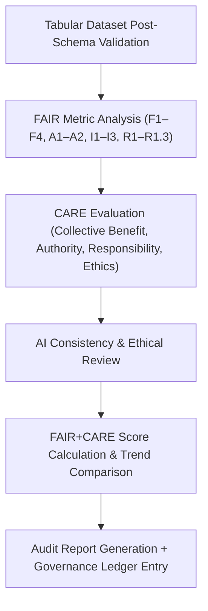

<div align="center">

# 🌍 Kansas Frontier Matrix — **FAIR+CARE Validation Logs**  
`data/work/staging/tabular/tmp/intake/validation/logs/faircare/`

### *“Good data is not just open — it’s ethical, accessible, and accountable.”*

**Purpose:** This directory archives the **FAIR (Findable, Accessible, Interoperable, Reusable)** and **CARE (Collective Benefit, Authority, Responsibility, Ethics)** validation logs generated for tabular datasets within the KFM pipeline.  
These validation outputs ensure each dataset aligns with open science, reproducibility, and responsible data governance standards.

[](../../../../../../../../../../../docs/architecture/repo-focus.md)  
[](../../../../../../../../../../../LICENSE)  
[]()  
[]()  
[]()

</div>

---

## 🧭 Overview

The **FAIR+CARE Validation Logs** document how tabular datasets within KFM conform to both open-data and ethical data frameworks.  
Validation runs assess metadata completeness, accessibility, interoperability across systems, reuse conditions, and cultural/ethical considerations tied to Kansas Frontier historical and ecological data.

Each validation run generates reports detailing:
- ✅ **FAIR metrics** (findability, accessibility, interoperability, reusability)
- 🕊️ **CARE metrics** (collective benefit, authority to control, responsibility, ethics)
- 🤖 **AI-based ethical consistency checks**
- 🔍 **Score evolution and improvement tracking**  

---

## 🗂️ Directory Layout

```text
data/work/staging/tabular/tmp/intake/validation/logs/faircare/
├── faircare_validation_report.json     # Combined FAIR+CARE metric results
├── ai_ethics_audit.json                # AI-driven CARE/ethics assessment output
├── faircare_scorecard.csv              # CSV summary of individual metric scores
├── faircare_trend.json                 # Temporal improvement data across validation runs
├── faircare_context.log                # Human-readable context & explanations
└── README.md                           # This document
````

---

## 🔁 FAIR+CARE Evaluation Workflow



---

## ⚙️ Metric Framework

### 🧩 FAIR Principles

| ID | Principle     | Metric                 | Description                                    |
| -- | ------------- | ---------------------- | ---------------------------------------------- |
| F1 | Findable      | Metadata completeness  | Uses persistent identifiers (e.g. DOI, UUID)   |
| A1 | Accessible    | Machine & human access | Open HTTP/HTTPS or public API                  |
| I1 | Interoperable | Schema alignment       | Conforms to open standards (STAC/DCAT/GeoJSON) |
| R1 | Reusable      | Licensing & provenance | Includes license + detailed provenance logs    |

### 🌱 CARE Principles

| ID | Principle            | Metric                    | Description                                     |
| -- | -------------------- | ------------------------- | ----------------------------------------------- |
| C1 | Collective Benefit   | Benefit index             | Dataset benefits local & indigenous communities |
| A2 | Authority to Control | Governance alignment      | Data managed under appropriate authority        |
| R2 | Responsibility       | Accountability compliance | Includes stewardship and citation requirements  |
| E3 | Ethics               | Cultural sensitivity      | Respects community guidelines and consent       |

---

## 🤖 AI Integration

| Module                | Function                                                                        | Output                 |
| --------------------- | ------------------------------------------------------------------------------- | ---------------------- |
| **AI FAIR Auditor**   | Uses LLMs to cross-check documentation for FAIR compliance gaps                 | `ai_fair_audit.json`   |
| **AI CARE Evaluator** | Scans datasets for ethical metadata alignment (e.g. tribal references, consent) | `ai_ethics_audit.json` |
| **Trend Analyzer**    | Evaluates historical performance of FAIR+CARE metrics                           | `faircare_trend.json`  |

The **AI ethics pipeline** (`src/nlp/ai_faircare_monitor.py`) runs during each validation cycle and appends to the governance ledger.

---

## 📈 FAIR+CARE Scoring

| Metric                        | Weight | Example                                     | Scoring |
| ----------------------------- | ------ | ------------------------------------------- | ------- |
| **FAIR Score**                | 0.6    | Based on schema compliance, accessibility   | 0.91    |
| **CARE Score**                | 0.4    | Based on governance, responsibility, ethics | 0.88    |
| **Composite FAIR+CARE Index** | —      | Weighted combined score                     | 0.90 ✅  |

> 📊 *Scores above 0.85 indicate full compliance with KFM’s FAIR+CARE policy thresholds.*

---

## 📜 Example Report (Excerpt)

```json
{
  "run_id": "2025-10-26_13-45-00",
  "fair": {
    "score": 0.91,
    "strengths": ["Metadata complete", "Accessible via open API"],
    "improvements": ["Add PID registry entry"]
  },
  "care": {
    "score": 0.88,
    "strengths": ["Strong ethical provenance", "Community benefit noted"],
    "improvements": ["Clarify authority control statement"]
  },
  "ai_review": {
    "flags": 1,
    "confidence": 0.97,
    "notes": "Minor ambiguity in license provenance section."
  },
  "timestamp": "2025-10-26T13:45:12Z"
}
```

---

## 🧾 Compliance Matrix

| Standard                                              | Scope                               | Validator        |
| ----------------------------------------------------- | ----------------------------------- | ---------------- |
| **FAIR Principles (GO-FAIR)**                         | Open data stewardship               | `fair-audit`     |
| **CARE Principles (Global Indigenous Data Alliance)** | Ethical governance                  | `faircare-audit` |
| **MCP-DL v6.3**                                       | Documentation-first reproducibility | `docs-validate`  |
| **STAC / DCAT**                                       | Metadata structure & persistence    | `stac-validate`  |

---

## ⚙️ Commands

```bash
# Run FAIR+CARE validation
make validate-faircare

# Generate FAIR+CARE summary scorecard
make faircare-summary

# Run AI ethics audit
make ai-faircare-audit
```

All outputs are version-controlled and automatically registered in the **governance ledger** for audit traceability.

---

## 🪶 Version History

| Version | Date       | Author              | Notes                                                                                         |
| ------- | ---------- | ------------------- | --------------------------------------------------------------------------------------------- |
| v9.0.0  | 2025-10-26 | `@kfm-architecture` | Initial creation of FAIR+CARE Validation Logs documentation (Diamond⁹ Ω / Crown∞Ω Certified). |

---

<div align="center">

### 🜂 Kansas Frontier Matrix — *Ethics · Openness · Stewardship*

**“Data is only truly open when it’s responsibly shared.”**

[]()
[]()
[]()
[]()
[]()

<br><br> <a href="#-kansas-frontier-matrix--faircare-validation-logs-diamond⁹-Ω--crown∞Ω-certified">⬆ Back to Top</a>

</div>
```

