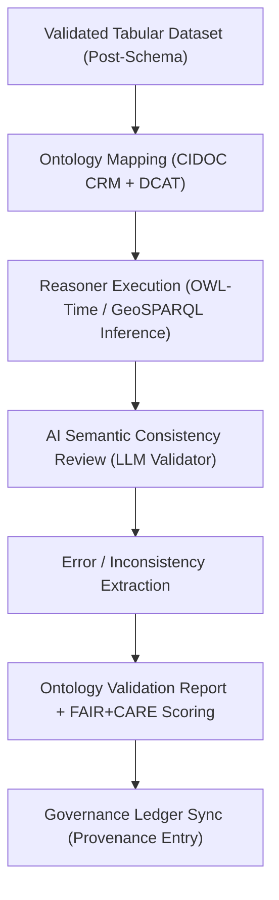

<div align="center">

# 🧬 Kansas Frontier Matrix — **Ontology Validation Logs**  
`data/work/staging/tabular/tmp/intake/validation/logs/ontology/`

### *“Where meaning meets structure — ensuring the language of data stays consistent.”*  

**Purpose:** This directory archives **semantic validation reports and ontology alignment logs** generated during tabular data processing.  
Each validation ensures that all datasets conform to **CIDOC CRM**, **OWL-Time**, and **DCAT** semantic standards for historical and scientific interoperability.

[](../../../../../../../../../../../docs/architecture/repo-focus.md)  
[](../../../../../../../../../../../LICENSE)  
[]()  
[]()  
[]()

</div>

---

## 🧭 Overview

The **Ontology Validation Logs** layer ensures that KFM’s tabular datasets maintain **semantic integrity and logical consistency** when integrated into the knowledge graph.  
It cross-checks dataset entities, predicates, and relationships against KFM’s semantic frameworks — including **CIDOC CRM**, **OWL-Time**, **PROV-O**, and **GeoSPARQL**.

Validation combines **rule-based reasoning** with **AI-assisted semantic inference** to identify mismatches, missing types, or inconsistent relationships.

---

## 🗂️ Directory Layout

```text
data/work/staging/tabular/tmp/intake/validation/logs/ontology/
├── ontology_validation_report.json        # Detailed semantic validation results
├── alignment_summary.json                 # Crosswalk to CIDOC CRM / OWL-Time / DCAT
├── ai_semantic_audit.json                 # AI-assisted ontology reasoning output
├── reasoning_trace.log                    # Human-readable reasoning chain log
├── inconsistent_triples.json              # Extracted non-conforming RDF triples
└── README.md                              # This document
````

---

## 🔁 Ontology Validation Workflow



---

## 🧩 Semantic Frameworks Used

| Ontology          | Purpose                                              | Version  | Reference                                                                         |
| ----------------- | ---------------------------------------------------- | -------- | --------------------------------------------------------------------------------- |
| **CIDOC CRM**     | Historical entities, events, and provenance modeling | v7.1     | [cidoc-crm.org](https://cidoc-crm.org)                                            |
| **OWL-Time**      | Temporal intervals and instants                      | W3C REC  | [w3.org/TR/owl-time](https://www.w3.org/TR/owl-time/)                             |
| **DCAT 3.0**      | Dataset cataloging and distribution metadata         | W3C REC  | [w3.org/TR/vocab-dcat-3](https://www.w3.org/TR/vocab-dcat-3/)                     |
| **PROV-O**        | Provenance and process documentation                 | W3C REC  | [w3.org/TR/prov-o](https://www.w3.org/TR/prov-o)                                  |
| **GeoSPARQL 1.1** | Spatial entity linking and geometric reasoning       | OGC 2021 | [opengeospatial.org/standards/geosparql](https://www.ogc.org/standards/geosparql) |

---

## 🤖 AI / ML Integration

| AI Module                        | Function                                                                                      | Output                      |
| -------------------------------- | --------------------------------------------------------------------------------------------- | --------------------------- |
| **Semantic Reasoner Agent**      | Uses transformer-based embedding similarity to match tabular fields with ontology predicates. | `ai_semantic_audit.json`    |
| **Triple Consistency Evaluator** | Checks RDF triples for missing domains/ranges and misaligned datatypes.                       | `inconsistent_triples.json` |
| **Explanation Generator**        | Produces human-readable summaries of reasoning failures or ontology conflicts.                | `reasoning_trace.log`       |

> 🧠 *AI modules supplement rule-based reasoning with language-model inference for nuanced semantic alignment.*

---

## 📘 Report Composition

| Section                | Description                                                                       |
| ---------------------- | --------------------------------------------------------------------------------- |
| **header**             | Metadata: run ID, schema version, ontology versions, timestamp.                   |
| **summary**            | Count of entities validated, inconsistencies found, ontology coverage percentage. |
| **details**            | Per-entity report: missing class, incorrect predicate, range mismatch.            |
| **ai_recommendations** | Suggested ontology mappings and fixes generated by AI reasoner.                   |
| **provenance**         | Hashes and timestamps for inclusion in governance ledger.                         |

---

## ⚙️ Commands

```bash
# Run ontology validation across all tabular datasets
make validate-ontology

# Generate ontology-to-schema alignment report
make ontology-alignment

# Run AI semantic audit and produce summary
make ai-ontology-audit
```

Outputs are written automatically to this directory and cross-linked in
`reports/audit/ontology_validation_audit.json`.

---

## 🧾 Compliance Matrix

| Standard                 | Scope                                   | Validator       |
| ------------------------ | --------------------------------------- | --------------- |
| **CIDOC CRM / OWL-Time** | Semantic and temporal entity validation | `graph-lint`    |
| **FAIR+CARE**            | Ethical and open-data compliance        | `fair-audit`    |
| **PROV-O / DCAT**        | Provenance and dataset interoperability | `stac-validate` |
| **MCP-DL v6.3**          | Documentation-first reproducibility     | `docs-validate` |
| **ISO 19115 / 19157**    | Metadata and quality assurance          | `geojson-lint`  |

---

## 🪶 Version History

| Version | Date       | Author              | Notes                                                                                        |
| ------- | ---------- | ------------------- | -------------------------------------------------------------------------------------------- |
| v9.0.0  | 2025-10-26 | `@kfm-architecture` | Initial creation of Ontology Validation Logs documentation (Diamond⁹ Ω / Crown∞Ω Certified). |

---

<div align="center">

### 🜂 Kansas Frontier Matrix — *Semantics · Reasoning · Reproducibility*

**“Ontology is the grammar of truth — validation keeps it fluent.”**

[]()
[]()
[]()
[]()
[]()

<br><br> <a href="#-kansas-frontier-matrix--ontology-validation-logs-diamond⁹-Ω--crown∞Ω-certified">⬆ Back to Top</a>

</div>
```

