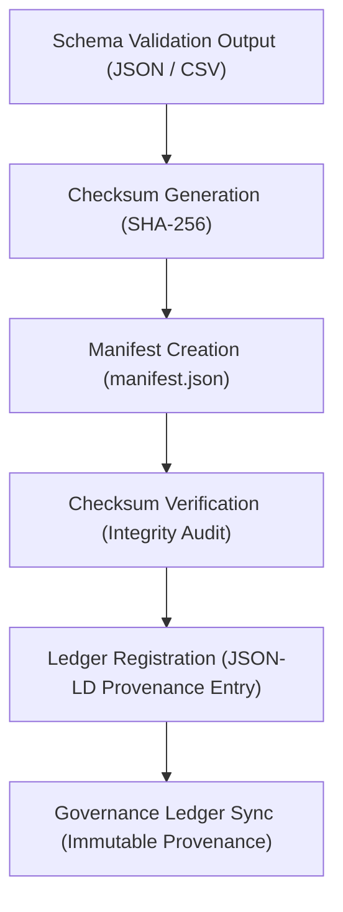

<div align="center">

# 🔒 Kansas Frontier Matrix — **Tabular Schema Checksums & Integrity Ledger**  
`data/work/staging/tabular/tmp/intake/validation/logs/schema/checksums/`

### *“Integrity is the heartbeat of reproducible science — verified, not assumed.”*  

**Purpose:** This directory stores **cryptographic checksum manifests** and validation logs for all tabular schema validation artifacts.  
Each checksum record ensures reproducibility, auditability, and FAIR+CARE-aligned data governance.

[](../../../../../../../../../../../../docs/architecture/repo-focus.md)  
[](../../../../../../../../../../../../LICENSE)  
[]()  
[]()  
[]()

</div>

---

## 🧭 Overview

The **Checksum & Integrity Ledger** functions as a **cryptographic proof layer** within the schema validation pipeline.  
Every JSON, CSV, or AI report generated during validation is hashed using **SHA-256** and logged here.

This process guarantees:
- **Reproducibility** — identical inputs always produce identical checksum fingerprints.  
- **Tamper Detection** — changes trigger mismatched hashes during audits.  
- **Transparency** — checksums are open, machine-verifiable, and tracked in Git and governance ledgers.  
- **Provenance Integrity** — all hashes are linked back to specific validation events with timestamps.  

---

## 🗂️ Directory Layout

```text
data/work/staging/tabular/tmp/intake/validation/logs/schema/checksums/
├── manifest.json                 # Master manifest of all validation artifact hashes
├── checksum_verification.log     # Log of validation + verification operations
├── schema_report.hash            # SHA-256 digest of schema validation report
├── ai_anomaly.hash               # SHA-256 digest of AI anomaly summary
├── fair_care_audit.hash          # SHA-256 digest of FAIR/CARE audit report
├── checksums_summary.csv         # Tabular summary of all computed digests
└── README.md                     # This document
````

---

## 🧮 Checksum Generation Workflow



---

## ⚙️ Checksum Specification

| Parameter              | Value                                     |
| ---------------------- | ----------------------------------------- |
| **Algorithm**          | SHA-256 (FIPS 180-4 Compliant)            |
| **Encoding**           | Hexadecimal                               |
| **Storage Format**     | JSON & CSV (redundant recording)          |
| **Validation Command** | `make checksums-verify`                   |
| **Automation Trigger** | Post-schema-validation hook               |
| **Ledger Integration** | `governance/tabular_intake_ledger.jsonld` |

> 🧩 Each record in the manifest links to its originating file and process metadata, enabling complete end-to-end traceability.

---

## 🧾 Manifest Structure

Example excerpt from `manifest.json`:

```json
{
  "timestamp": "2025-10-26T13:22:41Z",
  "algorithm": "SHA-256",
  "entries": [
    {
      "file": "schema_validation_report.json",
      "checksum": "d4b5f95f5ea418a7d33a1a0a276eec45d7f9072ff8b09e7a0173bca85697776e",
      "verified": true
    },
    {
      "file": "ai_anomaly_summary.json",
      "checksum": "cf12c42dc2c9859e3eaeefb046d5d55d64ab2d8b4d73c9b4e87f91d3f7310dcb",
      "verified": true
    }
  ]
}
```

---

## 🧠 AI Audit Cross-Reference

AI-assisted integrity analysis uses the checksum ledger to detect anomalies such as:

* Mismatched or regenerated files without version control tags.
* Temporal drift between checksum timestamps and ledger entries.
* Inconsistent digests across mirrored directories.

An **AI-verifier module** (`src/nlp/ai_integrity_monitor.py`) automatically flags checksum inconsistencies and submits them to:
`reports/audit/schema_ai_anomaly_ledger.json`

---

## 🔒 Verification Commands

```bash
# Compute and update checksum manifest
make checksums-update

# Verify all checksums in the manifest
make checksums-verify

# Run AI consistency check
make ai-checksum-audit
```

Logs are appended to `checksum_verification.log` and summarized in `checksums_summary.csv`.

---

## 🧾 Compliance Matrix

| Standard            | Alignment                               | Validator                    |
| ------------------- | --------------------------------------- | ---------------------------- |
| **ISO/IEC 10118-3** | Secure hash algorithm compliance        | Internal FIPS hash validator |
| **MCP-DL v6.3**     | Documentation-first checksum governance | `docs-validate`              |
| **FAIR+CARE**       | Provenance and audit transparency       | `fair-audit`                 |
| **STAC / DCAT**     | Asset metadata linkage                  | `stac-validate`              |

---

## 🪶 Version History

| Version | Date       | Author              | Notes                                                                                               |
| ------- | ---------- | ------------------- | --------------------------------------------------------------------------------------------------- |
| v9.0.0  | 2025-10-26 | `@kfm-architecture` | Initial checksum and integrity ledger documentation added under Diamond⁹ Ω / Crown∞Ω certification. |

---

<div align="center">

### 🜂 Kansas Frontier Matrix — *Integrity · Reproducibility · Verification*

**“Every file’s truth is written in its checksum.”**

[]()
[]()
[]()
[]()
[]()

<br><br> <a href="#-kansas-frontier-matrix--tabular-schema-checksums--integrity-ledger-diamond⁹-Ω--crown∞Ω-certified">⬆ Back to Top</a>

</div>
```

