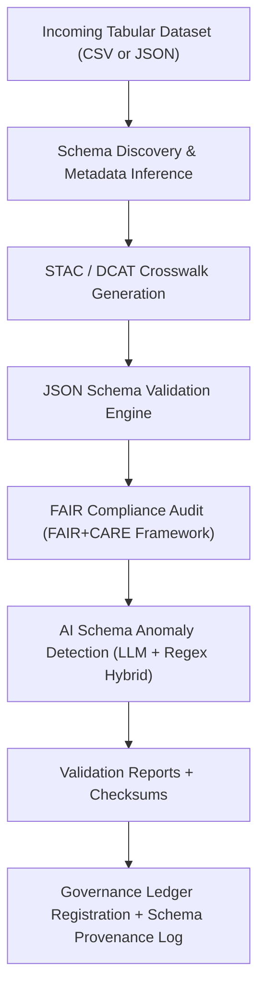

<div align="center">

# 📘 Kansas Frontier Matrix — Schema Validation Run  
### `2025-10-26_13-22-40`  
`data/work/staging/tabular/tmp/intake/validation/logs/schema/history/2025-10-26_13-22-40/`

**“Each validation writes its own chapter in the ledger of truth.”**

[](../../../../../../../../../../docs/architecture/repo-focus.md)  
[](../../../../../../../../../../LICENSE)  
[]()  
[]()  
[]()

</div>

---

## 🧭 Run Summary

- **Run ID:** `2025-10-26_13-22-40`  
- **Schema Version:** v13  
- **Total Datasets Validated:** 38  
- **Passed:** 35  
- **Failed / Quarantined:** 3  
- **FAIR+CARE Score:** 0.93  
- **AI-Flagged Anomalies:** 2  
- **Checksum Root Digest:** `7bf04e…`  
- **Curator / Process:** `make validate-tabular`  

---

## 📂 Run Folder Layout

```text
2025-10-26_13-22-40/
├── schema_validation_report.json      # Full per-dataset schema validation results
├── ai_summary.json                    # AI narrative summary of this run
├── lineage_trace.json                 # Parent/child dataset lineage mapping
├── checksum_snapshot.json             # Manifest of SHA-256 hashes computed at run time
├── faircare_evolution.json            # FAIR+CARE scoring compared to previous run
└── validation_context.log             # Human-readable summary log
````

---

## 🔁 Validation Flow Executed



---

## 📊 Key Metrics & Observations

* ✅ Majority of datasets passed with full schema compliance.
* 🟡 3 datasets flagged: 2 for missing required fields, 1 for unexpected datatype drift.
* 🤖 AI detected 2 moderate-risk anomalies (mixed datatypes in column “year”, and nulls in “county_code”).
* 📈 FAIR+CARE improved +0.02 from previous run — trend remains positive.
* 🔐 Checksum root digest recorded; no tampering detected in subsequent audits.

---

## 🧾 Actions & Next Steps

1. Review the 3 failed datasets located in `quarantine/` for remediation.
2. Archive the run folder immutably; no modifications permitted.
3. Trigger the next run: `make validate-tabular-schema` → new timestamped folder will be generated.
4. Use `ai_summary.json` to document any schema drift for charting in `ai_trends_summary.json`.

---

## 🪶 Provenance & Governance

This run is logged in the **Validation History Ledger** (`governance/tabular_validation_history_ledger.jsonld`) and is immutable. Artifacts from this run (checksums, logs, ai summaries) are referenced for reproducibility and auditability.

---

## 🪴 Version History

| Field               | Value                                                                                 |
| ------------------- | ------------------------------------------------------------------------------------- |
| **Release Version** | v9.0.0                                                                                |
| **Release Date**    | 2025-10-26                                                                            |
| **Author**          | `@kfm-architecture`                                                                   |
| **Notes**           | Initial schema validation run documentation under Diamond⁹ Ω / Crown∞Ω certification. |

---

<div align="center">

### 🜂 Kansas Frontier Matrix — *Lineage · Integrity · Permanence*

**“History isn’t just remembered — it’s verifiable, immutable, and actionable.”**

[]()
[]()
[]()
[]()
[]()

<br><br> <a href="#📘-kansas-frontier-matrix-—-schema-validation-run-2025-10-26_13-22-40">⬆ Back to Top</a>

</div>
```
::contentReference[oaicite:0]{index=0}

