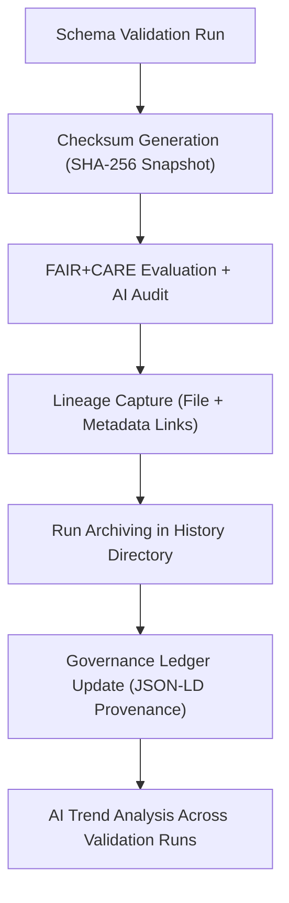

<div align="center">

# 📜 Kansas Frontier Matrix — **Tabular Schema Validation History & Lineage**  
`data/work/staging/tabular/tmp/intake/validation/logs/schema/history/`

### *“Every validation leaves a footprint; history ensures it can always be retraced.”*  

**Purpose:** This directory preserves the **chronological lineage** of schema validation runs — including AI insights, checksum states, anomalies, and FAIR+CARE audit results — forming a **living audit trail** for the KFM tabular validation pipeline.

[](../../../../../../../../../../../../docs/architecture/repo-focus.md)  
[](../../../../../../../../../../../../LICENSE)  
[]()  
[]()  
[]()  
[]()

</div>

---

## 🧭 Overview

The **Schema Validation History Layer** is a permanent ledger of all schema validation operations performed on tabular datasets.  
It integrates **metadata lineage**, **AI-generated validation summaries**, **anomaly traces**, and **checksum evolution records**.

Each validation cycle creates:
- 📁 A dedicated timestamped folder (`YYYYMMDD_HHMMSS/`)
- 🧾 JSON metadata capturing the run configuration, schema version, and dataset manifest  
- 🤖 AI-generated summary of validation context and detected changes  
- 🔒 Immutable hashes recorded in the checksum ledger  
- 📈 FAIR+CARE scoring evolution logs  

This design supports **longitudinal analysis** of data quality trends across time.

---

## 🗂️ Directory Layout

```text
data/work/staging/tabular/tmp/intake/validation/logs/schema/history/
├── 2025-10-26_13-22-40/                   # Folder per validation run
│   ├── schema_validation_report.json      # Detailed run-level report
│   ├── ai_summary.json                    # AI narrative of the validation results
│   ├── lineage_trace.json                 # File lineage and parent-child mapping
│   ├── checksum_snapshot.json             # Snapshot of all checksums at time of run
│   ├── faircare_evolution.json            # FAIR+CARE score comparison over time
│   └── validation_context.log             # Plain-text log summary
├── history_index.json                     # Manifest of all runs with metadata
├── ai_trends_summary.json                 # AI-detected trend report (multi-run)
├── lineage_graph.json                     # Combined JSON graph of dataset lineage
└── README.md
````

---

## 🔁 Validation Lineage Workflow



---

## 🧩 Data Lineage & Provenance Tracking

Each run’s metadata entry in `history_index.json` includes:

| Field            | Description                                 | Example                 |
| ---------------- | ------------------------------------------- | ----------------------- |
| `run_id`         | Unique identifier for the validation run    | `2025-10-26_13-22-40`   |
| `schema_version` | Schema version applied during validation    | `v13`                   |
| `dataset_count`  | Number of files validated in the run        | `38`                    |
| `passed`         | Count of datasets passing schema validation | `35`                    |
| `failed`         | Count of failed or quarantined datasets     | `3`                     |
| `fair_score`     | FAIR compliance score                       | `0.93`                  |
| `ai_flags`       | AI anomaly count                            | `2`                     |
| `checksum_root`  | SHA-256 digest of manifest snapshot         | `7bf04e...`             |
| `curator`        | Reviewer ID or process name                 | `make validate-tabular` |
| `timestamp`      | UTC timestamp of run                        | `2025-10-26T13:22:40Z`  |

All entries are cross-linked to the `governance/tabular_validation_history_ledger.jsonld` file for governance traceability.

---

## 🤖 AI Audit Insights

AI components enhance interpretability of historical trends:

| AI Module              | Description                                                                         | Output                        |
| ---------------------- | ----------------------------------------------------------------------------------- | ----------------------------- |
| **AI Trend Analyzer**  | Detects recurring schema violations, e.g., columns that repeatedly fail validation. | `ai_trends_summary.json`      |
| **Change Narrator**    | Generates human-readable summaries comparing current vs. previous run metrics.      | `ai_summary.json`             |
| **Anomaly Correlator** | Flags persistent anomalies across datasets and schema versions.                     | `ai_anomaly_persistence.json` |

AI outputs are referenced in `reports/audit/schema_history_audit.json` and contribute to FAIR+CARE governance dashboards.

---

## ⚙️ Maintenance & Commands

```bash
# Run full validation history archival
make validation-history-update

# Generate AI summaries for schema lineage evolution
make ai-schema-trends

# Export lineage graph visualization
make export-lineage-graph
```

> 🧩 *Each run folder remains immutable — any revalidation creates a new timestamped entry, preserving a complete lineage trail.*

---

## 📈 FAIR+CARE Evolution

| Metric            | Description                                             | Example     |
| ----------------- | ------------------------------------------------------- | ----------- |
| **FAIR Score**    | Composite FAIR metric per validation cycle              | 0.94 → 0.96 |
| **CARE Score**    | Ethical and cultural responsibility compliance          | 0.88 → 0.91 |
| **Improvement Δ** | Indicates positive or negative trend across validations | `+0.02`     |
| **AI Flags**      | Count of anomaly alerts compared to last run            | `1 ↓`       |
| **Schema Drift**  | Boolean flag for structural schema change               | `false`     |

---

## 🧾 Compliance Matrix

| Standard                 | Scope                               | Validator       |
| ------------------------ | ----------------------------------- | --------------- |
| **FAIR+CARE**            | Longitudinal compliance evolution   | `fair-audit`    |
| **CIDOC CRM / OWL-Time** | Temporal lineage representation     | `graph-lint`    |
| **MCP-DL v6.3**          | Documentation-first lineage logging | `docs-validate` |
| **ISO 19115 / 19157**    | Provenance metadata tracking        | `geojson-lint`  |
| **STAC / DCAT**          | Asset catalog version control       | `stac-validate` |

---

## 🪶 Version History

| Version | Date       | Author              | Notes                                                                                                                   |
| ------- | ---------- | ------------------- | ----------------------------------------------------------------------------------------------------------------------- |
| v9.0.0  | 2025-10-26 | `@kfm-architecture` | Initial creation of Tabular Schema Validation History & Lineage documentation under Diamond⁹ Ω / Crown∞Ω certification. |

---

<div align="center">

### 🜂 Kansas Frontier Matrix — *Lineage · Provenance · Permanence*

**“What is recorded cannot be lost; what is validated cannot be denied.”**

[]()
[]()
[]()
[]()
[]()

<br><br> <a href="#-kansas-frontier-matrix--tabular-schema-validation-history--lineage-diamond⁹-Ω--crown∞Ω-certified">⬆ Back to Top</a>

</div>
```

