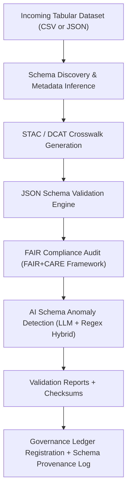

<div align="center">

# 🧾 Kansas Frontier Matrix — **Tabular Schema Validation Reports**  
`data/work/staging/tabular/tmp/intake/validation/logs/schema/reports/`

### *“No dataset passes without its schema telling a truthful story.”*  

**Purpose:** This directory archives the **machine-validated and AI-reviewed reports** generated during tabular schema validation within the KFM pipeline.  
All reports document the structural, semantic, and ethical integrity of incoming tabular data before promotion to normalization.

[](../../../../../../../../../../../docs/architecture/repo-focus.md)  
[](../../../../../../../../../../../LICENSE)  
[]()  
[](../../../../../../../../../../../docs/standards/)  
[]()

</div>

---

## 🧭 Overview

This directory is the **final checkpoint** in the *Intake Validation Chain*.  
Every schema validation run generates logs, JSON reports, and AI audit summaries stored here.  
Reports combine **STAC/DCAT schema conformance**, **CIDOC semantic validation**, and **AI anomaly detection** outputs.

### Core Functions
- ✅ **Schema compliance** check for structural accuracy  
- 🔍 **Crosswalk evaluation** (STAC/DCAT compatibility)  
- 🤖 **AI-based anomaly scan** of column values, types, and relationships  
- 🧩 **FAIR+CARE audit** for ethical and technical completeness  
- 🪶 **Checksum & provenance embedding** into the governance ledger  

---

## 🗂️ Directory Layout

```text
data/work/staging/tabular/tmp/intake/validation/logs/schema/reports/
├── schema_validation_report.json          # Primary JSON validation results
├── ai_anomaly_summary.json                # AI anomaly detection output
├── fair_care_audit.json                   # FAIR+CARE compliance report
├── checksum_manifest.json                 # File integrity registry
├── validation_summary.log                 # Combined human-readable summary
└── README.md                              # This document
````

---

## 🔁 Schema Validation Flow



---

## 🤖 AI Integration

| Module                   | Function                                                                      | Output                    | Schema                               |
| ------------------------ | ----------------------------------------------------------------------------- | ------------------------- | ------------------------------------ |
| **NER Schema Analyzer**  | Detects mislabeled, missing, or ambiguous columns using AI-driven heuristics. | `ai_anomaly_summary.json` | `schemas/tabular-ai-anomaly-v2.json` |
| **AI FAIR+CARE Auditor** | Uses an LLM to cross-check metadata ethics, accessibility, and completeness.  | `fair_care_audit.json`    | `schemas/tabular-faircare-v1.json`   |
| **Pattern Profiler**     | Learns typical field distributions to detect outliers or mixed datatypes.     | `schema_profile.json`     | `schemas/tabular-profile-v1.json`    |

All AI outputs are referenced in the **`reports/audit/schema_ai_anomaly_ledger.json`** and version-controlled via `git-lfs` to maintain reproducibility.

---

## 📈 Report Composition

| Section             | Description                                                             |
| ------------------- | ----------------------------------------------------------------------- |
| **summary**         | General overview of schema validation (valid fields, errors, warnings). |
| **details**         | Field-level insights: data types, cardinality, nulls, violations.       |
| **ai_flags**        | AI-detected irregularities or missing metadata entries.                 |
| **fair_care_score** | FAIR+CARE compliance scoring (0–1 normalized).                          |
| **provenance**      | Checksum, timestamp, and process metadata for governance linkage.       |

Each report conforms to **JSON-LD metadata embedding**, allowing provenance linkage in the `tabular_intake_ledger.jsonld`.

---

## 🧾 Example Command

```bash
# Run full schema validation + AI report generation
make validate-tabular-schema

# Generate FAIR+CARE audit and AI anomaly summary
make ai-schema-audit
```

Reports are automatically stored in this directory after successful execution.

---

## 🪶 Version History

| Version | Date       | Author              | Notes                                                                                                |
| ------- | ---------- | ------------------- | ---------------------------------------------------------------------------------------------------- |
| v9.0.0  | 2025-10-26 | `@kfm-architecture` | Initial creation of schema validation report documentation under Diamond⁹ Ω / Crown∞Ω certification. |

---

<div align="center">

### 🜂 Kansas Frontier Matrix — *Validation Integrity · Transparency · Provenance*

**“Structure tells truth; validation ensures it endures.”**

[]()
[]()
[]()
[]()
[]()

<br><br> <a href="#-kansas-frontier-matrix--tabular-schema-validation-reports-diamond⁹-Ω--crown∞Ω-certified">⬆ Back to Top</a>

</div>
```

