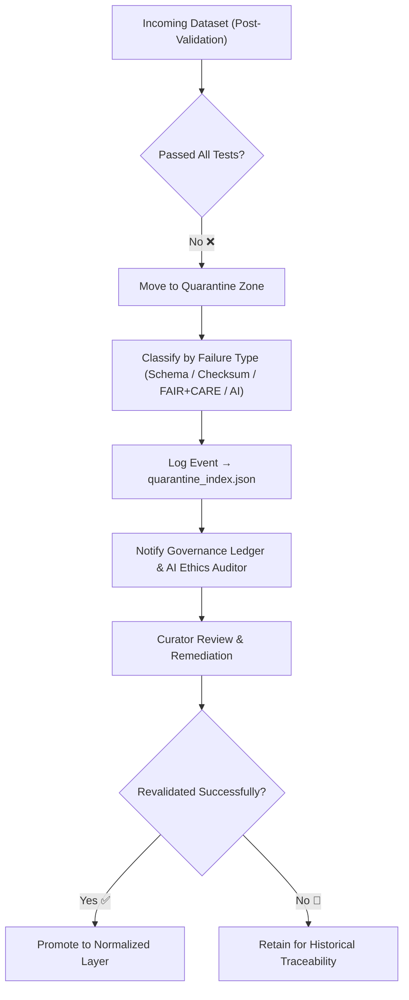

<div align="center">

# 🚫 Kansas Frontier Matrix — **Tabular Quarantine Zone**  
`data/work/staging/tabular/tmp/intake/validation/quarantine/`

### *“No dataset left behind — only those awaiting correction.”*

**Purpose:**  
This directory isolates **non-conforming, incomplete, or anomalous tabular datasets** flagged during the validation pipeline.  
Files here remain under **temporary quarantine** until reviewed, corrected, or purged under governance oversight.

[](../../../../../../../../../../docs/architecture/repo-focus.md)  
[](../../../../../../../../../../LICENSE)  
[]()  
[]()  
[]()

</div>

---

## 🧭 Overview

The **Tabular Quarantine Zone** acts as a containment layer for datasets that fail:
- ❌ **Schema validation** (missing or malformed fields)  
- ⚠️ **Checksum verification** (integrity mismatch)  
- 🧩 **AI anomaly checks** (irregular or inconsistent data patterns)  
- 📜 **FAIR+CARE compliance** (missing provenance or license data)

Quarantined datasets are not deleted — they are version-tracked, annotated, and re-evaluated after remediation.  
This ensures transparency and accountability while maintaining the reproducibility of every ETL cycle.

---

## 🗂️ Directory Layout

```text
data/work/staging/tabular/tmp/intake/validation/quarantine/
├── incoming/                        # Recently flagged datasets awaiting triage
├── ai_anomalies/                    # AI-detected irregularities (patterns, schema drift)
├── schema_failures/                 # Files failing JSON Schema validation
├── checksum_mismatches/             # Files failing integrity or checksum tests
├── faircare_incomplete/             # FAIR+CARE metadata or ethical compliance issues
├── remediation_logs/                # Logs and curator notes for corrective actions
├── quarantine_index.json            # Master registry of quarantined files
└── README.md                        # This document
````

---

## 🔁 Quarantine Workflow



---

## 🧩 Quarantine Record Format

Each quarantined dataset is logged in `quarantine_index.json` with full metadata and failure context:

| Field              | Description            | Example                                |
| ------------------ | ---------------------- | -------------------------------------- |
| `file_name`        | Dataset filename       | `census_1870_invalid.csv`              |
| `reason`           | Reason for quarantine  | `Missing required field 'county_code'` |
| `severity`         | Level of impact        | `critical`                             |
| `checksum_valid`   | Integrity check result | `false`                                |
| `ai_flagged`       | AI anomaly detected    | `true`                                 |
| `curator_assigned` | Reviewer or team       | `data_governance@kfm`                  |
| `status`           | Current review state   | `awaiting_review`                      |
| `timestamp`        | UTC time quarantined   | `2025-10-26T14:12:55Z`                 |

---

## ⚙️ Governance & AI Oversight

| Agent                    | Responsibility                                                 | Output                                        |
| ------------------------ | -------------------------------------------------------------- | --------------------------------------------- |
| **AI Integrity Monitor** | Automatically detects schema drift and checksum failures.      | `ai_anomalies/*.json`                         |
| **Ethics Auditor (AI)**  | Evaluates ethical data use & provenance in FAIR+CARE context.  | `faircare_incomplete/*.json`                  |
| **Human Curator**        | Reviews flagged datasets and approves restoration or archival. | `remediation_logs/*.log`                      |
| **Governance Ledger**    | Maintains immutable record of all quarantined data events.     | `governance/tabular_quarantine_ledger.jsonld` |

> 🧠 *AI systems flag but never delete — final authority always rests with human curators under FAIR+CARE ethics.*

---

## 📈 Metrics & Monitoring

| Metric                          | Description                             | Frequency                |
| ------------------------------- | --------------------------------------- | ------------------------ |
| **Active Quarantined Datasets** | Count of current unresolved quarantines | Real-time                |
| **Average Resolution Time**     | Mean time from quarantine to approval   | Weekly                   |
| **Revalidation Success Rate**   | % of datasets restored successfully     | Per release              |
| **Recurring Error Type**        | Most frequent failure reason            | AI-detected, auto-logged |

Metrics are visualized in governance dashboards and appended to FAIR+CARE reports.

---

## ⚙️ Commands

```bash
# View current quarantined files
make quarantine-list

# Run AI anomaly summary report
make ai-quarantine-audit

# Revalidate quarantined datasets
make quarantine-revalidate
```

> 💡 *All revalidated datasets are appended with an audit trail before promotion.*

---

## 🧾 Compliance Matrix

| Standard               | Scope                                     | Validator       |
| ---------------------- | ----------------------------------------- | --------------- |
| **FAIR+CARE**          | Ethical and governance compliance         | `fair-audit`    |
| **MCP-DL v6.3**        | Documentation and lineage reproducibility | `docs-validate` |
| **CIDOC CRM / PROV-O** | Provenance tracking and semantic linkage  | `graph-lint`    |
| **ISO 19115 / 19157**  | Data quality and lifecycle metadata       | `geojson-lint`  |
| **STAC / DCAT**        | Interoperable metadata cataloging         | `stac-validate` |

---

## 🪶 Version History

| Version | Date       | Author              | Notes                                                                                               |
| ------- | ---------- | ------------------- | --------------------------------------------------------------------------------------------------- |
| v9.0.0  | 2025-10-26 | `@kfm-architecture` | Initial creation of Tabular Quarantine Zone documentation under Diamond⁹ Ω / Crown∞Ω certification. |

---

<div align="center">

### 🜂 Kansas Frontier Matrix — *Accountability · Transparency · Remediation*

**“Quarantine is not exclusion — it’s integrity under review.”**

[]()
[]()
[]()
[]()
[]()

<br><br> <a href="#-kansas-frontier-matrix--tabular-quarantine-zone-diamond⁹-Ω--crown∞Ω-certified">⬆ Back to Top</a>

</div>
```

