<div align="center">

# 🤖 Kansas Frontier Matrix — **AI Anomalies (Quarantine Layer)**  
`data/work/staging/tabular/tmp/intake/validation/quarantine/ai_anomalies/`

### *“Every anomaly is data — validation just ensures we listen responsibly.”*

**Purpose:**  
This directory serves as the **global aggregation zone** for all AI-detected anomalies in the tabular validation pipelines of the Kansas Frontier Matrix (KFM).  
It unifies statistical, semantic, and ethical anomaly reports originating from dataset-level intake validations for long-term analysis, retraining, and governance review.

[](../../../../../../../../../../docs/architecture/repo-focus.md)  
[](../../../../../../../../../../LICENSE)  
[]()  
[]()  
[]()

</div>

---

## 🧭 Overview

The **AI Anomalies Quarantine Layer** consolidates all flagged AI anomalies across multiple validation contexts:
- Data quality irregularities  
- Semantic or contextual inconsistencies  
- Ethical and provenance misalignments  
- Drift detection from historical or temporal baselines  

By maintaining centralized anomaly records, this layer enables:
- Reproducible AI anomaly investigations  
- Model drift tracking across validation cycles  
- FAIR+CARE accountability for automated decisions  
- AI system retraining and interpretability improvements  

All anomalies recorded here are **explainable, versioned, and governance-linked**.

---

## 🗂️ Directory Layout

```text
data/work/staging/tabular/tmp/intake/validation/quarantine/ai_anomalies/
├── global_ai_anomalies_manifest.json       # Centralized index of AI-detected anomalies
├── model_performance_metrics.json          # AI model accuracy, drift, and F1 scores
├── ai_reasoning_registry.json              # LLM narrative summaries for anomaly explanations
├── anomaly_distribution_report.json        # Statistical analysis of anomaly classes
├── examples/                               # Cross-dataset anomaly samples
│   ├── ai_population_outlier_case.csv
│   ├── ai_semantic_mismatch_case.json
│   └── ai_temporal_drift_case.csv
├── retraining_queue.json                   # Datasets flagged for AI retraining
├── curator_notes.log                       # Human curation, review, and governance decisions
└── README.md                               # This document
````

---

## 🔁 Quarantine Workflow

```mermaid
flowchart TD
    A["AI Model Validation Cycle"] --> B["Detect Anomalies (Outlier / Semantic / FAIR+CARE)"]
    B --> C["Log to Dataset-Level ai_anomalies/ Folder"]
    C --> D["Sync to Global Registry → quarantine/ai_anomalies/"]
    D --> E["Generate Global Manifest + Drift Metrics"]
    E --> F["Curator + Governance Review"]
    F --> G["Flag for Retraining or Ethical Audit if Required"]
```



---

## 🧩 Global AI Anomalies Manifest Schema

| Field               | Description                             | Example                                                                    |
| ------------------- | --------------------------------------- | -------------------------------------------------------------------------- |
| `dataset_id`        | Dataset source name                     | `ks_agriculture_1890`                                                      |
| `anomaly_type`      | Class of detected issue                 | `Semantic Mismatch`                                                        |
| `field_name`        | Affected data field                     | `crop_yield_per_acre`                                                      |
| `ai_model`          | AI model responsible for detection      | `IsolationForest_v3.2`                                                     |
| `ai_confidence`     | Confidence score of detection           | `0.972`                                                                    |
| `ai_explanation`    | Human-readable explanation from LLM     | `"Detected value inconsistency with historical baseline for crop yields."` |
| `detected_value`    | Value triggering anomaly                | `190.5`                                                                    |
| `expected_baseline` | AI-estimated expected range or category | `60–90`                                                                    |
| `timestamp`         | UTC detection time                      | `2025-10-26T15:36:20Z`                                                     |

---

## 🤖 AI Modules Feeding This Layer

| Module                     | Function                                                   | Output                                  |
| -------------------------- | ---------------------------------------------------------- | --------------------------------------- |
| **Anomaly Detector**       | Identifies unusual data points or distributions.           | `global_ai_anomalies_manifest.json`     |
| **LLM Reasoner**           | Generates contextual narrative for each anomaly.           | `ai_reasoning_registry.json`            |
| **Temporal Drift Monitor** | Tracks concept and dataset drift over time.                | `model_performance_metrics.json`        |
| **Retraining Controller**  | Prioritizes anomalies for AI model updates.                | `retraining_queue.json`                 |
| **Governance Linker**      | Cross-references anomalies to FAIR+CARE provenance ledger. | `quarantine_ai_anomalies_ledger.jsonld` |

> 🧠 *Each anomaly record includes provenance, reproducibility metadata, and justification — adhering to explainable AI (XAI) and MCP-DL v6.3 standards.*

---

## ⚙️ Curator Workflow

Curators must:

1. Review the global anomaly manifest (`global_ai_anomalies_manifest.json`).
2. Check AI reasoning summaries (`ai_reasoning_registry.json`) for interpretability accuracy.
3. Document review outcomes or corrective actions in `curator_notes.log`.
4. If necessary, queue datasets for model retraining:

   ```bash
   make ai-retrain-queue
   ```
5. Trigger a governance sync to ensure provenance linkage:

   ```bash
   make governance-update
   ```

---

## 📈 AI Anomaly Categories & Examples

| Category                | Description                                   | Example                         | Recommended Action                |
| ----------------------- | --------------------------------------------- | ------------------------------- | --------------------------------- |
| **Statistical Outlier** | Numeric deviation beyond learned distribution | Population density = `9500`     | Verify or correct data            |
| **Semantic Mismatch**   | AI misclassified entity or location           | `"Wichita"` labeled as `County` | Fix metadata ontology             |
| **Temporal Drift**      | Historical inconsistency or unexpected trend  | Year `2150`                     | Correct parsing or model baseline |
| **Ethical Violation**   | Dataset lacks FAIR+CARE compliance            | Missing consent metadata        | Add governance attributes         |

---

## 🧾 Compliance Matrix

| Standard               | Scope                                    | Validator       |
| ---------------------- | ---------------------------------------- | --------------- |
| **FAIR+CARE**          | Ethical and governance accountability    | `fair-audit`    |
| **MCP-DL v6.3**        | Explainable AI documentation             | `docs-validate` |
| **ISO/IEC 23053:2022** | AI transparency and lifecycle monitoring | `ai-validate`   |
| **CIDOC CRM / PROV-O** | Provenance graph linkage                 | `graph-lint`    |
| **STAC / DCAT 3.0**    | Metadata catalog interoperability        | `stac-validate` |

---

## 🪶 Version History

| Version | Date       | Author              | Notes                                                                                                       |
| ------- | ---------- | ------------------- | ----------------------------------------------------------------------------------------------------------- |
| v9.0.0  | 2025-10-26 | `@kfm-architecture` | Initial creation of AI Anomalies (Quarantine Layer) documentation under Diamond⁹ Ω / Crown∞Ω certification. |

---

<div align="center">

### 🜂 Kansas Frontier Matrix — *Insight · Accountability · Evolution*

**“AI finds the noise — governance ensures the meaning.”**

[]()
[]()
[]()
[]()
[]()

<br><br> <a href="#-kansas-frontier-matrix--ai-anomalies-global-quarantine-layer--diamond⁹-Ω--crown∞Ω-certified">⬆ Back to Top</a>

</div>
