<div align="center">

# 🧠 Kansas Frontier Matrix — **AI Anomaly Evidence Examples**  
`data/work/staging/tabular/tmp/intake/validation/quarantine/ai_anomalies/examples/`

### *“Transparency transforms detection into understanding.”*

**Purpose:**  
This directory holds **representative examples of anomalies detected by AI systems** during validation across all datasets in the KFM Quarantine Layer.  
Each sample demonstrates outliers, semantic irregularities, or contextual deviations identified by the AI anomaly detection and reasoning pipeline.

[](../../../../../../../../../../../../../../../../docs/architecture/repo-focus.md)  
[](../../../../../../../../../../../../../../../../LICENSE)  
[]()  
[]()  
[]()

</div>

---

## 🧭 Overview

The **AI Anomaly Evidence Examples Layer** provides tangible, FAIR+CARE-aligned artifacts that showcase how AI models flagged and interpreted irregularities across multiple datasets.  
These examples are aggregated globally from dataset-level quarantines to demonstrate:
- Statistical outlier detection  
- Semantic misclassification  
- Temporal drift recognition  
- Provenance or metadata inconsistency  

Each evidence sample is checksum-verified, governance-linked, and used for retraining, audit review, and continuous improvement of AI reasoning integrity.

---

## 🗂️ Directory Layout

```text
data/work/staging/tabular/tmp/intake/validation/quarantine/ai_anomalies/examples/
├── ai_population_outlier_case.csv        # Extreme statistical deviation example
├── ai_semantic_mismatch_case.json        # Example of AI semantic misclassification
├── ai_temporal_drift_case.csv            # Evidence of detected temporal or distribution drift
├── ai_anomaly_evidence_summary.json      # Consolidated AI reasoning and contextual metadata
├── evidence_checksums.json               # SHA-256 hashes verifying evidence integrity
└── README.md                             # This document
````

---

## 🔁 Evidence Extraction Workflow

```mermaid
flowchart TD
    A["Dataset-Level AI Anomaly Detected"] --> B["Extract 5–10 Representative Records"]
    B --> C["Store Globally as CSV/JSON Samples"]
    C --> D["Compute Integrity Checksums → evidence_checksums.json"]
    D --> E["Run AI Reasoner for Global Contextual Analysis"]
    E --> F["Document Summary → ai_anomaly_evidence_summary.json"]
    F --> G["Register Provenance in Global Ledger (JSON-LD)"]
```



---

## 📄 Example Metadata Schema

Each sample is recorded in `ai_anomaly_evidence_summary.json` for interpretability:

| Field            | Description                           | Example                                                                                       |
| ---------------- | ------------------------------------- | --------------------------------------------------------------------------------------------- |
| `case_id`        | Global anomaly case identifier        | `ai_temporal_drift_case_03`                                                                   |
| `source_dataset` | Origin dataset name                   | `ks_agriculture_1890`                                                                         |
| `anomaly_type`   | Detected anomaly class                | `Temporal Drift`                                                                              |
| `field_name`     | Affected field                        | `harvest_date`                                                                                |
| `ai_confidence`  | Detection confidence (0–1)            | `0.961`                                                                                       |
| `ai_explanation` | LLM narrative for anomaly context     | `"Detected timestamp pattern inconsistent with typical seasonal range (1890-06 to 1890-09)."` |
| `checksum`       | SHA-256 integrity hash of sample file | `e4ba67f23b1de0aa73a...`                                                                      |
| `timestamp`      | Extraction time                       | `2025-10-26T15:38:09Z`                                                                        |

---

## 🤖 AI Anomaly Interpretation Modules

| Module                        | Function                                              | Output                                         |
| ----------------------------- | ----------------------------------------------------- | ---------------------------------------------- |
| **AI Outlier Detector**       | Flags statistical deviations and extreme values.      | `ai_anomaly_evidence_summary.json`             |
| **Semantic Context Analyzer** | Detects categorical or ontological inconsistencies.   | `ai_anomaly_evidence_summary.json`             |
| **Temporal Drift Monitor**    | Identifies chronological or distributional drift.     | `ai_anomaly_evidence_summary.json`             |
| **Checksum Verifier**         | Confirms sample integrity for audit use.              | `evidence_checksums.json`                      |
| **Governance Mapper**         | Integrates anomaly provenance with FAIR+CARE records. | `quarantine_ai_anomaly_examples_ledger.jsonld` |

> 🧠 *All AI reasoning outputs are cross-referenced against schema ontology and human curator evaluations to ensure explainable trustworthiness.*

---

## ⚙️ Curator Workflow

Curators must:

1. Review `ai_anomaly_evidence_summary.json` and verify AI interpretations.
2. Examine extracted examples for real-world context validity.
3. Confirm evidence integrity using:

   ```bash
   make checksum-verify
   ```
4. Add curator commentary to `curator_notes.log` for ethical or contextual review.
5. Queue anomalies for retraining or AI threshold adjustment using:

   ```bash
   make ai-retrain-queue
   ```

---

## 📈 Common Anomaly Examples & Resolutions

| Case               | Type                  | Example                                     | Resolution                     |
| ------------------ | --------------------- | ------------------------------------------- | ------------------------------ |
| **Outlier**        | Statistical deviation | Population density `9500` vs. average `800` | Confirm legitimacy or correct  |
| **Semantic Error** | Entity mislabeling    | `"Wichita"` classified as `County`          | Correct schema link            |
| **Temporal Drift** | Year anomaly          | `2150` recorded                             | Fix parsing or baseline model  |
| **Provenance Gap** | Missing lineage field | Absent `checksum` or `source_id`            | Update metadata and revalidate |

---

## 🧾 Compliance Matrix

| Standard               | Scope                                          | Validator       |
| ---------------------- | ---------------------------------------------- | --------------- |
| **FAIR+CARE**          | Open, ethical provenance of AI evidence        | `fair-audit`    |
| **MCP-DL v6.3**        | AI reasoning documentation and reproducibility | `docs-validate` |
| **CIDOC CRM / PROV-O** | Semantic linkage of anomaly provenance         | `graph-lint`    |
| **ISO/IEC 23053:2022** | Lifecycle accountability in AI systems         | `ai-validate`   |
| **STAC / DCAT 3.0**    | Metadata interoperability for evidence         | `stac-validate` |

---

## 🪶 Version History

| Version | Date       | Author              | Notes                                                                                                   |
| ------- | ---------- | ------------------- | ------------------------------------------------------------------------------------------------------- |
| v9.0.0  | 2025-10-26 | `@kfm-architecture` | Initial creation of AI Anomaly Evidence Example documentation under Diamond⁹ Ω / Crown∞Ω certification. |

---

<div align="center">

### 🜂 Kansas Frontier Matrix — *Transparency · Context · Learning*

**“Anomaly detection isn’t judgment — it’s discovery in progress.”**

[]()
[]()
[]()
[]()
[]()

<br><br> <a href="#-kansas-frontier-matrix--ai-anomaly-evidence-examples-global-quarantine-layer--diamond⁹-Ω--crown∞Ω-certified">⬆ Back to Top</a>

</div>
