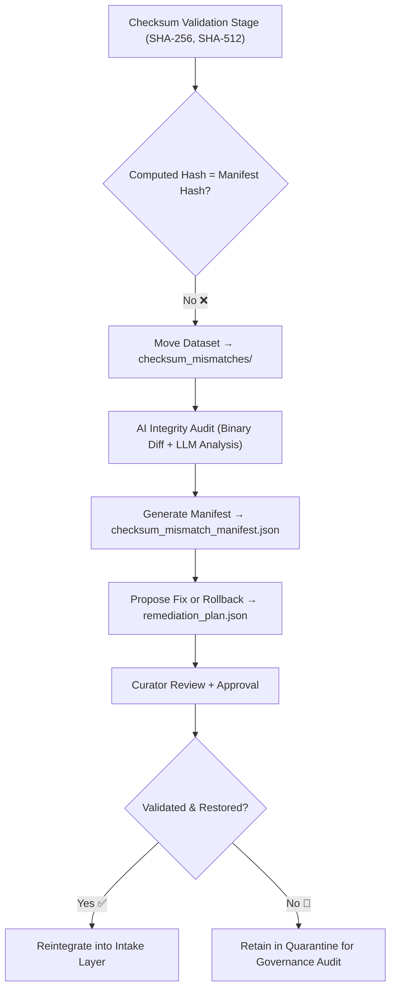

<div align="center">

# 🔐 Kansas Frontier Matrix — **Checksum Mismatches**  
`data/work/staging/tabular/tmp/intake/validation/quarantine/checksum_mismatches/`

### *“Integrity is not a declaration — it’s a proof verified in every byte.”*

**Purpose:**  
This directory captures datasets whose **calculated checksums differ from their declared manifest values**, signaling potential corruption, modification, or version drift.  
Checksum mismatches represent one of the most critical data integrity failures within the Kansas Frontier Matrix (KFM) pipeline, requiring curator investigation before reintegration.

[](../../../../../../../../../../../docs/architecture/repo-focus.md)  
[](../../../../../../../../../../../LICENSE)  
[]()  
[]()  
[]()

</div>

---

## 🧭 Overview

The **Checksum Mismatches Quarantine Layer** isolates datasets that failed cryptographic validation during the integrity check stage of the KFM ETL pipeline.  
A mismatch occurs when the file’s computed hash (SHA-256, SHA-512) no longer matches its manifest or provenance record.  
Possible causes include:
- File corruption during ingestion or compression  
- Manual edits or encoding conversions  
- Outdated manifests referencing prior versions  
- Partial uploads or data truncation  

Checksum mismatches halt automated pipeline progression until validated and resolved.

---

## 🗂️ Directory Layout

```text
data/work/staging/tabular/tmp/intake/validation/quarantine/checksum_mismatches/
├── checksum_mismatch_manifest.json         # Log of all detected mismatched hashes
├── ai_integrity_review.json                # AI explanations for mismatch sources
├── remediation_plan.json                   # Curator or AI-generated fix strategies
├── examples/                               # Evidence files showing checksum discrepancies
│   ├── ks_population_1890_example.json
│   ├── ks_agriculture_1870_example.csv
│   └── ks_treaty_1851_example.csv
├── curator_notes.log                       # Human review and verification notes
└── README.md                               # This document
````

---

## 🔁 Validation Workflow



---

## 🧩 Manifest Schema

Each record in `checksum_mismatch_manifest.json` documents a cryptographic failure event:

| Field                    | Description                                          | Example                                                                   |
| ------------------------ | ---------------------------------------------------- | ------------------------------------------------------------------------- |
| `dataset_id`             | Dataset name                                         | `ks_population_1890`                                                      |
| `expected_checksum`      | Hash recorded in manifest                            | `d2aefb6e8ac0b1a...`                                                      |
| `computed_checksum`      | Hash recalculated from file                          | `d2aefb6e8ac0b1aXYZ`                                                      |
| `file_path`              | File under analysis                                  | `data/work/staging/tabular/tmp/intake/.../ks_population_1890.csv`         |
| `hash_algorithm`         | Algorithm used                                       | `SHA-256`                                                                 |
| `size_diff_bytes`        | Size difference between current and previous version | `+1024`                                                                   |
| `ai_commentary`          | AI-generated reasoning                               | `"Checksum mismatch caused by encoding conversion from UTF-8 to UTF-16."` |
| `remediation_suggestion` | Fix proposal                                         | `"Revert to UTF-8 encoded file and rehash to update manifest."`           |
| `timestamp`              | UTC detection time                                   | `2025-10-26T15:44:03Z`                                                    |

---

## 🤖 AI Integrity Analyzer

| Module                 | Function                                                        | Output                                      |
| ---------------------- | --------------------------------------------------------------- | ------------------------------------------- |
| **Binary Diff Engine** | Identifies file differences at bit-level granularity            | `ai_integrity_review.json`                  |
| **AI Reasoner**        | Provides natural language summaries of probable mismatch causes | `ai_integrity_review.json`                  |
| **Checksum Validator** | Verifies integrity of all datasets via SHA-256/SHA-512          | `checksum_mismatch_manifest.json`           |
| **Auto-Restorer**      | Suggests rollback or hash regeneration operations               | `remediation_plan.json`                     |
| **Governance Logger**  | Registers mismatch events in FAIR+CARE ledger                   | `tabular_checksum_mismatches_ledger.jsonld` |

> 🧠 *All AI insights are stored with traceable reasoning tokens under MCP-DL’s transparency mandate.*

---

## ⚙️ Curator Workflow

Curators should:

1. Review discrepancies listed in `checksum_mismatch_manifest.json`.
2. Cross-check computed and expected hashes using independent tools:

   ```bash
   sha256sum <filename>
   ```
3. Investigate causes in `ai_integrity_review.json`.
4. Apply approved remediations or restore archived copies.
5. Run integrity revalidation:

   ```bash
   make checksums-verify
   ```
6. Record resolution outcomes in `curator_notes.log` and governance ledger.

---

## 📈 Common Causes of Checksum Drift

| Category              | Description                      | Example                | Resolution                             |
| --------------------- | -------------------------------- | ---------------------- | -------------------------------------- |
| **Encoding Drift**    | File encoding changed            | UTF-8 → UTF-16         | Re-encode file and regenerate checksum |
| **Manual Edit**       | Untracked human modification     | Added header line      | Rollback to previous commit            |
| **Truncated Upload**  | File partially transferred       | 2 MB expected → 1.9 MB | Restore from archive                   |
| **Outdated Manifest** | Manifest not updated post-change | Hash mismatch only     | Recompute manifest with new checksum   |

---

## 🧾 Compliance Matrix

| Standard                           | Scope                                   | Validator         |
| ---------------------------------- | --------------------------------------- | ----------------- |
| **SHA-256 / SHA-512 (FIPS 180-4)** | Cryptographic hash consistency          | `checksum-verify` |
| **FAIR+CARE**                      | Ethical provenance and trust validation | `fair-audit`      |
| **MCP-DL v6.3**                    | Documentation-first reproducibility     | `docs-validate`   |
| **CIDOC CRM / PROV-O**             | Provenance and lineage relationships    | `graph-lint`      |
| **ISO 19115 / 19157**              | Data quality and metadata integrity     | `geojson-lint`    |

---

## 🪶 Version History

| Version | Date       | Author              | Notes                                                                                           |
| ------- | ---------- | ------------------- | ----------------------------------------------------------------------------------------------- |
| v9.0.0  | 2025-10-26 | `@kfm-architecture` | Initial creation of Checksum Mismatches documentation under Diamond⁹ Ω / Crown∞Ω certification. |

---

<div align="center">

### 🜂 Kansas Frontier Matrix — *Verification · Provenance · Trust*

**“Checksum failures don’t erode trust — unverified data does.”**

[]()
[]()
[]()
[]()
[]()

<br><br> <a href="#-kansas-frontier-matrix--checksum-mismatches-integrity-verification-class--diamond⁹-Ω--crown∞Ω-certified">⬆ Back to Top</a>

</div>
