<div align="center">

# 📁 Kansas Frontier Matrix — **Checksum Mismatch Evidence Examples**  
`data/work/staging/tabular/tmp/intake/validation/quarantine/checksum_mismatches/examples/`

### *“Integrity failures are only meaningful when proven transparently.”*

**Purpose:**  
This directory holds **forensic samples and contextual evidence** demonstrating checksum mismatches identified during validation within the Kansas Frontier Matrix (KFM) pipeline.  
Each example provides a reproducible case where computed and manifest-stored hashes diverged, aiding in integrity audits and FAIR+CARE provenance documentation.

[](../../../../../../../../../../../../../../../../docs/architecture/repo-focus.md)  
[](../../../../../../../../../../../../../../../../LICENSE)  
[]()  
[]()  
[]()

</div>

---

## 🧭 Overview

The **Checksum Mismatch Evidence Examples Layer** provides explicit, traceable samples of validation integrity failures.  
These evidence files are extracted directly from quarantined datasets and used to verify anomaly classification, investigate potential corruption, and support curator decisions during provenance audits.

Checksum mismatch examples serve to:
- Illustrate hash computation and comparison logic  
- Provide reproducible evidence for governance and audit  
- Aid in AI retraining for error detection  
- Document reproducible proofs of integrity verification failures  

---

## 🗂️ Directory Layout

```text
data/work/staging/tabular/tmp/intake/validation/quarantine/checksum_mismatches/examples/
├── ks_population_1890_example.json        # Example showing byte-level mismatch
├── ks_agriculture_1870_example.csv        # Encoding drift causing checksum discrepancy
├── ks_treaty_1851_example.csv             # Outdated manifest reference
├── ai_checksum_example_summary.json       # AI-generated explanations and verification context
├── evidence_checksums.json                # SHA-256 integrity validation of example files
└── README.md                              # This document
````

---

## 🔁 Evidence Extraction Workflow

```mermaid
flowchart TD
    A["Checksum Mismatch Detected"] --> B["Extract 5–10 Lines Illustrating Divergence"]
    B --> C["Store Fragments as CSV/JSON"]
    C --> D["Compute New Checksums (SHA-256) → evidence_checksums.json"]
    D --> E["Run AI Integrity Analyzer for Root Cause Classification"]
    E --> F["Generate Explanations → ai_checksum_example_summary.json"]
    F --> G["Register Provenance in Governance Ledger (JSON-LD)"]
```



---

## 📄 Example Metadata Schema

Each example entry is documented in `ai_checksum_example_summary.json` as structured metadata:

| Field               | Description                           | Example                                                                      |
| ------------------- | ------------------------------------- | ---------------------------------------------------------------------------- |
| `dataset_id`        | Parent dataset name                   | `ks_population_1890`                                                         |
| `file_path`         | Example file path                     | `examples/ks_population_1890_example.json`                                   |
| `expected_checksum` | Hash stored in manifest               | `9b8a11f03b5c8e0ef8ab...`                                                    |
| `computed_checksum` | Hash recalculated during validation   | `9b8a11f03b5c8e0ef8XX`                                                       |
| `discrepancy_type`  | Type of mismatch                      | `Byte-level drift / encoding inconsistency`                                  |
| `ai_commentary`     | AI-generated narrative on cause       | `"Checksum mismatch likely due to UTF-8 BOM addition during file transfer."` |
| `checksum`          | Verification hash of the example file | `3f25bda7ee59d72e89f...`                                                     |
| `timestamp`         | Time of extraction                    | `2025-10-26T15:46:19Z`                                                       |

---

## 🤖 AI Integrity Analysis Modules

| Module                 | Function                                          | Output                                                      |
| ---------------------- | ------------------------------------------------- | ----------------------------------------------------------- |
| **Binary Diff Engine** | Identifies file-level bit or encoding deltas      | `ai_checksum_example_summary.json`                          |
| **AI Reasoner**        | Generates interpretable cause narratives          | `ai_checksum_example_summary.json`                          |
| **Checksum Verifier**  | Confirms reproducibility of mismatched hashes     | `evidence_checksums.json`                                   |
| **Governance Mapper**  | Links anomaly provenance to FAIR+CARE audit trail | `tabular_checksum_mismatch_evidence_examples_ledger.jsonld` |

> 🧠 *All AI integrity findings include probability-weighted confidence scores and contextual justification fields for curator transparency.*

---

## ⚙️ Curator Workflow

Curators should:

1. Review example metadata in `ai_checksum_example_summary.json`.
2. Verify evidence hashes using:

   ```bash
   make checksum-verify
   ```
3. Inspect mismatched files for root cause: encoding drift, partial upload, or outdated manifest.
4. Record remediation decisions in `curator_notes.log`.
5. Execute integrity revalidation post-fix:

   ```bash
   make revalidate-checksum
   ```

---

## 📈 Common Checksum Error Scenarios

| Category              | Description                                 | Example            | Resolution                           |
| --------------------- | ------------------------------------------- | ------------------ | ------------------------------------ |
| **Encoding Drift**    | Character encoding modified during transfer | UTF-8 → UTF-16     | Re-encode and regenerate checksum    |
| **Manifest Outdated** | Manifest references prior file version      | Old hash retained  | Recalculate manifest entries         |
| **File Truncation**   | File size differs from source               | Missing bytes      | Restore original dataset             |
| **Unauthorized Edit** | File modified outside pipeline              | Extra header added | Revert and lock file version control |

---

## 🧾 Compliance Matrix

| Standard                           | Scope                                      | Validator         |
| ---------------------------------- | ------------------------------------------ | ----------------- |
| **SHA-256 / SHA-512 (FIPS 180-4)** | Cryptographic integrity assurance          | `checksum-verify` |
| **FAIR+CARE**                      | Ethical and traceable verification process | `fair-audit`      |
| **MCP-DL v6.3**                    | Documentation and provenance compliance    | `docs-validate`   |
| **CIDOC CRM / PROV-O**             | Provenance relationship tracking           | `graph-lint`      |
| **ISO 19115 / 19157**              | Metadata completeness and quality          | `geojson-lint`    |

---

## 🪶 Version History

| Version | Date       | Author              | Notes                                                                                                           |
| ------- | ---------- | ------------------- | --------------------------------------------------------------------------------------------------------------- |
| v9.0.0  | 2025-10-26 | `@kfm-architecture` | Initial creation of Checksum Mismatch Evidence Examples documentation under Diamond⁹ Ω / Crown∞Ω certification. |

---

<div align="center">

### 🜂 Kansas Frontier Matrix — *Verification · Forensics · Governance*

**“Integrity isn’t just a number — it’s a reproducible truth.”**

[]()
[]()
[]()
[]()
[]()

<br><br> <a href="#-kansas-frontier-matrix--checksum-mismatch-evidence-examples-integrity-proof-layer--diamond⁹-Ω--crown∞Ω-certified">⬆ Back to Top</a>

</div>
