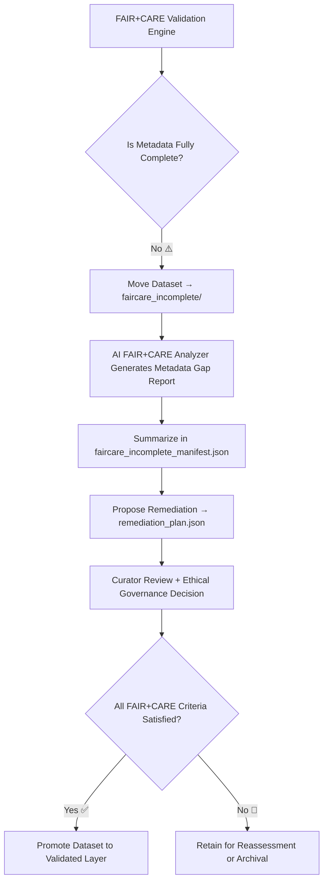

<div align="center">

# 🌿 Kansas Frontier Matrix — **FAIR+CARE Incomplete**  
`data/work/staging/tabular/tmp/intake/validation/quarantine/faircare_incomplete/`

### *“Open data is not enough — it must also be ethical, transparent, and whole.”*

**Purpose:**  
This directory contains datasets that are **partially compliant with FAIR (Findable, Accessible, Interoperable, Reusable)** and **CARE (Collective Benefit, Authority to Control, Responsibility, Ethics)** principles.  
These files exhibit **metadata gaps or incomplete ethical documentation**, preventing full certification under KFM governance standards.

[](../../../../../../../../../../../docs/architecture/repo-focus.md)  
[](../../../../../../../../../../../LICENSE)  
[]()  
[]()  
[]()

</div>

---

## 🧭 Overview

The **FAIR+CARE Incomplete Layer** is a quarantine space for datasets that demonstrate **partial adherence** to ethical and open-data frameworks.  
These datasets are not rejected but are flagged for **curatorial review** to complete or correct missing metadata fields.

Typical causes include:
- Missing license declaration or unclear reuse terms  
- Absent provenance linkage (`source_id`, `checksum`, or `wasDerivedFrom`)  
- Incomplete community governance metadata (`community_authority`, `ethics_statement`)  
- Unverified access URLs or incomplete STAC/DCAT references  
- FAIR metrics scoring below compliance thresholds (e.g., FAIR < 0.85)

---

## 🗂️ Directory Layout

```text
data/work/staging/tabular/tmp/intake/validation/quarantine/faircare_incomplete/
├── faircare_incomplete_manifest.json     # Registry of partially compliant datasets
├── ai_ethics_analysis.json               # AI-generated summaries of incomplete FAIR+CARE metadata
├── remediation_plan.json                 # AI and curator-proposed metadata completion actions
├── examples/                             # Sample excerpts of incomplete metadata cases
│   ├── ks_agriculture_1885_example.json
│   ├── ks_treaty_1851_example.csv
│   └── ks_land_records_1890_example.json
├── curator_notes.log                     # Curator oversight, metadata completion decisions
└── README.md                             # This document
````

---

## 🔁 Validation & Review Workflow



---

## 🧩 Manifest Schema

Each dataset entry in `faircare_incomplete_manifest.json` includes compliance tracking metadata:

| Field                    | Description                        | Example                                                               |
| ------------------------ | ---------------------------------- | --------------------------------------------------------------------- |
| `dataset_id`             | Dataset identifier                 | `ks_agriculture_1885`                                                 |
| `missing_fields`         | FAIR+CARE metadata elements absent | `["license", "community_authority", "checksum"]`                      |
| `fair_score`             | FAIR metric score (0–1)            | `0.78`                                                                |
| `care_score`             | CARE metric score (0–1)            | `0.82`                                                                |
| `ai_explanation`         | AI summary of deficiencies         | `"License and checksum missing; community governance unverified."`    |
| `remediation_suggestion` | Proposed fix                       | `"Add CC-BY 4.0 license; populate checksum; update authority field."` |
| `timestamp`              | Detection timestamp                | `2025-10-26T15:48:44Z`                                                |

---

## 🤖 AI FAIR+CARE Completeness Engine

| Module                   | Function                                                      | Output                                      |
| ------------------------ | ------------------------------------------------------------- | ------------------------------------------- |
| **AI Metadata Auditor**  | Detects incomplete metadata fields across FAIR+CARE standards | `faircare_incomplete_manifest.json`         |
| **Ethical Gap Analyzer** | Evaluates CARE authority and consent compliance               | `ai_ethics_analysis.json`                   |
| **Auto-Remediator**      | Suggests missing or corrective metadata insertions            | `remediation_plan.json`                     |
| **Governance Mapper**    | Links remediation and ethical reviews to provenance records   | `tabular_faircare_incomplete_ledger.jsonld` |

> 🧠 *All AI analyses include confidence levels and contextual justification, ensuring human oversight under FAIR+CARE governance.*

---

## ⚙️ Curator Workflow

Curators should:

1. Review all datasets listed in `faircare_incomplete_manifest.json`.
2. Evaluate AI recommendations for accuracy in `ai_ethics_analysis.json`.
3. Update missing metadata fields manually or via approved automation.
4. Log remediation outcomes in `curator_notes.log`.
5. Re-run the FAIR+CARE validator:

   ```bash
   make faircare-validate
   ```
6. Approve for reintegration once ethical completeness ≥ 0.95.

---

## 📈 Common FAIR+CARE Gaps

| Category    | Missing Element       | Example                            | Recommended Fix                   |
| ----------- | --------------------- | ---------------------------------- | --------------------------------- |
| **FAIR F1** | Persistent Identifier | Dataset lacks DOI                  | Assign dataset DOI or UUID        |
| **FAIR A1** | Accessibility Info    | No access URL provided             | Add valid HTTP/HTTPS access point |
| **CARE A2** | Authority to Control  | Missing `community_authority`      | Document governance relationship  |
| **CARE R2** | Responsibility        | No curator contact or ethical note | Add `curator_contact` field       |

---

## 🧾 Compliance Matrix

| Standard                      | Scope                                         | Validator        |
| ----------------------------- | --------------------------------------------- | ---------------- |
| **FAIR Principles (GO-FAIR)** | Metadata completeness & transparency          | `fair-audit`     |
| **CARE Principles (GIDA)**    | Cultural & ethical governance                 | `faircare-audit` |
| **MCP-DL v6.3**               | Documentation reproducibility & AI governance | `docs-validate`  |
| **CIDOC CRM / PROV-O**        | Provenance and semantic traceability          | `graph-lint`     |
| **ISO 19115 / 19157**         | Metadata completeness & lineage               | `geojson-lint`   |

---

## 🪶 Version History

| Version | Date       | Author              | Notes                                                                                            |
| ------- | ---------- | ------------------- | ------------------------------------------------------------------------------------------------ |
| v9.0.0  | 2025-10-26 | `@kfm-architecture` | Initial creation of FAIR+CARE Incomplete documentation under Diamond⁹ Ω / Crown∞Ω certification. |

---

<div align="center">

### 🜂 Kansas Frontier Matrix — *Completeness · Ethics · Stewardship*

**“Ethical data isn’t missing — it’s waiting to be completed.”**

[]()
[]()
[]()
[]()
[]()

<br><br> <a href="#-kansas-frontier-matrix--faircare-incomplete-ethical-metadata-compliance-class--diamond⁹-Ω--crown∞Ω-certified">⬆ Back to Top</a>

</div>
