<div align="center">

# 🌾 Kansas Frontier Matrix — **FAIR+CARE Incomplete Examples**  
`data/work/staging/tabular/tmp/intake/validation/quarantine/faircare_incomplete/examples/`

### *“Every omission is an opportunity for ethical completeness.”*

**Purpose:**  
This directory contains **evidence samples** of datasets with incomplete FAIR+CARE metadata, extracted from the KFM validation pipeline.  
These examples illustrate common missing fields, ethical documentation gaps, and metadata omissions that prevent full FAIR+CARE certification.

[](../../../../../../../../../../../../../../../../docs/architecture/repo-focus.md)  
[](../../../../../../../../../../../../../../../../LICENSE)  
[]()  
[]()  
[]()

</div>

---

## 🧭 Overview

The **FAIR+CARE Incomplete Example Layer** provides representative cases demonstrating partial metadata compliance within the Kansas Frontier Matrix (KFM).  
Each example shows:
- Missing licenses, provenance, or community consent fields  
- Unscored FAIR or CARE indicators below compliance thresholds  
- Datasets requiring curator attention for completion  
- AI-assisted reasoning on missing or ambiguous metadata  

These evidence samples support curator training, FAIR+CARE audits, and governance reporting for ethical transparency.

---

## 🗂️ Directory Layout

```text
data/work/staging/tabular/tmp/intake/validation/quarantine/faircare_incomplete/examples/
├── ks_agriculture_1885_example.json      # Missing license and checksum fields
├── ks_treaty_1851_example.csv            # Lacking community authority and provenance metadata
├── ks_land_records_1890_example.json     # Incomplete FAIR accessibility data
├── ai_faircare_incomplete_summary.json   # AI reasoning and metric explanations
├── evidence_checksums.json               # SHA-256 verification of example integrity
└── README.md                             # This document
````

---

## 🔁 Example Extraction Workflow

```mermaid
flowchart TD
    A["FAIR+CARE Validation Flags Dataset"] --> B["Extract Records Illustrating Missing Metadata"]
    B --> C["Store Examples as CSV/JSON"]
    C --> D["Compute File Checksums → evidence_checksums.json"]
    D --> E["AI FAIR+CARE Engine Generates Narrative Analysis"]
    E --> F["Save Findings → ai_faircare_incomplete_summary.json"]
    F --> G["Register Provenance → Governance Ledger (JSON-LD Entry)"]
```



---

## 📄 Example Metadata Schema

Each example is logged in `ai_faircare_incomplete_summary.json` with contextual metadata:

| Field                    | Description                         | Example                                                                            |
| ------------------------ | ----------------------------------- | ---------------------------------------------------------------------------------- |
| `dataset_id`             | Dataset name                        | `ks_agriculture_1885`                                                              |
| `file_path`              | Example evidence file path          | `examples/ks_agriculture_1885_example.json`                                        |
| `missing_fields`         | Absent FAIR+CARE metadata elements  | `["license", "checksum", "community_authority"]`                                   |
| `fair_score`             | FAIR compliance metric (0–1)        | `0.78`                                                                             |
| `care_score`             | CARE compliance metric (0–1)        | `0.80`                                                                             |
| `ai_explanation`         | AI-generated context summary        | `"Dataset missing license and community authority fields; provenance incomplete."` |
| `remediation_suggestion` | AI or curator recommendation        | `"Add CC-BY 4.0 license and verify provenance linkage to authority ledger."`       |
| `checksum`               | SHA-256 file integrity verification | `a8b94d2e9f74d32c5b3e...`                                                          |
| `timestamp`              | Extraction timestamp                | `2025-10-26T15:50:29Z`                                                             |

---

## 🤖 AI FAIR+CARE Gap Analyzer

| Module                | Function                                                             | Output                                               |
| --------------------- | -------------------------------------------------------------------- | ---------------------------------------------------- |
| **AI FAIR Auditor**   | Identifies incomplete FAIR metadata (findability, reusability, etc.) | `ai_faircare_incomplete_summary.json`                |
| **AI CARE Assessor**  | Evaluates CARE-related governance, ethics, and authority fields      | `ai_faircare_incomplete_summary.json`                |
| **Auto-Remediator**   | Suggests corrective metadata additions                               | `ai_faircare_incomplete_summary.json`                |
| **Checksum Verifier** | Ensures example evidence file integrity                              | `evidence_checksums.json`                            |
| **Governance Mapper** | Links FAIR+CARE evidence to provenance records                       | `tabular_faircare_incomplete_examples_ledger.jsonld` |

> 🧠 *Each AI audit includes interpretability tokens, FAIR+CARE context scoring, and curator confidence ratings for governance approval.*

---

## ⚙️ Curator Workflow

Curators should:

1. Review each AI interpretation in `ai_faircare_incomplete_summary.json`.
2. Verify example content for actual metadata omissions.
3. Confirm checksum integrity:

   ```bash
   make checksum-verify
   ```
4. Implement metadata updates per remediation suggestions.
5. Log ethical or governance decisions in `curator_notes.log`.
6. Revalidate metadata completeness:

   ```bash
   make faircare-validate
   ```

---

## 📈 Common FAIR+CARE Incompleteness Examples

| Missing Element       | Category  | Impact                        | Recommended Fix                              |
| --------------------- | --------- | ----------------------------- | -------------------------------------------- |
| `license`             | FAIR R1.1 | Legal ambiguity on reuse      | Add SPDX license (e.g., CC-BY 4.0)           |
| `checksum`            | FAIR R1.3 | Weak provenance tracking      | Generate SHA-256 checksum                    |
| `community_authority` | CARE A2   | Governance noncompliance      | Record community or custodian metadata       |
| `provenance_record`   | FAIR F2   | Data lineage incomplete       | Add `wasDerivedFrom` and `source_id`         |
| `curator_contact`     | CARE R2   | Lacks responsibility metadata | Include curator or data steward contact info |

---

## 🧾 Compliance Matrix

| Standard                      | Scope                                        | Validator        |
| ----------------------------- | -------------------------------------------- | ---------------- |
| **FAIR Principles (GO-FAIR)** | Metadata completeness & transparency         | `fair-audit`     |
| **CARE Principles (GIDA)**    | Community governance & ethics                | `faircare-audit` |
| **MCP-DL v6.3**               | Documentation-first reproducibility & ethics | `docs-validate`  |
| **CIDOC CRM / PROV-O**        | Provenance traceability & authority mapping  | `graph-lint`     |
| **ISO 19115 / 19157**         | Metadata lineage & completeness              | `geojson-lint`   |

---

## 🪶 Version History

| Version | Date       | Author              | Notes                                                                                                    |
| ------- | ---------- | ------------------- | -------------------------------------------------------------------------------------------------------- |
| v9.0.0  | 2025-10-26 | `@kfm-architecture` | Initial creation of FAIR+CARE Incomplete Example documentation under Diamond⁹ Ω / Crown∞Ω certification. |

---

<div align="center">

### 🜂 Kansas Frontier Matrix — *Completeness · Transparency · Ethics*

**“Completeness isn’t bureaucracy — it’s respect for data, people, and truth.”**

[]()
[]()
[]()
[]()
[]()

<br><br> <a href="#-kansas-frontier-matrix--faircare-incomplete-examples-ethical-metadata-evidence-layer--diamond⁹-Ω--crown∞Ω-certified">⬆ Back to Top</a>

</div>
