<div align="center">

# 📥 Kansas Frontier Matrix — **Quarantine Incoming Holding Bay**  
`data/work/staging/tabular/tmp/intake/validation/quarantine/incoming/`

### *“Where non-conforming data pauses before being understood.”*

**Purpose:**  
This directory serves as the **first-level quarantine intake** area for tabular datasets flagged during validation.  
It temporarily holds datasets automatically redirected from the schema validation, checksum, AI, or FAIR+CARE review layers for manual or automated triage.

[](../../../../../../../../../../../docs/architecture/repo-focus.md)  
[](../../../../../../../../../../../LICENSE)  
[]()  
[]()  
[]()

</div>

---

## 🧭 Overview

The **Incoming Quarantine Bay** captures datasets immediately after they fail one or more automated validation checks.  
It acts as the triage point for further AI and human review, ensuring that:
- All failed datasets are retained in a secure and traceable state.  
- Each entry receives metadata annotations explaining the failure cause.  
- No dataset is lost, overwritten, or prematurely deleted.  

This space bridges the transition between **automated validation** and **curator remediation** in the KFM pipeline.

---

## 🗂️ Directory Layout

```text
data/work/staging/tabular/tmp/intake/validation/quarantine/incoming/
├── flagged_datasets/                   # Incoming failed datasets awaiting classification
├── ai_diagnostics/                     # AI-generated pre-analysis of detected issues
├── intake_manifest.json                # Machine-readable manifest of quarantined files
├── ai_anomaly_precheck.json             # Preliminary AI anomaly scan results
├── quarantine_notes.log                # Curator notes and AI observations
└── README.md                           # This document
````

---

## 🔁 Incoming Workflow

```mermaid
flowchart TD
    A["Dataset Fails Validation (Schema / Checksum / FAIR+CARE / AI)"] --> B["Redirect to Quarantine: Incoming Bay"]
    B --> C["AI Auto-Classification (Failure Type & Severity)"]
    C --> D["Generate intake_manifest.json + ai_anomaly_precheck.json"]
    D --> E["Human Review → quarantine/classified/ or remediation pipeline"]
    E --> F["Governance Ledger Registration (JSON-LD Provenance Entry)"]
```



---

## 🧩 Intake Manifest Schema

Each new quarantined dataset is registered in `intake_manifest.json` as an immutable entry:

| Field            | Description                                    | Example                                                 |
| ---------------- | ---------------------------------------------- | ------------------------------------------------------- |
| `dataset_id`     | Unique identifier for dataset                  | `ks_demographics_1870`                                  |
| `source_path`    | Original source before quarantine              | `data/work/staging/tabular/tmp/intake/validation/logs/` |
| `reason_flag`    | Primary reason for quarantine                  | `Schema violation: missing field 'county_code'`         |
| `severity`       | Impact level (`critical`, `moderate`, `minor`) | `critical`                                              |
| `ai_confidence`  | Confidence level from AI classifier            | `0.973`                                                 |
| `checksum_valid` | Boolean check result                           | `false`                                                 |
| `timestamp`      | UTC ingest time                                | `2025-10-26T14:23:10Z`                                  |

---

## 🤖 AI Oversight & Diagnostics

| AI Component                  | Function                                                                                  | Output                     |
| ----------------------------- | ----------------------------------------------------------------------------------------- | -------------------------- |
| **AI Pre-Triage Agent**       | Scans incoming quarantined files for schema drift, encoding errors, or pattern anomalies. | `ai_anomaly_precheck.json` |
| **AI Explainer Module**       | Produces human-readable cause descriptions for failed datasets.                           | `quarantine_notes.log`     |
| **Confidence Scoring Engine** | Rates reliability of AI classifications and flags uncertain cases for human review.       | `intake_manifest.json`     |

AI tools work alongside **MCP governance** to provide explainable reasoning for every automated quarantine event.

---

## ⚙️ Commands

```bash
# List all newly quarantined datasets
make quarantine-incoming-list

# Run AI triage on newly flagged datasets
make ai-quarantine-precheck

# Promote reviewed datasets to classified quarantine
make quarantine-promote
```

> ⚠️ *Never manually delete or modify datasets in this directory — all files are under checksum governance.*

---

## 🧾 Compliance Matrix

| Standard              | Scope                                 | Validator       |
| --------------------- | ------------------------------------- | --------------- |
| **FAIR+CARE**         | Governance & ethical transparency     | `fair-audit`    |
| **MCP-DL v6.3**       | Documentation-first triage logging    | `docs-validate` |
| **ISO 19115 / 19157** | Provenance metadata & quality control | `geojson-lint`  |
| **STAC / DCAT 3.0**   | Dataset catalog alignment             | `stac-validate` |

---

## 🪶 Version History

| Version | Date       | Author              | Notes                                                                                                       |
| ------- | ---------- | ------------------- | ----------------------------------------------------------------------------------------------------------- |
| v9.0.0  | 2025-10-26 | `@kfm-architecture` | Initial creation of Quarantine Incoming Holding Bay documentation under Diamond⁹ Ω / Crown∞Ω certification. |

---

<div align="center">

### 🜂 Kansas Frontier Matrix — *Containment · Traceability · Integrity*

**“Every failed dataset is a lesson waiting to be corrected.”**

[]()
[]()
[]()
[]()
[]()

<br><br> <a href="#-kansas-frontier-matrix--quarantine-incoming-holding-bay-diamond⁹-Ω--crown∞Ω-certified">⬆ Back to Top</a>

</div>

