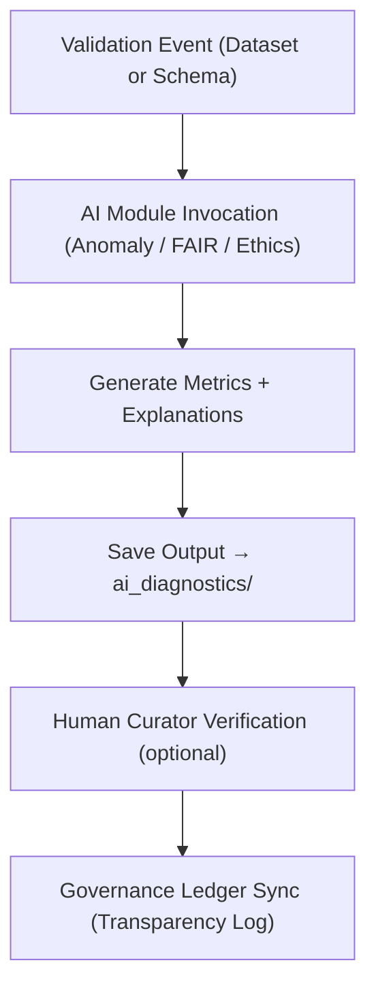

<div align="center">

# 🧮 Kansas Frontier Matrix — **AI Diagnostics**  
`data/work/staging/tabular/tmp/intake/validation/quarantine/incoming/ai_diagnostics/`

### *“Understanding the model is as important as understanding the data.”*

**Purpose:**  
This directory captures the **diagnostic outputs, interpretability metrics, and internal reasoning summaries** generated by the AI modules during validation of tabular datasets in the Kansas Frontier Matrix (KFM).  
Each record details anomaly explanations, confidence metrics, and interpretability artifacts for transparency under **MCP-DL v6.3** and **FAIR+CARE** standards.

[](../../../../../../../../../../../../docs/architecture/repo-focus.md)  
[](../../../../../../../../../../../../LICENSE)  
[]()  
[]()  
[]()

</div>

---

## 🧭 Overview

The **AI Diagnostics Subdirectory** functions as the **transparency ledger** for machine reasoning within KFM’s automated validation pipeline.  
It documents the inner workings of the anomaly detection, schema validation, and ethics models — ensuring that every AI action is explainable, auditable, and reproducible.

AI diagnostics include:
- Model confidence scores for anomaly detection  
- Natural-language reasoning from LLM validators  
- Statistical summaries from outlier and drift detection  
- AI-to-human audit alignment metrics (agreement ratio)  
- Explainable-AI visualizations (feature importances, SHAP values)  

All diagnostics adhere to KFM’s AI Governance Charter and are cross-linked to data provenance ledgers.

---

## 🗂️ Directory Layout

```text
data/work/staging/tabular/tmp/intake/validation/quarantine/incoming/ai_diagnostics/
├── model_metadata.json                  # Model architecture, parameters, and training context
├── ai_reasoning_log.json                # LLM narrative explanations of decisions
├── feature_importances.json             # Feature weighting and contribution metrics
├── shap_explanations.json               # SHAP / LIME interpretability outputs
├── drift_metrics.json                   # Temporal and distribution drift statistics
├── validation_summary.json              # Consolidated AI validation diagnostics
├── examples/                            # Linked examples and visual references
│   ├── anomaly_case_001.csv
│   ├── ethical_case_002.json
│   └── temporal_drift_003.csv
├── curator_review.log                   # Human notes verifying AI diagnostic interpretations
└── README.md                            # This document
````

---

## 🔁 AI Diagnostic Workflow



---

## 🧩 Key Diagnostic Files

| File                       | Description                                  | Purpose                                     |
| -------------------------- | -------------------------------------------- | ------------------------------------------- |
| `model_metadata.json`      | Model name, architecture, and parameters     | Enables reproducibility and version control |
| `ai_reasoning_log.json`    | LLM-generated explanations for AI decisions  | Human-readable interpretability             |
| `feature_importances.json` | Weight of each variable in model decisions   | Transparency into feature-level bias        |
| `shap_explanations.json`   | Local/global explainability data             | Model introspection                         |
| `drift_metrics.json`       | Time-series and distribution drift detection | Detects model degradation                   |
| `validation_summary.json`  | Aggregated diagnostic results                | Combined model output summary               |

---

## 🤖 AI Diagnostic Modules

| Module                                | Role                                                         | Output                                 |
| ------------------------------------- | ------------------------------------------------------------ | -------------------------------------- |
| **AI Validation Engine**              | Evaluates datasets for structure and semantic conformity     | `validation_summary.json`              |
| **Anomaly Interpreter (LLM)**         | Generates natural language explanations for model detections | `ai_reasoning_log.json`                |
| **Explainability Engine (SHAP/LIME)** | Quantifies feature contributions and bias                    | `shap_explanations.json`               |
| **Drift Monitor**                     | Tracks model performance over time                           | `drift_metrics.json`                   |
| **Governance Integrator**             | Publishes diagnostics into ledger entries                    | `tabular_ai_diagnostics_ledger.jsonld` |

> 🧠 *All AI diagnostics are versioned and immutable; no automated process can alter past reasoning records.*

---

## ⚙️ Curator Workflow

Curators and auditors should:

1. Review AI explanations in `ai_reasoning_log.json` for clarity and completeness.
2. Confirm consistency between feature importances and domain knowledge.
3. Document discrepancies or potential biases in `curator_review.log`.
4. Request retraining or threshold adjustment if systematic bias is detected.
5. Execute revalidation or retraining via:

   ```bash
   make ai-diagnostics-review
   make ai-train
   ```

---

## 📈 AI Explainability Metrics

| Metric                       | Description                          | Threshold | Interpretation           |
| ---------------------------- | ------------------------------------ | --------- | ------------------------ |
| **Confidence Score**         | Model certainty of anomaly detection | > 0.95    | Reliable prediction      |
| **Feature Weight StdDev**    | Stability of model decision factors  | < 0.15    | Low bias                 |
| **AI-Human Agreement Ratio** | % of AI outputs confirmed by curator | > 0.85    | High interpretability    |
| **Temporal Drift Δ**         | Change in model accuracy over time   | < 5%      | Stable model performance |

---

## 🧾 Compliance Matrix

| Standard               | Scope                                       | Validator       |
| ---------------------- | ------------------------------------------- | --------------- |
| **FAIR+CARE**          | Ethical interpretability and accountability | `fair-audit`    |
| **MCP-DL v6.3**        | Documentation-first AI reasoning framework  | `docs-validate` |
| **CIDOC CRM / PROV-O** | Provenance metadata and lineage tracking    | `graph-lint`    |
| **ISO/IEC 23053:2022** | AI system lifecycle and governance          | `ai-validate`   |
| **STAC / DCAT 3.0**    | Structured metadata publishing              | `stac-validate` |

---

## 🪶 Version History

| Version | Date       | Author              | Notes                                                                                      |
| ------- | ---------- | ------------------- | ------------------------------------------------------------------------------------------ |
| v9.0.0  | 2025-10-26 | `@kfm-architecture` | Initial creation of AI Diagnostics documentation under Diamond⁹ Ω / Crown∞Ω certification. |

---

<div align="center">

### 🜂 Kansas Frontier Matrix — *Transparency · Interpretability · Governance*

**“Validation isn’t complete until the machine explains itself.”**

[]()
[]()
[]()
[]()
[]()

<br><br> <a href="#-kansas-frontier-matrix--ai-diagnostics-model-reasoning--validation-insights--diamond⁹-Ω--crown∞Ω-certified">⬆ Back to Top</a>

</div>
