<div align="center">

# 🧩 Kansas Frontier Matrix — **AI Diagnostic Examples**  
`data/work/staging/tabular/tmp/intake/validation/quarantine/incoming/ai_diagnostics/examples/`

### *“AI reasoning is only trustworthy when its logic is visible.”*

**Purpose:**  
This directory contains **human-auditable evidence** of how AI models reasoned, detected anomalies, or interpreted data patterns during validation in the Kansas Frontier Matrix (KFM).  
Each example includes interpretable excerpts, reasoning outputs, and integrity checksums supporting transparent model explainability.

[](../../../../../../../../../../../../../../../../docs/architecture/repo-focus.md)  
[](../../../../../../../../../../../../../../../../LICENSE)  
[]()  
[]()  
[]()

</div>

---

## 🧭 Overview

The **AI Diagnostic Examples Layer** provides **excerpts and logs** demonstrating how AI validation models derived conclusions, flagged anomalies, or explained semantic patterns.  
This transparency layer ensures human verifiability of AI reasoning and compliance with the **FAIR+CARE** and **MCP-DL v6.3** governance principles.

These examples support:
- **Explainable AI audits** — showing “why” a dataset was flagged.  
- **Bias detection** — highlighting skewed or uncertain model outputs.  
- **Governance reviews** — ensuring accountability of AI-driven actions.  
- **Reproducibility checks** — verifying consistent reasoning under version control.  

---

## 🗂️ Directory Layout

```text
data/work/staging/tabular/tmp/intake/validation/quarantine/incoming/ai_diagnostics/examples/
├── anomaly_case_001.csv               # Statistical anomaly reasoning
├── ethical_case_002.json              # AI rationale for FAIR+CARE ethical flag
├── temporal_drift_003.csv             # Example of model drift detection
├── ai_diagnostic_summary.json         # Consolidated reasoning and SHAP insight summary
├── evidence_checksums.json            # SHA-256 verification for reproducibility
└── README.md                          # This document
````

---

## 🔁 Example Extraction Workflow

```mermaid
flowchart TD
    A["AI Module Processes Dataset"] --> B["Generate Reasoning Output (LLM / SHAP / Stats)"]
    B --> C["Extract Representative Case Studies"]
    C --> D["Store as CSV/JSON Examples"]
    D --> E["Compute SHA-256 Checksums → evidence_checksums.json"]
    E --> F["Summarize Model Reasoning → ai_diagnostic_summary.json"]
    F --> G["Record Provenance → Governance Ledger"]
```



---

## 📄 Example Metadata Schema

Each AI reasoning example is described in `ai_diagnostic_summary.json`:

| Field            | Description                        | Example                                                                              |
| ---------------- | ---------------------------------- | ------------------------------------------------------------------------------------ |
| `case_id`        | Unique example identifier          | `anomaly_case_001`                                                                   |
| `dataset_id`     | Source dataset                     | `ks_population_1880`                                                                 |
| `ai_module`      | AI model responsible               | `IsolationForest_v3.2`                                                               |
| `reasoning_type` | Model interpretability method used | `SHAP feature attribution`                                                           |
| `detected_issue` | Anomaly or flag type               | `Population outlier`                                                                 |
| `ai_explanation` | Natural-language reasoning summary | `"High SHAP value from 'population_density' feature caused anomaly classification."` |
| `checksum`       | File integrity hash (SHA-256)      | `d47a6ecbff394e0b19c7e...`                                                           |
| `timestamp`      | UTC time of extraction             | `2025-10-26T15:30:54Z`                                                               |

---

## 🤖 AI Explainability Components

| Component             | Description                                                      | Output                                         |
| --------------------- | ---------------------------------------------------------------- | ---------------------------------------------- |
| **SHAP Engine**       | Calculates per-feature importance influencing model predictions. | `ai_diagnostic_summary.json`                   |
| **LLM Reasoner**      | Generates natural-language interpretation of AI logic.           | `ai_diagnostic_summary.json`                   |
| **Bias Profiler**     | Detects potential bias in feature weighting or thresholding.     | `ai_diagnostic_summary.json`                   |
| **Checksum Verifier** | Ensures evidence authenticity for reproducibility.               | `evidence_checksums.json`                      |
| **Governance Mapper** | Links reasoning artifacts to provenance records.                 | `tabular_ai_diagnostic_examples_ledger.jsonld` |

> 🧠 *AI interpretability reports follow the MCP-DL explainability contract — deterministic, auditable, and ethically traceable.*

---

## ⚙️ Curator Workflow

Curators or auditors should:

1. Review reasoning narratives in `ai_diagnostic_summary.json`.
2. Verify evidence hashes using:

   ```bash
   make checksum-verify
   ```
3. Compare SHAP or LIME outputs for bias detection.
4. Add curator commentary or ethical interpretation in `curator_review.log`.
5. Trigger retraining or explainability verification:

   ```bash
   make ai-explain-review
   ```

---

## 📈 Example AI Reasoning Scenarios

| Case    | Category            | Description                            | AI Model              | Recommended Action                 |
| ------- | ------------------- | -------------------------------------- | --------------------- | ---------------------------------- |
| **001** | Statistical Outlier | Anomalous population density value     | IsolationForest_v3.2  | Verify against historical registry |
| **002** | Ethical Compliance  | Dataset missing Indigenous attribution | EthicsClassifier_v1.4 | Add FAIR+CARE metadata             |
| **003** | Temporal Drift      | Year range out of scope for schema     | TemporalModel_v2.0    | Adjust time-normalization logic    |

---

## 🧾 Compliance Matrix

| Standard               | Scope                                        | Validator       |
| ---------------------- | -------------------------------------------- | --------------- |
| **FAIR+CARE**          | Ethical transparency and AI interpretability | `fair-audit`    |
| **MCP-DL v6.3**        | Machine reasoning documentation framework    | `docs-validate` |
| **ISO/IEC 23053:2022** | AI system lifecycle traceability             | `ai-validate`   |
| **CIDOC CRM / PROV-O** | Provenance metadata traceability             | `graph-lint`    |
| **STAC / DCAT 3.0**    | Metadata publication for explainable outputs | `stac-validate` |

---

## 🪶 Version History

| Version | Date       | Author              | Notes                                                                                             |
| ------- | ---------- | ------------------- | ------------------------------------------------------------------------------------------------- |
| v9.0.0  | 2025-10-26 | `@kfm-architecture` | Initial creation of AI Diagnostic Example documentation under Diamond⁹ Ω / Crown∞Ω certification. |

---

<div align="center">

### 🜂 Kansas Frontier Matrix — *Transparency · Interpretation · Accountability*

**“A model that explains itself invites trust.”**

[]()
[]()
[]()
[]()
[]()

<br><br> <a href="#-kansas-frontier-matrix--ai-diagnostic-examples-explainability-evidence-layer--diamond⁹-Ω--crown∞Ω-certified">⬆ Back to Top</a>

</div>
