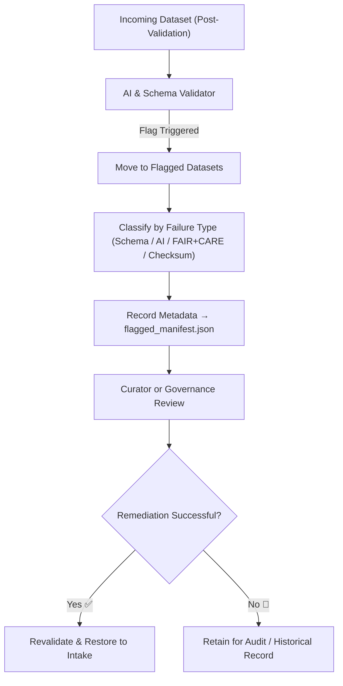

<div align="center">

# 🚩 Kansas Frontier Matrix — **Flagged Datasets (Quarantine Intake Zone)**  
`data/work/staging/tabular/tmp/intake/validation/quarantine/incoming/flagged_datasets/`

### *“Every flag is a signal — not an error, but an opportunity for precision.”*

**Purpose:**  
This directory stores **datasets automatically flagged by the validation, AI, or FAIR+CARE systems** during the KFM intake process.  
Each file in this directory requires review by human curators or automated remediation before re-entry into the validation cycle.

[](../../../../../../../../../../../../docs/architecture/repo-focus.md)  
[](../../../../../../../../../../../../LICENSE)  
[]()  
[]()  
[]()

</div>

---

## 🧭 Overview

The **Flagged Datasets Subdirectory** is a secure holding space for data that has triggered automated or manual flags during validation.  
Files here are considered **temporarily non-compliant**, typically due to one or more of the following:

- ❌ **Schema non-conformance** (missing fields, invalid datatypes)  
- ⚠️ **Checksum discrepancies** (mismatch between file and manifest)  
- 🧩 **AI-detected anomalies** (pattern irregularities, value drift)  
- 🕊️ **FAIR+CARE violations** (missing license, ethical provenance)  
- 📉 **Metadata gaps** (incomplete or inconsistent descriptors)

These flagged datasets are held under strict governance until corrective action has been performed and verified by a curator.

---

## 🗂️ Directory Layout

```text
data/work/staging/tabular/tmp/intake/validation/quarantine/incoming/flagged_datasets/
├── schema_errors/                  # Datasets failing schema validation
├── checksum_mismatch/              # Files failing integrity checks
├── ai_anomalies/                   # Files flagged by AI anomaly detection
├── faircare_violations/            # Files failing FAIR+CARE criteria
├── flagged_manifest.json           # Master manifest of all flagged datasets
├── curator_notes.log               # Human-readable notes for review actions
└── README.md                       # This document
````

---

## 🔁 Flagging & Review Workflow



---

## 🧩 Flagged Manifest Schema

Each flagged file is registered in `flagged_manifest.json` as a verifiable JSON-LD object:

| Field               | Description                                     | Example                        |
| ------------------- | ----------------------------------------------- | ------------------------------ |
| `file_name`         | Dataset file name                               | `kansas_climate_1880.csv`      |
| `flag_reason`       | Cause of quarantine flag                        | `Missing 'county_code' column` |
| `ai_confidence`     | AI model certainty (0–1)                        | `0.964`                        |
| `checksum_verified` | Boolean integrity indicator                     | `false`                        |
| `severity`          | Impact category (`critical`, `moderate`, `low`) | `moderate`                     |
| `review_status`     | Current remediation state                       | `pending`                      |
| `curator`           | Assigned curator or reviewer                    | `@kfm-data-governance`         |
| `timestamp`         | Time of flag registration                       | `2025-10-26T14:25:52Z`         |

---

## 🤖 AI Detection Modules

| Module                  | Function                                                         | Output                              |
| ----------------------- | ---------------------------------------------------------------- | ----------------------------------- |
| **AI Schema Validator** | Detects missing, duplicated, or mis-typed fields                 | `ai_anomalies/schema_ai_flags.json` |
| **AI Outlier Detector** | Scans numerical and categorical data for irregular distributions | `ai_anomalies/outlier_flags.json`   |
| **Ethics Auditor**      | Flags datasets lacking community attribution or ethical metadata | `faircare_violations/*.json`        |
| **Integrity Agent**     | Verifies checksum mismatches and replication inconsistencies     | `checksum_mismatch/*.json`          |

> 🧠 *Each AI-generated flag includes a confidence score and an interpretability note for human review.*

---

## 🧾 Curator Responsibilities

Curators are required to:

1. Review the flagged dataset and AI context files.
2. Add annotations to `curator_notes.log` describing actions taken.
3. Submit remediation commits that document fixes, retaining old file hashes for traceability.
4. Trigger a revalidation cycle with `make revalidate-flagged`.

---

## ⚙️ Common Commands

```bash
# List all flagged datasets
make flagged-list

# Generate a flag summary report
make flagged-summary

# Trigger revalidation for reviewed files
make revalidate-flagged
```

> ⚠️ *Flagged files are under governance freeze — direct edits or deletion outside the remediation process are strictly prohibited.*

---

## 🧾 Compliance Matrix

| Standard               | Scope                                       | Validator       |
| ---------------------- | ------------------------------------------- | --------------- |
| **FAIR+CARE**          | Ethical and open-data compliance            | `fair-audit`    |
| **MCP-DL v6.3**        | Documentation-first governance traceability | `docs-validate` |
| **CIDOC CRM / PROV-O** | Provenance and lineage metadata             | `graph-lint`    |
| **ISO 19115 / 19157**  | Data quality and lifecycle tracking         | `geojson-lint`  |
| **STAC / DCAT**        | Catalog metadata linkage                    | `stac-validate` |

---

## 🪶 Version History

| Version | Date       | Author              | Notes                                                                                        |
| ------- | ---------- | ------------------- | -------------------------------------------------------------------------------------------- |
| v9.0.0  | 2025-10-26 | `@kfm-architecture` | Initial creation of Flagged Datasets documentation under Diamond⁹ Ω / Crown∞Ω certification. |

---

<div align="center">

### 🜂 Kansas Frontier Matrix — *Accountability · Insight · Recovery*

**“Flags are not failures — they’re signals of integrity at work.”**

[]()
[]()
[]()
[]()
[]()

<br><br> <a href="#-kansas-frontier-matrix--flagged-datasets-quarantine-intake-zone--diamond⁹-Ω--crown∞Ω-certified">⬆ Back to Top</a>

</div>
