<div align="center">

# 🤖 Kansas Frontier Matrix — **AI Anomalies**  
`data/work/staging/tabular/tmp/intake/validation/quarantine/incoming/flagged_datasets/ai_anomalies/`

### *“When machines detect what humans might miss, validation listens.”*

**Purpose:**  
This directory captures datasets flagged by **AI-driven anomaly detection models** during tabular validation.  
These anomalies represent statistically, semantically, or structurally unusual data patterns that diverge from KFM’s expected norms.  
Each record is automatically logged, scored, and stored with provenance to ensure reproducibility and interpretability.

[](../../../../../../../../../../../../docs/architecture/repo-focus.md)  
[](../../../../../../../../../../../../LICENSE)  
[]()  
[]()  
[]()

</div>

---

## 🧭 Overview

The **AI Anomalies Subdirectory** collects machine-identified irregularities across tabular datasets using both deterministic validation and unsupervised learning.  
Anomalies may indicate:
- Unusual statistical outliers (e.g., population value 10× higher than norm).  
- Semantic mismatches (e.g., non-historical year, mismatched coordinates).  
- Pattern drift (e.g., data distributions inconsistent with temporal series).  
- Metadata misalignment (e.g., field incorrectly classified by AI inference).  

All AI-flagged results are **explainable, logged, and subject to curator review** before reintegration.

---

## 🗂️ Directory Layout

```text
data/work/staging/tabular/tmp/intake/validation/quarantine/incoming/flagged_datasets/ai_anomalies/
├── ai_anomalies_manifest.json            # Registry of AI-flagged anomalies
├── model_metadata.json                   # Information on model version, parameters, thresholds
├── ai_explanations.json                  # Human-readable model explanations and reasoning tokens
├── anomaly_profiles.json                 # Statistical summaries of detected anomalies
├── examples/                             # Representative dataset fragments of anomalies
│   ├── ks_population_1870_example.csv
│   ├── ks_census_1900_example.json
│   └── ks_economy_1910_example.csv
├── curator_notes.log                     # Manual validation and governance comments
└── README.md                             # This document
````

---

## 🔁 AI Detection Workflow

```mermaid
flowchart TD
    A["ETL Tabular Validation"] --> B["AI Anomaly Detector (Unsupervised + Rule-Based)"]
    B --> C{"Anomaly Detected?"}
    C -- "Yes" --> D["Log Entry → ai_anomalies_manifest.json"]
    D --> E["Generate Model Explanation → ai_explanations.json"]
    E --> F["Record Statistical Profile → anomaly_profiles.json"]
    F --> G["Move Dataset → ai_anomalies/"]
    G --> H["Curator Review + Decision (Retain / Correct / Retrain)"]
```



---

## 🧩 AI Anomalies Manifest Schema

| Field            | Description                   | Example                |
| ---------------- | ----------------------------- | ---------------------- |
| `dataset_id`     | Dataset name                  | `ks_population_1870`   |
| `anomaly_type`   | Type of detected anomaly      | `Statistical Outlier`  |
| `field_name`     | Field under scrutiny          | `population_density`   |
| `detected_value` | Observed anomalous value      | `9452`                 |
| `expected_range` | Calculated normal value range | `100–1200`             |
| `ai_confidence`  | Confidence score (0–1)        | `0.986`                |
| `explanation_id` | Link to LLM reasoning entry   | `EXP-003492`           |
| `timestamp`      | UTC detection time            | `2025-10-26T15:26:40Z` |

---

## 🤖 AI Models & Methods

| Model                     | Method                              | Purpose                       | Output                       |
| ------------------------- | ----------------------------------- | ----------------------------- | ---------------------------- |
| **Isolation Forest**      | Unsupervised outlier detection      | Detect numerical anomalies    | `ai_anomalies_manifest.json` |
| **LLM Semantic Analyzer** | NLP-based entity/context validation | Identify semantic mismatches  | `ai_explanations.json`       |
| **DBSCAN / K-Means**      | Clustering analysis                 | Detect distributional drift   | `anomaly_profiles.json`      |
| **Hybrid Rule Engine**    | Deterministic + learned rules       | Enforce KFM schema boundaries | `ai_anomalies_manifest.json` |

> 🧠 *All anomaly detections are explainable via SHAP, attention maps, and text-based reasoning logs under MCP-DL.*

---

## ⚙️ Curator Workflow

Curators should:

1. Review AI outputs in `ai_anomalies_manifest.json` and `ai_explanations.json`.
2. Determine whether flagged entries represent genuine data anomalies or expected variations.
3. Add notes to `curator_notes.log` with validation decisions.
4. If corrections are needed, execute:

   ```bash
   make ai-anomaly-review
   make revalidate-flagged
   ```
5. For model retraining or threshold tuning:

   ```bash
   make ai-train-anomaly
   ```

---

## 📈 Example Anomaly Types

| Anomaly Class                  | Description                        | Example                             | Remediation                                |
| ------------------------------ | ---------------------------------- | ----------------------------------- | ------------------------------------------ |
| **Statistical Outlier**        | Value far from distribution norm   | Population density `9452`           | Verify data; correct or flag as historical |
| **Temporal Drift**             | Event outside historical range     | Treaty date `2150-01-01`            | Fix parsing or dataset metadata            |
| **Semantic Misclassification** | AI misinterprets categorical label | `"Fort Riley"` classified as `City` | Update training data ontology              |
| **Metadata Inconsistency**     | Field-level mismatch with schema   | `checksum` type mismatch            | Correct schema field definition            |

---

## 🧾 Compliance Matrix

| Standard               | Scope                                   | Validator       |
| ---------------------- | --------------------------------------- | --------------- |
| **FAIR+CARE**          | Ethical transparency & explainability   | `fair-audit`    |
| **MCP-DL v6.3**        | Documentation-first AI interpretability | `docs-validate` |
| **CIDOC CRM / PROV-O** | Provenance and entity linkage           | `graph-lint`    |
| **ISO 19115 / 19157**  | Metadata quality & integrity            | `geojson-lint`  |
| **STAC / DCAT 3.0**    | Metadata catalog standardization        | `stac-validate` |

---

## 🪶 Version History

| Version | Date       | Author              | Notes                                                                                    |
| ------- | ---------- | ------------------- | ---------------------------------------------------------------------------------------- |
| v9.0.0  | 2025-10-26 | `@kfm-architecture` | Initial creation of AI Anomalies documentation under Diamond⁹ Ω / Crown∞Ω certification. |

---

<div align="center">

### 🜂 Kansas Frontier Matrix — *Detection · Insight · Accountability*

**“AI doesn’t replace validation — it deepens it.”**

[]()
[]()
[]()
[]()
[]()

<br><br> <a href="#-kansas-frontier-matrix--ai-anomalies-machine-learning-validation-class--diamond⁹-Ω--crown∞Ω-certified">⬆ Back to Top</a>

</div>
