<div align="center">

# 🧠 Kansas Frontier Matrix — **AI Anomaly Examples**  
`data/work/staging/tabular/tmp/intake/validation/quarantine/incoming/flagged_datasets/ai_anomalies/examples/`

### *“Each anomaly is a signal — and every signal deserves context.”*

**Purpose:**  
This directory stores **AI-flagged sample records** that triggered anomaly detection during KFM’s validation pipelines.  
These examples provide human-readable and machine-traceable evidence of unusual data points, helping improve AI model interpretability, retraining, and FAIR+CARE audit transparency.

[](../../../../../../../../../../../../../../../../docs/architecture/repo-focus.md)  
[](../../../../../../../../../../../../../../../../LICENSE)  
[]()  
[]()  
[]()

</div>

---

## 🧭 Overview

The **AI Anomaly Examples Layer** holds a curated set of evidence extracted from validation runs where the AI engine detected deviations from expected norms.  
Examples demonstrate:
- Numerical outliers (e.g., implausibly high or low values)  
- Temporal inconsistencies (e.g., events occurring outside historical context)  
- Semantic mismatches (e.g., wrong classification of entity or place)  
- Metadata drift (e.g., mismatched schema-ontology links)  

Each evidence file includes checksums and provenance references for full auditability and reproducibility.

---

## 🗂️ Directory Layout

```text
data/work/staging/tabular/tmp/intake/validation/quarantine/incoming/flagged_datasets/ai_anomalies/examples/
├── ks_population_1870_example.csv       # Outlier in population density
├── ks_census_1900_example.json          # Temporal anomaly in event records
├── ks_economy_1910_example.csv          # Semantic or contextual mismatch
├── ai_anomaly_summary.json              # AI-generated narrative explanations
├── evidence_checksums.json              # SHA-256 hashes for evidence integrity
└── README.md                            # This document
````

---

## 🔁 Example Extraction Workflow

```mermaid
flowchart TD
    A["AI Detector Flags Anomaly During Validation"] --> B["Extract 5–10 Rows Illustrating the Anomaly"]
    B --> C["Save Excerpts as CSV/JSON Evidence"]
    C --> D["Compute SHA-256 Checksums → evidence_checksums.json"]
    D --> E["Run LLM Explainer for Contextual Reasoning"]
    E --> F["Store Results in ai_anomaly_summary.json"]
    F --> G["Link Provenance to Governance Ledger (JSON-LD)"]
```



---

## 📄 Example Metadata Schema

Each anomaly sample is documented in `ai_anomaly_summary.json` as structured metadata:

| Field            | Description                  | Example                                                                           |
| ---------------- | ---------------------------- | --------------------------------------------------------------------------------- |
| `dataset_id`     | Dataset identifier           | `ks_population_1870`                                                              |
| `file_path`      | Example file location        | `examples/ks_population_1870_example.csv`                                         |
| `anomaly_type`   | Type of anomaly detected     | `Statistical Outlier`                                                             |
| `field_name`     | Column affected              | `population_density`                                                              |
| `detected_value` | Value triggering anomaly     | `9452`                                                                            |
| `expected_range` | AI-determined norm           | `100–1200`                                                                        |
| `ai_explanation` | AI interpretation            | `"Detected a population outlier 7.8x higher than state median for 1870 dataset."` |
| `checksum`       | SHA-256 hash of example file | `a67d98efbb2c11af1e...`                                                           |
| `timestamp`      | UTC extraction time          | `2025-10-26T15:28:56Z`                                                            |

---

## 🤖 AI Evidence Modules

| Module                                  | Function                                            | Output                                      |
| --------------------------------------- | --------------------------------------------------- | ------------------------------------------- |
| **Outlier Detector (Isolation Forest)** | Flags numeric values outside learned distributions. | `ai_anomaly_summary.json`                   |
| **Semantic Analyzer (LLM)**             | Explains data context and potential causal factors. | `ai_anomaly_summary.json`                   |
| **Checksum Validator**                  | Verifies evidence file integrity.                   | `evidence_checksums.json`                   |
| **Governance Mapper**                   | Registers anomaly evidence to provenance ledger.    | `tabular_ai_anomaly_examples_ledger.jsonld` |

> 🧠 *All AI summaries include confidence intervals and reasoning steps per MCP-DL interpretability standards.*

---

## ⚙️ Curator Workflow

Curators must:

1. Review the AI reasoning and confirm the anomaly’s legitimacy.
2. Add contextual human insight in `curator_notes.log` if necessary.
3. Confirm checksum integrity using:

   ```bash
   make checksum-verify
   ```
4. Determine corrective or investigative actions (retain, fix, or retrain).
5. Re-run validation workflow with:

   ```bash
   make revalidate-flagged
   ```

---

## 📈 Example Anomaly Classes

| Category                | Description                                       | Example                            | Action               |
| ----------------------- | ------------------------------------------------- | ---------------------------------- | -------------------- |
| **Statistical Outlier** | Extreme deviation from numerical average          | Population value `9452`            | Verify or flag       |
| **Temporal Drift**      | Out-of-range year or event timestamp              | `2150-01-01`                       | Correct or nullify   |
| **Semantic Mismatch**   | Inconsistent classification between AI and schema | `"Fort Riley"` labeled as “County” | Adjust metadata      |
| **Distribution Shift**  | AI model detects data drift across releases       | Value skewed >3σ                   | Recalibrate pipeline |

---

## 🧾 Compliance Matrix

| Standard               | Scope                                        | Validator       |
| ---------------------- | -------------------------------------------- | --------------- |
| **FAIR+CARE**          | Ethical audit transparency                   | `fair-audit`    |
| **MCP-DL v6.3**        | AI documentation & explainability compliance | `docs-validate` |
| **CIDOC CRM / PROV-O** | Semantic provenance of AI annotations        | `graph-lint`    |
| **ISO 19115 / 19157**  | Metadata quality and consistency             | `geojson-lint`  |
| **STAC / DCAT 3.0**    | AI evidence metadata cataloging              | `stac-validate` |

---

## 🪶 Version History

| Version | Date       | Author              | Notes                                                                                          |
| ------- | ---------- | ------------------- | ---------------------------------------------------------------------------------------------- |
| v9.0.0  | 2025-10-26 | `@kfm-architecture` | Initial creation of AI Anomaly Example documentation under Diamond⁹ Ω / Crown∞Ω certification. |

---

<div align="center">

### 🜂 Kansas Frontier Matrix — *Learning · Integrity · Transparency*

**“Anomalies are the feedback loops that make intelligence honest.”**

[]()
[]()
[]()
[]()
[]()

<br><br> <a href="#-kansas-frontier-matrix--ai-anomaly-examples-machine-learning-evidence-layer--diamond⁹-Ω--crown∞Ω-certified">⬆ Back to Top</a>

</div>
