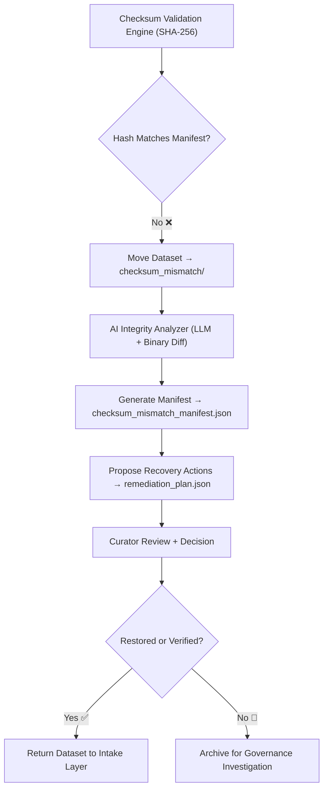

<div align="center">

# 🔒 Kansas Frontier Matrix — **Checksum Mismatch**  
`data/work/staging/tabular/tmp/intake/validation/quarantine/incoming/flagged_datasets/checksum_mismatch/`

### *“Integrity is not assumed — it’s mathematically proven.”*

**Purpose:**  
This directory contains tabular datasets that failed integrity verification due to **checksum mismatches** between their stored metadata and recalculated file digests.  
Such mismatches indicate potential corruption, modification, or version divergence since the last checksum computation.

[](../../../../../../../../../../../../docs/architecture/repo-focus.md)  
[](../../../../../../../../../../../../LICENSE)  
[]()  
[]()  
[]()

</div>

---

## 🧭 Overview

The **Checksum Mismatch Subdirectory** captures datasets whose recorded cryptographic checksums (typically SHA-256) no longer match their computed hash values during validation.  
Checksum discrepancies may arise from:
- Accidental file edits or overwrites  
- Encoding changes during transfer or serialization  
- Partial file corruption or truncation  
- Hash mismatch due to schema or data updates without manifest refresh  

Each mismatch is treated as a **critical FAIR+CARE integrity violation** and is automatically logged, version-tracked, and assigned a provenance entry in the governance ledger.

---

## 🗂️ Directory Layout

```text
data/work/staging/tabular/tmp/intake/validation/quarantine/incoming/flagged_datasets/checksum_mismatch/
├── checksum_mismatch_manifest.json       # Manifest of mismatched file hashes
├── ai_integrity_analysis.json            # AI reasoning explaining mismatch context
├── remediation_plan.json                 # Suggested actions (recompute, restore, or rollback)
├── examples/                             # Data excerpts for forensic comparison
│   ├── ks_agriculture_1875_example.csv
│   ├── ks_population_1890_example.json
│   └── ks_census_1900_example.csv
├── curator_notes.log                     # Manual curator observations and corrections
└── README.md                             # This document
````

---

## 🔁 Detection Workflow



---

## 🧩 Manifest Schema

Each mismatch entry in `checksum_mismatch_manifest.json` includes:

| Field                | Description                         | Example                                                                          |
| -------------------- | ----------------------------------- | -------------------------------------------------------------------------------- |
| `dataset_id`         | Dataset name                        | `ks_population_1890`                                                             |
| `expected_checksum`  | Hash stored in metadata manifest    | `b85ef3c4a9d7e9f2a1d...`                                                         |
| `computed_checksum`  | Hash recalculated during validation | `b85ef3c4a9d7e9f2a1dXXXX`                                                        |
| `file_path`          | File under inspection               | `data/work/staging/tabular/tmp/intake/validation/tmp/ks_population_1890.csv`     |
| `size_diff_bytes`    | Byte difference between versions    | `-104`                                                                           |
| `ai_commentary`      | AI-generated explanation            | `"Checksum mismatch suggests partial file truncation or encoding modification."` |
| `remediation_action` | Recommended fix                     | `"Restore from last verified checksum commit."`                                  |
| `timestamp`          | Detection time                      | `2025-10-26T15:22:33Z`                                                           |

---

## 🤖 AI Integrity & Provenance Modules

| Module                    | Function                                                                      | Output                                    |
| ------------------------- | ----------------------------------------------------------------------------- | ----------------------------------------- |
| **AI Integrity Analyzer** | Determines likely causes of checksum mismatches (corruption, edit, transfer). | `ai_integrity_analysis.json`              |
| **Binary Diff Engine**    | Compares bit-level deltas between versions.                                   | `ai_integrity_analysis.json`              |
| **Auto-Restorer**         | Suggests verified rollback or re-ingestion strategy.                          | `remediation_plan.json`                   |
| **Governance Recorder**   | Updates the ledger with provenance and resolution events.                     | `tabular_checksum_mismatch_ledger.jsonld` |

> 🧠 *All checksum mismatch analyses maintain cryptographic reproducibility and traceability under FAIR+CARE governance.*

---

## ⚙️ Curator Workflow

Curators must:

1. Review checksum mismatch reports in `checksum_mismatch_manifest.json`.
2. Compare computed and expected hashes using independent tools (e.g., `sha256sum`).
3. Verify whether the discrepancy results from authorized updates, encoding errors, or file corruption.
4. Document findings in `curator_notes.log`.
5. Execute repair or rollback as advised in `remediation_plan.json`:

   ```bash
   make restore-checksum
   ```
6. Revalidate dataset integrity:

   ```bash
   make checksums-verify
   ```
7. Confirm resolution and ledger entry update.

---

## 📈 Example Checksum Issues

| Issue Type            | Description                           | Example                  | Resolution                           |
| --------------------- | ------------------------------------- | ------------------------ | ------------------------------------ |
| **Corrupted File**    | File truncated or encoding damaged    | `missing 200 bytes`      | Restore from previous version        |
| **Unauthorized Edit** | Data altered without manifest update  | `computed ≠ stored hash` | Update manifest + log provenance     |
| **Manifest Drift**    | Schema modified but old hash retained | `expected: old format`   | Regenerate manifest                  |
| **Encoding Change**   | UTF-8 → UTF-16 file conversion        | hash mismatch            | Convert to UTF-8, recompute checksum |

---

## 🧾 Compliance Matrix

| Standard                 | Scope                                     | Validator         |
| ------------------------ | ----------------------------------------- | ----------------- |
| **SHA-256 / FIPS 180-4** | Cryptographic checksum integrity          | `checksum-verify` |
| **FAIR+CARE**            | Provenance and ethical data traceability  | `fair-audit`      |
| **CIDOC CRM / PROV-O**   | Provenance relationships for data lineage | `graph-lint`      |
| **MCP-DL v6.3**          | Documentation-first verification pipeline | `docs-validate`   |
| **ISO 19115 / 19157**    | Metadata integrity and data quality       | `geojson-lint`    |

---

## 🪶 Version History

| Version | Date       | Author              | Notes                                                                                         |
| ------- | ---------- | ------------------- | --------------------------------------------------------------------------------------------- |
| v9.0.0  | 2025-10-26 | `@kfm-architecture` | Initial creation of Checksum Mismatch documentation under Diamond⁹ Ω / Crown∞Ω certification. |

---

<div align="center">

### 🜂 Kansas Frontier Matrix — *Integrity · Trust · Verification*

**“A dataset’s integrity isn’t a promise — it’s a proof.”**

[]()
[]()
[]()
[]()
[]()

<br><br> <a href="#-kansas-frontier-matrix--checksum-mismatch-integrity-validation-class--diamond⁹-Ω--crown∞Ω-certified">⬆ Back to Top</a>

</div>
