<div align="center">

# 📁 Kansas Frontier Matrix — **Checksum Mismatch Examples**  
`data/work/staging/tabular/tmp/intake/validation/quarantine/incoming/flagged_datasets/checksum_mismatch/examples/`

### *“Integrity errors are not failures — they are signals that trust is working.”*

**Purpose:**  
This directory provides **verifiable example fragments** of datasets that triggered checksum mismatches during validation.  
These examples represent evidence of integrity deviations detected by the KFM validation framework and serve as FAIR+CARE-aligned proof for curation, audit, and AI-assisted anomaly investigation.

[](../../../../../../../../../../../../../../../../docs/architecture/repo-focus.md)  
[](../../../../../../../../../../../../../../../../LICENSE)  
[]()  
[]()  
[]()

</div>

---

## 🧭 Overview

The **Checksum Mismatch Example Layer** contains data excerpts (CSV/JSON) showing differences between stored and recalculated file contents.  
These fragments illustrate corruption, alteration, or misalignment between the current dataset and its checksum registry in `manifest.json`.  

Each example helps:
- Demonstrate checksum comparison and failure detection workflows  
- Train and verify AI integrity models  
- Support transparent FAIR+CARE audit logging  
- Provide forensic reproducibility for curators and compliance teams  

---

## 🗂️ Directory Layout

```text
data/work/staging/tabular/tmp/intake/validation/quarantine/incoming/flagged_datasets/checksum_mismatch/examples/
├── ks_agriculture_1875_example.csv        # Example with altered content post-ingest
├── ks_population_1890_example.json        # JSON with corrupted encoding
├── ks_census_1900_example.csv             # File truncated or mismatched bytes
├── ai_integrity_example_summary.json      # AI reasoning for integrity mismatches
├── evidence_checksums.json                # SHA-256 hashes verifying examples
└── README.md                              # This document
````

---

## 🔁 Evidence Extraction Workflow

```mermaid
flowchart TD
    A["Checksum mismatch detected"] --> B["Extract 5–10 lines showing affected data"]
    B --> C["Save as CSV/JSON evidence file"]
    C --> D["Compute SHA-256 for each example (evidence_checksums.json)"]
    D --> E["Run AI Integrity Analyzer for reasoning"]
    E --> F["Record findings in ai_integrity_example_summary.json"]
    F --> G["Register provenance → Governance Ledger"]
```



---

## 📄 Example Metadata Schema

Each example file is referenced in `ai_integrity_example_summary.json` with structured metadata:

| Field               | Description                           | Example                                                                   |
| ------------------- | ------------------------------------- | ------------------------------------------------------------------------- |
| `dataset_id`        | Dataset name                          | `ks_population_1890`                                                      |
| `file_path`         | Path to evidence file                 | `examples/ks_population_1890_example.json`                                |
| `expected_checksum` | Original checksum from manifest       | `8a5b47ac...`                                                             |
| `computed_checksum` | New checksum from validation          | `8a5b47acXXXX`                                                            |
| `size_diff_bytes`   | Byte size difference between versions | `-104`                                                                    |
| `ai_explanation`    | AI-generated reasoning                | `"Checksum mismatch likely due to UTF-8 encoding change or manual edit."` |
| `checksum`          | SHA-256 hash of example evidence file | `b54f0c22a314d...`                                                        |
| `timestamp`         | Extraction time (UTC)                 | `2025-10-26T15:24:48Z`                                                    |

---

## 🤖 AI Integrity Analysis

| Module                   | Function                                                         | Output                                             |
| ------------------------ | ---------------------------------------------------------------- | -------------------------------------------------- |
| **Binary Diff Engine**   | Highlights bit-level changes across file versions                | `ai_integrity_example_summary.json`                |
| **AI Integrity Auditor** | Interprets mismatch origins (encoding, corruption, update drift) | `ai_integrity_example_summary.json`                |
| **Checksum Validator**   | Confirms SHA-256 evidence file hashes                            | `evidence_checksums.json`                          |
| **Governance Recorder**  | Links evidence to provenance metadata and audit trails           | `tabular_checksum_mismatch_examples_ledger.jsonld` |

> 🧠 *AI commentary includes anomaly classification and explainable confidence metrics (per MCP-DL fairness standards).*

---

## ⚙️ Curator Workflow

Curators are expected to:

1. Review each mismatch example and compare with manifest entries.
2. Validate integrity reports in `ai_integrity_example_summary.json`.
3. Confirm file integrity via:

   ```bash
   make checksum-verify
   ```
4. Document cause of mismatch (e.g., encoding issue, unauthorized edit) in `curator_notes.log`.
5. Restore or regenerate verified data from backups when necessary.
6. Execute revalidation:

   ```bash
   make revalidate-flagged
   ```

---

## 📈 Example Integrity Cases

| Case                  | Description                                  | Root Cause            | Resolution                             |
| --------------------- | -------------------------------------------- | --------------------- | -------------------------------------- |
| **Encoding Drift**    | CSV saved in UTF-16 instead of UTF-8         | Character re-encoding | Convert + recompute checksum           |
| **Manual Edit**       | User-modified data cell without revalidating | Governance bypass     | Rollback or manifest update            |
| **File Truncation**   | Missing rows or trailing newlines            | Transfer error        | Restore full file from version control |
| **Binary Corruption** | Checksum mismatch due to byte error          | Storage anomaly       | Replace from verified archive          |

---

## 🧾 Compliance Matrix

| Standard                 | Scope                                | Validator         |
| ------------------------ | ------------------------------------ | ----------------- |
| **SHA-256 / FIPS 180-4** | Cryptographic integrity assurance    | `checksum-verify` |
| **FAIR+CARE**            | Reproducibility and audit ethics     | `fair-audit`      |
| **CIDOC CRM / PROV-O**   | Provenance and modification tracking | `graph-lint`      |
| **MCP-DL v6.3**          | Transparent evidence documentation   | `docs-validate`   |
| **ISO 19115 / 19157**    | Data quality and lineage management  | `geojson-lint`    |

---

## 🪶 Version History

| Version | Date       | Author              | Notes                                                                                                 |
| ------- | ---------- | ------------------- | ----------------------------------------------------------------------------------------------------- |
| v9.0.0  | 2025-10-26 | `@kfm-architecture` | Initial creation of Checksum Mismatch Example documentation under Diamond⁹ Ω / Crown∞Ω certification. |

---

<div align="center">

### 🜂 Kansas Frontier Matrix — *Integrity · Transparency · Verification*

**“Every mismatch teaches vigilance — validation is the language of trust.”**

[]()
[]()
[]()
[]()
[]()

<br><br> <a href="#-kansas-frontier-matrix--checksum-mismatch-examples-error-evidence-layer--diamond⁹-Ω--crown∞Ω-certified">⬆ Back to Top</a>

</div>
