<div align="center">

# 🌍 Kansas Frontier Matrix — **FAIR+CARE Violations**  
`data/work/staging/tabular/tmp/intake/validation/quarantine/incoming/flagged_datasets/faircare_violations/`

### *“Openness without ethics is incompleteness — validation ensures both.”*

**Purpose:**  
This directory contains datasets that failed validation under the **FAIR (Findable, Accessible, Interoperable, Reusable)** and **CARE (Collective Benefit, Authority to Control, Responsibility, Ethics)** frameworks.  
Files here represent ethical, legal, or provenance deficiencies detected during automated and AI-augmented governance review.

[](../../../../../../../../../../../../docs/architecture/repo-focus.md)  
[](../../../../../../../../../../../../LICENSE)  
[]()  
[]()  
[]()

</div>

---

## 🧭 Overview

The **FAIR+CARE Violations Subdirectory** isolates datasets exhibiting issues related to:
- **Incomplete metadata** (missing license, provenance, or contact info)  
- **Unclear data authority or ownership**  
- **Accessibility breaches** (restricted or unverified distribution links)  
- **Cultural or ethical non-compliance** (lack of Indigenous or community data consent)  
- **CARE responsibility misalignment** (improper representation or attribution)  

All files in this directory undergo secondary AI and human review to determine if remediation, redaction, or archival action is necessary.

---

## 🗂️ Directory Layout

```text
data/work/staging/tabular/tmp/intake/validation/quarantine/incoming/flagged_datasets/faircare_violations/
├── faircare_violations_manifest.json     # Registry of FAIR+CARE compliance issues
├── ai_ethics_audit.json                  # AI-driven analysis of ethical compliance
├── remediation_plan.json                 # Suggested resolution or redaction procedures
├── examples/                             # Sample datasets illustrating ethical/metadata issues
│   ├── ks_treaty_1851_example.csv
│   ├── ks_indigenous_records_1880_example.json
│   └── ks_census_1900_example.csv
├── curator_notes.log                     # Human-led audit and review documentation
└── README.md                             # This document
````

---

## 🔁 Validation Workflow

```mermaid
flowchart TD
    A["Dataset Validation Stage"] --> B["FAIR+CARE Policy Engine (AI + Ruleset)"]
    B --> C{"Compliance Violations Found?"}
    C -- "Yes" --> D["Dataset → faircare_violations/"]
    D --> E["AI Ethics & Governance Analyzer"]
    E --> F["Generate Report → faircare_violations_manifest.json"]
    F --> G["Curator Oversight & Decision (Fix / Redact / Archive)"]
```



---

## 🧩 Manifest Schema

Each FAIR+CARE issue is documented in `faircare_violations_manifest.json`:

| Field                    | Description                                       | Example                                                                                       |
| ------------------------ | ------------------------------------------------- | --------------------------------------------------------------------------------------------- |
| `dataset_id`             | Dataset identifier                                | `ks_treaty_1851`                                                                              |
| `violation_type`         | FAIR+CARE compliance issue                        | `Missing License Metadata`                                                                    |
| `description`            | Explanation of issue                              | `"Dataset lacks declared usage license and provenance record."`                               |
| `severity`               | Level of impact (`critical`, `moderate`, `minor`) | `critical`                                                                                    |
| `ai_explanation`         | AI-generated reasoning                            | `"Absence of explicit reuse permissions violates FAIR principle R1.1 and CARE principle E4."` |
| `remediation_suggestion` | Proposed correction or policy action              | `"Add CC-BY 4.0 license and update provenance metadata."`                                     |
| `timestamp`              | UTC detection time                                | `2025-10-26T15:31:40Z`                                                                        |

---

## 🤖 AI Ethical Governance Engine

| AI Module                   | Function                                                       | Output                                      |
| --------------------------- | -------------------------------------------------------------- | ------------------------------------------- |
| **AI FAIR+CARE Auditor**    | Evaluates datasets against machine-readable FAIR+CARE criteria | `faircare_violations_manifest.json`         |
| **Ethics Context Analyzer** | Detects potential cultural sensitivity or ownership conflicts  | `ai_ethics_audit.json`                      |
| **Auto-Remediator**         | Suggests ethical metadata fixes or redactions                  | `remediation_plan.json`                     |
| **Governance Linker**       | Logs compliance lineage in FAIR+CARE ledger                    | `tabular_faircare_violations_ledger.jsonld` |

> 🧠 *AI recommendations are advisory; all ethical decisions are confirmed through human governance review.*

---

## ⚙️ Curator Workflow

Curators should:

1. Review flagged datasets in `faircare_violations_manifest.json`.
2. Assess AI explanations in `ai_ethics_audit.json` for context accuracy.
3. Implement remediations defined in `remediation_plan.json`.
4. Document actions and decisions in `curator_notes.log`.
5. Revalidate datasets via:

   ```bash
   make faircare-validate
   ```
6. Ensure final FAIR+CARE certification before promotion to production.

---

## 📈 Example Violations & Resolutions

| Type                        | Description                            | Example                     | Resolution                                        |
| --------------------------- | -------------------------------------- | --------------------------- | ------------------------------------------------- |
| **License Missing**         | Dataset lacks open license declaration | No `license` field present  | Add `"license": "CC-BY 4.0"`                      |
| **Provenance Absent**       | Missing `source_id` or `checksum`      | No `provenance` metadata    | Add `governance/source_registry.json` link        |
| **Restricted Data**         | Contains community or private data     | `"restricted_access": true` | Redact or anonymize sensitive fields              |
| **Ethical Attribution Gap** | Indigenous data uncredited             | No `community` field        | Add `community`, `region`, and `consent` metadata |

---

## 🧾 Compliance Matrix

| Standard                      | Scope                          | Validator        |
| ----------------------------- | ------------------------------ | ---------------- |
| **FAIR Principles (GO-FAIR)** | Open data compliance           | `fair-audit`     |
| **CARE Principles (GIDA)**    | Indigenous data governance     | `faircare-audit` |
| **MCP-DL v6.3**               | Documentation-first governance | `docs-validate`  |
| **CIDOC CRM / PROV-O**        | Provenance documentation       | `graph-lint`     |
| **ISO 19115 / 19157**         | Metadata quality standards     | `geojson-lint`   |

---

## 🪶 Version History

| Version | Date       | Author              | Notes                                                                                            |
| ------- | ---------- | ------------------- | ------------------------------------------------------------------------------------------------ |
| v9.0.0  | 2025-10-26 | `@kfm-architecture` | Initial creation of FAIR+CARE Violations documentation under Diamond⁹ Ω / Crown∞Ω certification. |

---

<div align="center">

### 🜂 Kansas Frontier Matrix — *Ethics · Accountability · Provenance*

**“Data stewardship is not only technical — it is moral.”**

[]()
[]()
[]()
[]()
[]()

<br><br> <a href="#-kansas-frontier-matrix--faircare-violations-ethical-compliance-validation-class--diamond⁹-Ω--crown∞Ω-certified">⬆ Back to Top</a>

</div>
