<div align="center">

# 🌐 Kansas Frontier Matrix — **FAIR+CARE Violation Examples**  
`data/work/staging/tabular/tmp/intake/validation/quarantine/incoming/flagged_datasets/faircare_violations/examples/`

### *“Transparency is the first step toward ethical correction.”*

**Purpose:**  
This directory archives **example fragments** from datasets that failed FAIR+CARE compliance validation.  
Each example documents how ethical, provenance, or metadata requirements were violated — providing evidence for audit review, governance correction, and AI ethics retraining.

[](../../../../../../../../../../../../../../../../docs/architecture/repo-focus.md)  
[](../../../../../../../../../../../../../../../../LICENSE)  
[]()  
[]()  
[]()

</div>

---

## 🧭 Overview

The **FAIR+CARE Violation Examples Layer** contains ethically relevant evidence extracted from validation logs and datasets where open data and community stewardship requirements were breached.  
Examples provide insight into:
- Missing or ambiguous licenses  
- Absent or incomplete provenance documentation  
- Lack of Indigenous data authority acknowledgement  
- Restricted access violating FAIR findability or accessibility principles  
- Metadata omissions breaking CARE responsibility or ethical requirements  

These examples serve as **audit training material** for curators, governance boards, and AI ethics systems ensuring reproducible compliance monitoring.

---

## 🗂️ Directory Layout

```text
data/work/staging/tabular/tmp/intake/validation/quarantine/incoming/flagged_datasets/faircare_violations/examples/
├── ks_treaty_1851_example.csv             # Missing license and community consent fields
├── ks_indigenous_records_1880_example.json # Absent authority control or ethical consent metadata
├── ks_census_1900_example.csv             # Restricted data missing reuse permissions
├── ai_ethics_example_summary.json          # AI analysis of FAIR+CARE noncompliance examples
├── evidence_checksums.json                 # SHA-256 hashes for all example files
└── README.md                               # This document
````

---

## 🔁 Example Extraction Workflow

```mermaid
flowchart TD
    A["FAIR+CARE Validator Flags Dataset"] --> B["Extract 5–10 Illustrative Records"]
    B --> C["Save Fragments (CSV/JSON) to examples/"]
    C --> D["Compute File Checksums → evidence_checksums.json"]
    D --> E["AI Ethics Analyzer Generates Narrative Summary"]
    E --> F["Record Explanation → ai_ethics_example_summary.json"]
    F --> G["Link Example Provenance → Governance Ledger (JSON-LD)"]
```



---

## 📄 Example Metadata Schema

Each violation sample is logged in `ai_ethics_example_summary.json` and linked to FAIR+CARE context:

| Field                 | Description                   | Example                                                                                 |
| --------------------- | ----------------------------- | --------------------------------------------------------------------------------------- |
| `dataset_id`          | Dataset name                  | `ks_treaty_1851`                                                                        |
| `file_path`           | Example file location         | `examples/ks_treaty_1851_example.csv`                                                   |
| `violation_type`      | FAIR+CARE principle breached  | `Missing License Metadata`                                                              |
| `principles_affected` | FAIR/CARE codes               | `["F2", "R1.1", "C2"]`                                                                  |
| `ai_commentary`       | AI-generated explanation      | `"Dataset lacks declared open license and Indigenous community consent documentation."` |
| `recommended_action`  | Ethical remediation advice    | `"Add CC-BY 4.0 license and confirm authority-to-control statement."`                   |
| `checksum`            | File integrity hash (SHA-256) | `f93a4e72baf01a6ec74e...`                                                               |
| `timestamp`           | Extraction time               | `2025-10-26T15:33:17Z`                                                                  |

---

## 🤖 AI Ethics Analyzer Modules

| Module                       | Function                                           | Output                                              |
| ---------------------------- | -------------------------------------------------- | --------------------------------------------------- |
| **FAIR+CARE Rule Engine**    | Detects missing metadata and policy violations     | `ai_ethics_example_summary.json`                    |
| **LLM Governance Explainer** | Generates narrative reports with ethical reasoning | `ai_ethics_example_summary.json`                    |
| **Checksum Verifier**        | Validates file evidence hashes                     | `evidence_checksums.json`                           |
| **Provenance Mapper**        | Creates JSON-LD links to ledger governance entries | `tabular_faircare_violation_examples_ledger.jsonld` |

> 🧠 *AI ethical summaries are explainable, traceable, and reviewed by human governance teams for validation.*

---

## ⚙️ Curator Workflow

Curators and governance reviewers should:

1. Inspect `ai_ethics_example_summary.json` for violation context and impact.
2. Review extracted examples for accuracy and sensitivity.
3. Verify evidence integrity via:

   ```bash
   make checksum-verify
   ```
4. Document actions (correction, redaction, or approval) in `curator_notes.log`.
5. Execute follow-up validation to confirm resolution:

   ```bash
   make faircare-validate
   ```

---

## 📈 Common FAIR+CARE Violations

| Category                       | Example                           | Violation       | Resolution                               |
| ------------------------------ | --------------------------------- | --------------- | ---------------------------------------- |
| **License Omission**           | Missing `"license"` field         | Fails FAIR R1.1 | Add CC or Open Data license              |
| **Authority Undefined**        | No Indigenous governance metadata | CARE A2 breach  | Include `"community_authority"` metadata |
| **Provenance Gap**             | No `source_id` or `checksum`      | FAIR R1.3       | Link provenance registry record          |
| **Ethical Redaction Required** | Sensitive names or imagery        | CARE R2         | Redact or anonymize data                 |

---

## 🧾 Compliance Matrix

| Standard               | Scope                                      | Validator        |
| ---------------------- | ------------------------------------------ | ---------------- |
| **FAIR+CARE**          | Ethical open science framework             | `faircare-audit` |
| **MCP-DL v6.3**        | Documentation-driven governance compliance | `docs-validate`  |
| **CIDOC CRM / PROV-O** | Provenance and cultural data standards     | `graph-lint`     |
| **ISO 19115 / 19157**  | Metadata and quality lineage tracking      | `geojson-lint`   |
| **STAC / DCAT 3.0**    | Dataset metadata interoperability          | `stac-validate`  |

---

## 🪶 Version History

| Version | Date       | Author              | Notes                                                                                                   |
| ------- | ---------- | ------------------- | ------------------------------------------------------------------------------------------------------- |
| v9.0.0  | 2025-10-26 | `@kfm-architecture` | Initial creation of FAIR+CARE Violation Example documentation under Diamond⁹ Ω / Crown∞Ω certification. |

---

<div align="center">

### 🜂 Kansas Frontier Matrix — *Ethics · Openness · Stewardship*

**“Accountability isn’t an afterthought — it’s the architecture of trust.”**

[]()
[]()
[]()
[]()
[]()

<br><br> <a href="#-kansas-frontier-matrix--faircare-violation-examples-ethical-evidence-layer--diamond⁹-Ω--crown∞Ω-certified">⬆ Back to Top</a>

</div>
