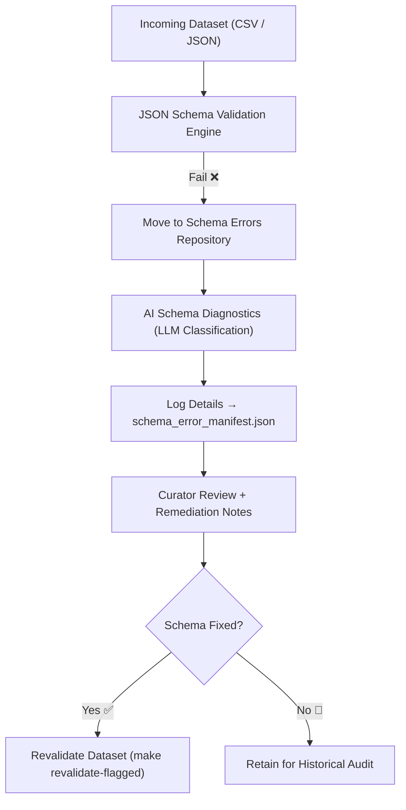

<div align="center">

# ❗ Kansas Frontier Matrix — **Schema Error Repository**  
`data/work/staging/tabular/tmp/intake/validation/quarantine/incoming/flagged_datasets/schema_errors/`

### *“When structure breaks, documentation restores it.”*

**Purpose:**  
This directory stores all **tabular datasets that fail schema validation** during intake into the Kansas Frontier Matrix (KFM).  
Files here contain missing, malformed, or inconsistent fields detected during automated or AI-enhanced schema enforcement.

[](../../../../../../../../../../../../../../docs/architecture/repo-focus.md)  
[](../../../../../../../../../../../../../../LICENSE)  
[]()  
[]()  
[]()

</div>

---

## 🧭 Overview

The **Schema Error Repository** isolates datasets that violate JSON Schema or STAC/DCAT metadata conformance requirements.  
These errors often stem from:
- Missing required fields or metadata  
- Incorrect field datatypes  
- Invalid enumerations or pattern mismatches  
- Deprecated schema versions  
- Unexpected column names or order  

All files placed here are traceable, versioned, and remediated under MCP-DL v6.3 governance rules.

---

## 🗂️ Directory Layout

```text
data/work/staging/tabular/tmp/intake/validation/quarantine/incoming/flagged_datasets/schema_errors/
├── invalid_field_types/             # Datasets with datatype mismatches
├── missing_required_fields/         # Files missing critical schema-defined fields
├── pattern_violations/              # Regex or enum mismatches
├── deprecated_schema_versions/      # Datasets using outdated schema versions
├── schema_error_manifest.json       # Registry of all schema error cases
├── ai_schema_diagnostics.json       # AI-generated context for schema error classification
├── remediation_notes.log            # Curator notes for fixing schema issues
└── README.md                        # This document
````

---

## 🔁 Error Identification Workflow



---

## 🧩 Schema Error Manifest Structure

Each dataset failure is recorded in `schema_error_manifest.json` as an auditable entry:

| Field            | Description                      | Example                                                    |
| ---------------- | -------------------------------- | ---------------------------------------------------------- |
| `dataset_id`     | Unique dataset name or ID        | `ks_population_1880`                                       |
| `error_type`     | Type of schema failure           | `missing_required_field`                                   |
| `field_name`     | Field causing validation failure | `county_code`                                              |
| `expected_type`  | Schema-defined datatype          | `integer`                                                  |
| `found_type`     | Detected datatype                | `string`                                                   |
| `schema_version` | Applied schema definition        | `v13`                                                      |
| `ai_explanation` | AI-detected error context        | `"Field 'county_code' missing or misnamed in header row."` |
| `timestamp`      | UTC timestamp of failure event   | `2025-10-26T14:27:33Z`                                     |

---

## 🤖 AI Schema Diagnostics

| AI Component            | Function                                                           | Output                                   |
| ----------------------- | ------------------------------------------------------------------ | ---------------------------------------- |
| **AI Schema Explainer** | Uses LLMs to summarize root cause and remediation suggestions.     | `ai_schema_diagnostics.json`             |
| **Field Classifier**    | Detects misnamed or misplaced columns via pattern recognition.     | `schema_error_manifest.json`             |
| **Auto-Mapper**         | Suggests corrected schema mappings for known issues.               | `ai_schema_diagnostics.json`             |
| **FAIR Auditor**        | Cross-verifies schema metadata completeness under FAIR principles. | `reports/fair/schema_error_summary.json` |

> 🧠 *AI modules operate as support systems for curators, ensuring consistent, transparent error documentation.*

---

## ⚙️ Curator Actions

Curators must:

1. Review the file and its associated diagnostics.
2. Correct field structure or naming per schema requirements.
3. Log the remediation details in `remediation_notes.log`.
4. Re-run validation using:

   ```bash
   make revalidate-flagged
   ```
5. Upon successful validation, the dataset is automatically promoted out of quarantine.

---

## 🧾 Compliance Matrix

| Standard                 | Scope                                | Validator       |
| ------------------------ | ------------------------------------ | --------------- |
| **JSON Schema Draft-07** | Core validation                      | `jsonschema`    |
| **STAC 1.0 / DCAT 3.0**  | Metadata conformance                 | `stac-validate` |
| **CIDOC CRM / PROV-O**   | Provenance traceability              | `graph-lint`    |
| **FAIR+CARE**            | Ethical and documentation compliance | `fair-audit`    |
| **MCP-DL v6.3**          | Documentation-first reproducibility  | `docs-validate` |

---

## 🪶 Version History

| Version | Date       | Author              | Notes                                                                                               |
| ------- | ---------- | ------------------- | --------------------------------------------------------------------------------------------------- |
| v9.0.0  | 2025-10-26 | `@kfm-architecture` | Initial creation of Schema Error Repository documentation under Diamond⁹ Ω / Crown∞Ω certification. |

---

<div align="center">

### 🜂 Kansas Frontier Matrix — *Validation · Correction · Reproducibility*

**“Schemas don’t fail — they teach us how to see structure clearly.”**

[]()
[]()
[]()
[]()
[]()

<br><br> <a href="#-kansas-frontier-matrix--schema-error-repository-quarantine-intake-zone--diamond⁹-Ω--crown∞Ω-certified">⬆ Back to Top</a>

</div>
