<div align="center">

# 📜 Kansas Frontier Matrix — **Deprecated Schema Versions**  
`data/work/staging/tabular/tmp/intake/validation/quarantine/incoming/flagged_datasets/schema_errors/deprecated_schema_versions/`

### *“Yesterday’s structure cannot safely hold today’s data.”*

**Purpose:**  
This directory captures datasets validated using **outdated or deprecated schema definitions**, no longer compliant with current KFM data standards (MCP-DL v6.3 / STAC 1.0 / DCAT 3.0).  
These datasets remain in quarantine until they are **migrated to the latest schema version** or approved for archival under governance policy.

[](../../../../../../../../../../../../../docs/architecture/repo-focus.md)  
[](../../../../../../../../../../../../../LICENSE)  
[]()  
[]()  
[]()

</div>

---

## 🧭 Overview

The **Deprecated Schema Versions Subdirectory** serves as a staging zone for datasets that:
- Were validated against an older JSON Schema revision (e.g., v10, v11, v12).  
- Contain outdated field definitions or missing properties introduced in newer schema versions.  
- Reference retired ontology mappings (e.g., legacy CIDOC or DCAT v2.0 terms).  
- Lack required FAIR+CARE compliance metadata (added in MCP-DL v6.3 and later).  

Datasets here are reviewed by schema maintainers and governance leads to determine if **automated migration**, **manual patching**, or **deprecation archival** is required.

---

## 🗂️ Directory Layout

```text
data/work/staging/tabular/tmp/intake/validation/quarantine/incoming/flagged_datasets/schema_errors/deprecated_schema_versions/
├── deprecated_schema_manifest.json       # Index of datasets using old schema versions
├── ai_schema_version_analysis.json       # AI reasoning and cross-version comparison
├── migration_plan.json                   # Proposed schema upgrade roadmap
├── examples/                             # CSV/JSON snippets from deprecated schema datasets
│   ├── ks_treaty_1840_example.json
│   ├── ks_population_1870_example.csv
│   └── ks_agriculture_1885_example.json
├── curator_notes.log                     # Human-led review and migration logs
└── README.md                             # This document
````

---

## 🔁 Validation Workflow

```mermaid
flowchart TD
    A["Validation Engine: Schema Version Check"] --> B{"Schema Version < Latest?"}
    B -- "Yes" --> C["Move Dataset → deprecated_schema_versions/"]
    C --> D["AI Schema Comparison (Cross-Version Diff Engine)"]
    D --> E["Generate Manifest → deprecated_schema_manifest.json"]
    E --> F["Suggest Migration Plan (Upgrade Paths, Field Mapping)"]
    F --> G["Curator Review + Schema Update"]
    G --> H{"Migrated to Latest Schema?"}
    H -- "Yes ✅" --> I["Promote to Intake Layer"]
    H -- "No 🚫" --> J["Archive as Deprecated Dataset"]
```



---

## 🧩 Manifest Schema

Each record in `deprecated_schema_manifest.json` includes:

| Field                    | Description                                        | Example                                                                    |
| ------------------------ | -------------------------------------------------- | -------------------------------------------------------------------------- |
| `dataset_id`             | Dataset name                                       | `ks_population_1870`                                                       |
| `schema_version_used`    | Old schema applied                                 | `v11`                                                                      |
| `latest_schema_version`  | Current schema required                            | `v13`                                                                      |
| `ai_summary`             | AI description of detected version differences     | `"Schema v11 lacks new field 'checksum'; field 'license' format updated."` |
| `migration_priority`     | Urgency level (`critical`, `moderate`, `optional`) | `critical`                                                                 |
| `remediation_suggestion` | Migration path                                     | `"Use migration_plan.json to auto-map missing fields."`                    |
| `timestamp`              | UTC detection time                                 | `2025-10-26T15:18:21Z`                                                     |

---

## 🤖 AI Schema Migration Engine

| AI Module                   | Function                                                                                    | Output                                                 |
| --------------------------- | ------------------------------------------------------------------------------------------- | ------------------------------------------------------ |
| **Schema Diff Engine**      | Compares deprecated schema to current version, identifying changes and missing definitions. | `ai_schema_version_analysis.json`                      |
| **Migration Planner**       | Generates automated upgrade steps (field renames, format conversions, ontology updates).    | `migration_plan.json`                                  |
| **Governance Sync Agent**   | Records migration history in the provenance ledger.                                         | `tabular_deprecated_schema_versions_ledger.jsonld`     |
| **FAIR Compliance Checker** | Evaluates new schema’s alignment with FAIR+CARE principles post-upgrade.                    | `reports/fair/deprecated_schema_versions_summary.json` |

> 🧠 *All AI migration recommendations are reviewed by human schema stewards before implementation.*

---

## ⚙️ Curator Workflow

Curators and schema maintainers must:

1. Review `deprecated_schema_manifest.json` and `ai_schema_version_analysis.json` for migration feasibility.
2. Apply automated or manual updates based on `migration_plan.json`.
3. Revalidate datasets under the new schema version using:

   ```bash
   make validate-tabular-schema
   ```
4. Document changes in `curator_notes.log`.
5. Update governance ledger entries for version provenance tracking.

---

## 📈 Migration Example

| Field Name         | Change Type       | Action                                    |
| ------------------ | ----------------- | ----------------------------------------- |
| `checksum`         | **New Field**     | Add SHA-256 digest field to metadata      |
| `license`          | **Format Update** | Update from `"CC-BY 3.0"` → `"CC-BY 4.0"` |
| `stac_catalog_ref` | **Removed Field** | Replace with `catalog_uri`                |
| `faircare_score`   | **New Field**     | Add FAIR+CARE compliance metric           |

---

## 🧾 Compliance Matrix

| Standard                 | Scope                                     | Validator       |
| ------------------------ | ----------------------------------------- | --------------- |
| **JSON Schema Draft-07** | Schema definition and version enforcement | `jsonschema`    |
| **FAIR+CARE**            | Metadata ethics and accessibility         | `fair-audit`    |
| **CIDOC CRM / OWL-Time** | Temporal and event ontology alignment     | `graph-lint`    |
| **MCP-DL v6.3**          | Schema migration documentation standard   | `docs-validate` |
| **ISO 19115 / 19157**    | Metadata lineage and version traceability | `geojson-lint`  |

---

## 🪶 Version History

| Version | Date       | Author              | Notes                                                                                                  |
| ------- | ---------- | ------------------- | ------------------------------------------------------------------------------------------------------ |
| v9.0.0  | 2025-10-26 | `@kfm-architecture` | Initial creation of Deprecated Schema Versions documentation under Diamond⁹ Ω / Crown∞Ω certification. |

---

<div align="center">

### 🜂 Kansas Frontier Matrix — *Evolution · Continuity · Provenance*

**“Standards evolve — and every dataset must evolve with them.”**

[]()
[]()
[]()
[]()
[]()

<br><br> <a href="#-kansas-frontier-matrix--deprecated-schema-versions-schema-governance-class--diamond⁹-Ω--crown∞Ω-certified">⬆ Back to Top</a>

</div>
