<div align="center">

# 📚 Kansas Frontier Matrix — **Deprecated Schema Version Examples**  
`data/work/staging/tabular/tmp/intake/validation/quarantine/incoming/flagged_datasets/schema_errors/deprecated_schema_versions/examples/`

### *“To understand progress, we must preserve the footprints of the old schema.”*

**Purpose:**  
This directory contains **verifiable evidence samples** of datasets validated against outdated or deprecated schema versions.  
These examples demonstrate version drift, missing fields, and format changes, serving as training data for AI migration engines and governance audits.

[](../../../../../../../../../../../../../../../../../../../../docs/architecture/repo-focus.md)  
[](../../../../../../../../../../../../../../../../../../../../LICENSE)  
[]()  
[]()  
[]()

</div>

---

## 🧭 Overview

The **Deprecated Schema Version Examples Layer** preserves short data snippets and validation outputs demonstrating schema version mismatches.  
Each example corresponds to a dataset previously validated under an outdated JSON Schema or ontology mapping (e.g., STAC 0.9, DCAT 2.0, CIDOC CRM v6.x).  

These examples enable:
- Comparative analysis of field evolution across schema versions.  
- Testing and training of automated schema migration tools.  
- FAIR+CARE documentation of legacy data handling and transformation lineage.  
- Transparent governance of data version transitions under MCP-DL compliance.  

---

## 🗂️ Directory Layout

```text
data/work/staging/tabular/tmp/intake/validation/quarantine/incoming/flagged_datasets/schema_errors/deprecated_schema_versions/examples/
├── ks_treaty_1840_example.json            # Example dataset validated under schema v10
├── ks_population_1870_example.csv         # Example with outdated checksum and license fields
├── ks_agriculture_1885_example.json       # Example missing FAIR+CARE metadata (v11 schema)
├── ai_schema_diff_summary.json            # AI reasoning comparing old vs. new schema
├── evidence_checksums.json                # SHA-256 hashes verifying evidence integrity
└── README.md                              # This document
````

---

## 🔁 Example Extraction Workflow

```mermaid
flowchart TD
    A["Validation detects outdated schema version"] --> B["Extract representative dataset fragments"]
    B --> C["Save as CSV/JSON in examples/"]
    C --> D["Compute SHA-256 checksums for reproducibility"]
    D --> E["Run AI Schema Diff Engine (Cross-Version Comparison)"]
    E --> F["Generate ai_schema_diff_summary.json"]
    F --> G["Register evidence provenance → Governance Ledger"]
```



---

## 📄 Example Metadata Schema

Each example is recorded in `ai_schema_diff_summary.json` with its version context:

| Field                    | Description                      | Example                                                                                                  |
| ------------------------ | -------------------------------- | -------------------------------------------------------------------------------------------------------- |
| `dataset_id`             | Dataset name                     | `ks_agriculture_1885`                                                                                    |
| `file_path`              | Path to example evidence         | `examples/ks_agriculture_1885_example.json`                                                              |
| `schema_version_used`    | Schema originally used           | `v11`                                                                                                    |
| `current_schema_version` | Latest approved schema           | `v13`                                                                                                    |
| `fields_missing`         | Fields not defined in old schema | `["checksum", "faircare_score"]`                                                                         |
| `ai_commentary`          | LLM-generated reasoning          | `"Schema v11 lacks new FAIR+CARE fields introduced in v13. Metadata incomplete for current compliance."` |
| `checksum`               | SHA-256 verification hash        | `ff9d4ab0d3a1779eea0e8...`                                                                               |
| `timestamp`              | Extraction time                  | `2025-10-26T15:19:57Z`                                                                                   |

---

## 🤖 AI Schema Evolution Engine

| Module                    | Function                                                      | Output                                                     |
| ------------------------- | ------------------------------------------------------------- | ---------------------------------------------------------- |
| **AI Schema Diff Engine** | Detects discrepancies between deprecated and current schemas. | `ai_schema_diff_summary.json`                              |
| **Version Analyzer**      | Tracks removed, added, and modified fields.                   | `ai_schema_diff_summary.json`                              |
| **Checksum Verifier**     | Confirms integrity of example fragments.                      | `evidence_checksums.json`                                  |
| **Governance Mapper**     | Links outdated schema evidence to ledger provenance records.  | `tabular_deprecated_schema_version_examples_ledger.jsonld` |

> 🧠 *AI modules generate explainable schema version diffs and highlight migration-impact fields for human review.*

---

## ⚙️ Curator Workflow

Curators and schema maintainers must:

1. Review each example and its AI-generated comparison report.
2. Confirm deprecated schema identifiers in `ai_schema_diff_summary.json`.
3. Document schema change implications in `curator_notes.log`.
4. Perform or simulate migration using:

   ```bash
   make migrate-schema
   ```
5. Validate updated datasets against the latest schema version:

   ```bash
   make validate-tabular-schema
   ```

---

## 🧾 Compliance Matrix

| Standard                 | Scope                                         | Validator       |
| ------------------------ | --------------------------------------------- | --------------- |
| **JSON Schema Draft-07** | Schema syntax and version enforcement         | `jsonschema`    |
| **FAIR+CARE**            | Legacy data transparency and migration ethics | `fair-audit`    |
| **CIDOC CRM / OWL-Time** | Temporal version lineage tracking             | `graph-lint`    |
| **MCP-DL v6.3**          | Documentation-driven schema evolution         | `docs-validate` |
| **STAC / DCAT 3.0**      | Schema modernization for spatio-temporal data | `stac-validate` |

---

## 🪶 Version History

| Version | Date       | Author              | Notes                                                                                                          |
| ------- | ---------- | ------------------- | -------------------------------------------------------------------------------------------------------------- |
| v9.0.0  | 2025-10-26 | `@kfm-architecture` | Initial creation of Deprecated Schema Version Examples documentation under Diamond⁹ Ω / Crown∞Ω certification. |

---

<div align="center">

### 🜂 Kansas Frontier Matrix — *Evolution · Compliance · Memory*

**“Every legacy schema is a lesson — and every lesson must be documented.”**

[]()
[]()
[]()
[]()
[]()

<br><br> <a href="#-kansas-frontier-matrix--deprecated-schema-version-examples-error-evidence-layer--diamond⁹-Ω--crown∞Ω-certified">⬆ Back to Top</a>

</div>
