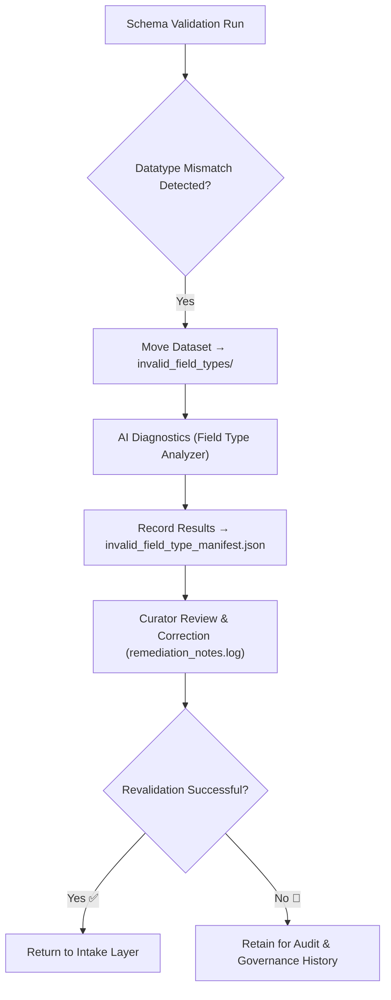

<div align="center">

# ⚠️ Kansas Frontier Matrix — **Invalid Field Types**  
`data/work/staging/tabular/tmp/intake/validation/quarantine/incoming/flagged_datasets/schema_errors/invalid_field_types/`

### *“A dataset is only as strong as the types that define its truth.”*

**Purpose:**  
This directory contains **datasets that failed schema validation due to datatype mismatches**.  
These issues occur when a field’s detected type (e.g., *string*, *integer*, *boolean*) differs from the expected type defined in the KFM tabular schema (`schemas/tabular-intake-v13.json`).

[](../../../../../../../../../../../../../../../docs/architecture/repo-focus.md)  
[](../../../../../../../../../../../../../../../LICENSE)  
[]()  
[]()  
[]()

</div>

---

## 🧭 Overview

The **Invalid Field Types Subdirectory** isolates tabular datasets that exhibit incorrect or inconsistent data types within one or more fields.  
This class of schema error typically arises when:
- Numeric fields contain string values (e.g., `"12a"` in a numeric column)  
- Boolean fields use inconsistent casing or representation (`"TRUE"`, `"false"`, `1`, `Yes`)  
- Temporal fields contain invalid date formats or mixed ISO standards  
- Fields use **comma-delimited numeric strings** where numeric arrays are expected  
- The schema version does not match the dataset’s structure expectations  

AI-assisted validation automatically detects and classifies these issues, providing interpretable reasoning for each field-level mismatch.

---

## 🗂️ Directory Layout

```text
data/work/staging/tabular/tmp/intake/validation/quarantine/incoming/flagged_datasets/schema_errors/invalid_field_types/
├── numeric_as_string/             # Fields where numbers appear as text
├── boolean_inconsistencies/       # Fields with inconsistent boolean values
├── date_format_mismatch/          # Incorrect or mixed date formats
├── mixed_type_fields/             # Columns with heterogeneous value types
├── invalid_field_type_manifest.json  # Summary manifest of detected type errors
├── ai_fieldtype_diagnostics.json     # AI-generated explanations for datatype mismatches
├── remediation_notes.log             # Curator documentation for corrections
└── README.md                         # This document
````

---

## 🔁 Validation Workflow



---

## 🧩 Invalid Field Type Manifest Schema

Each entry in `invalid_field_type_manifest.json` documents a unique mismatch:

| Field            | Description                                    | Example                                            |
| ---------------- | ---------------------------------------------- | -------------------------------------------------- |
| `dataset_id`     | Dataset name or identifier                     | `ks_population_1890`                               |
| `column_name`    | Field with invalid type                        | `total_population`                                 |
| `expected_type`  | Type per schema                                | `integer`                                          |
| `detected_type`  | Type detected during validation                | `string`                                           |
| `error_sample`   | Example of invalid value                       | `"15a"`                                            |
| `severity`       | Impact level (`critical`, `moderate`, `minor`) | `moderate`                                         |
| `ai_explanation` | AI-generated explanation                       | `"Non-numeric characters found in numeric field."` |
| `timestamp`      | UTC timestamp                                  | `2025-10-26T14:31:20Z`                             |

---

## 🤖 AI Diagnostics Engine

| AI Module                 | Description                                                                        | Output                             |
| ------------------------- | ---------------------------------------------------------------------------------- | ---------------------------------- |
| **Field Type Classifier** | Detects field-level datatype inconsistencies using statistical heuristics.         | `invalid_field_type_manifest.json` |
| **AI Schema Explainer**   | Generates natural-language descriptions for each mismatch.                         | `ai_fieldtype_diagnostics.json`    |
| **Pattern Validator**     | Identifies recurring type anomalies across datasets (e.g., "year" fields as text). | `ai_fieldtype_summary.json`        |
| **Auto-Mapper**           | Suggests automatic schema corrections for simple cases.                            | `ai_fieldtype_suggestions.json`    |

> 🧠 *All AI-generated explanations are logged for human audit; auto-corrections require explicit curator approval.*

---

## ⚙️ Curator Actions

Curators should:

1. Review AI reports in `ai_fieldtype_diagnostics.json`.
2. Correct the source dataset using consistent, schema-aligned datatypes.
3. Record the correction details in `remediation_notes.log`.
4. Re-run schema validation using:

   ```bash
   make revalidate-flagged
   ```
5. Verify the dataset’s promotion out of the quarantine zone.

---

## 🧾 Compliance Matrix

| Standard                 | Scope                               | Validator       |
| ------------------------ | ----------------------------------- | --------------- |
| **JSON Schema Draft-07** | Datatype validation                 | `jsonschema`    |
| **STAC / DCAT**          | Metadata and format crosswalk       | `stac-validate` |
| **CIDOC CRM / OWL-Time** | Semantic and temporal consistency   | `graph-lint`    |
| **FAIR+CARE**            | Ethical and documentation alignment | `fair-audit`    |
| **MCP-DL v6.3**          | Documentation-first reproducibility | `docs-validate` |

---

## 🪶 Version History

| Version | Date       | Author              | Notes                                                                                                        |
| ------- | ---------- | ------------------- | ------------------------------------------------------------------------------------------------------------ |
| v9.0.0  | 2025-10-26 | `@kfm-architecture` | Initial creation of Invalid Field Types schema error documentation under Diamond⁹ Ω / Crown∞Ω certification. |

---

<div align="center">

### 🜂 Kansas Frontier Matrix — *Precision · Verification · Consistency*

**“Integrity isn’t broken by errors — it’s strengthened by how we correct them.”**

[]()
[]()
[]()
[]()
[]()

<br><br> <a href="#-kansas-frontier-matrix--invalid-field-types-schema-error-subclass--diamond⁹-Ω--crown∞Ω-certified">⬆ Back to Top</a>

</div>
