<div align="center">

# 🧭 Kansas Frontier Matrix — **Boolean Inconsistencies**  
`data/work/staging/tabular/tmp/intake/validation/quarantine/incoming/flagged_datasets/schema_errors/invalid_field_types/boolean_inconsistencies/`

### *“Truth should never come in mixed case.”*

**Purpose:**  
This directory contains **datasets where boolean (true/false) fields fail schema validation due to inconsistent formatting, capitalization, or representation**.  
Such errors cause logical mismatches during validation and downstream inference (e.g., `"TRUE"`, `"False"`, `"0"`, `"yes"`).

[](../../../../../../../../../../../../../../../docs/architecture/repo-focus.md)  
[](../../../../../../../../../../../../../../../LICENSE)  
[]()  
[]()  
[]()

</div>

---

## 🧭 Overview

Boolean inconsistencies occur when **logical values are not standardized** in the dataset.  
This subdirectory stores quarantined datasets that use heterogeneous or invalid boolean representations, such as:
- `"TRUE"` / `"False"` (mixed case)
- `"1"` / `"0"` instead of `true` / `false`
- `"Yes"` / `"No"` or `"Y"` / `"N"`
- Empty or null entries where boolean values are required

These files are flagged by **schema validators** and **AI consistency checks** as part of KFM’s intake validation workflow.

---

## 🗂️ Directory Layout

```text
data/work/staging/tabular/tmp/intake/validation/quarantine/incoming/flagged_datasets/schema_errors/invalid_field_types/boolean_inconsistencies/
├── mixed_case_booleans/             # Examples with 'TRUE'/'False' mismatch
├── numeric_booleans/                # Examples using 1/0 instead of true/false
├── text_booleans/                   # Examples using 'Yes'/'No' or 'Y'/'N'
├── empty_boolean_fields/            # Boolean columns with missing values
├── boolean_inconsistency_manifest.json  # Manifest of all flagged boolean errors
├── ai_boolean_diagnostics.json      # AI-generated explanations and suggestions
├── remediation_notes.log            # Curator notes and fixes
└── README.md                        # This document
````

---

## 🔁 Detection Workflow

```mermaid
flowchart TD
    A["Schema Validation: Boolean Field Check"] --> B{"Value Conforms to Standard?"}
    B -- "No ❌" --> C["Move Dataset → boolean_inconsistencies/"]
    C --> D["AI Field Analyzer (Pattern Recognition + NLP Context)"]
    D --> E["Generate Manifest Entry → boolean_inconsistency_manifest.json"]
    E --> F["AI Reasoning Report → ai_boolean_diagnostics.json"]
    F --> G["Curator Review + Correction"]
    G --> H{"Validated Successfully?"}
    H -- "Yes ✅" --> I["Return to Intake Layer"]
    H -- "No 🚫" --> J["Retain for Audit and Governance Records"]
```



---

## 🧩 Manifest Structure

Each validation failure is captured in `boolean_inconsistency_manifest.json`:

| Field                    | Description                              | Example                                                             |
| ------------------------ | ---------------------------------------- | ------------------------------------------------------------------- |
| `dataset_id`             | Dataset name                             | `ks_land_ownership_1875`                                            |
| `column_name`            | Boolean field with error                 | `is_homesteaded`                                                    |
| `invalid_values`         | Unique non-standard boolean values found | `["TRUE", "False", "1", "Yes"]`                                     |
| `expected_values`        | Acceptable schema values                 | `["true", "false"]`                                                 |
| `ai_confidence`          | Confidence level in AI classification    | `0.962`                                                             |
| `ai_comment`             | AI-generated interpretation              | `"Mixed boolean encoding detected in column 'is_homesteaded'."`     |
| `remediation_suggestion` | Recommended fix                          | `"Convert all boolean values to lowercase 'true'/'false' strings."` |
| `timestamp`              | UTC timestamp                            | `2025-10-26T14:43:30Z`                                              |

---

## 🤖 AI Detection Modules

| Module                    | Function                                               | Output                                |
| ------------------------- | ------------------------------------------------------ | ------------------------------------- |
| **AI Boolean Normalizer** | Identifies and classifies inconsistent boolean formats | `boolean_inconsistency_manifest.json` |
| **Pattern Validator**     | Detects non-standard boolean literals (e.g., "Y"/"N")  | `ai_boolean_diagnostics.json`         |
| **Context Reasoner**      | Evaluates field semantics using surrounding text       | `ai_boolean_diagnostics.json`         |
| **Auto-Remediator**       | Suggests correction regex or mapping rules             | `remediation_notes.log`               |

> 🧠 *AI modules operate under MCP-DL guidelines: automated suggestions, never silent fixes.*

---

## ⚙️ Curator Responsibilities

Curators must:

1. Review each dataset and confirm the invalid boolean patterns.
2. Document findings in `remediation_notes.log`.
3. Apply necessary transformations (e.g., lowercase conversion or value mapping).
4. Execute a revalidation using:

   ```bash
   make revalidate-flagged
   ```
5. Ensure successful validation and update governance ledger references.

---

## 🧾 Compliance Matrix

| Standard                 | Scope                                       | Validator       |
| ------------------------ | ------------------------------------------- | --------------- |
| **JSON Schema Draft-07** | Type and enum enforcement                   | `jsonschema`    |
| **FAIR+CARE**            | Ethical and transparent remediation logging | `fair-audit`    |
| **CIDOC CRM / PROV-O**   | Provenance and governance traceability      | `graph-lint`    |
| **MCP-DL v6.3**          | Documentation-first reproducibility         | `docs-validate` |
| **ISO 19115 / 19157**    | Metadata consistency & lineage              | `geojson-lint`  |

---

## 🪶 Version History

| Version | Date       | Author              | Notes                                                                                               |
| ------- | ---------- | ------------------- | --------------------------------------------------------------------------------------------------- |
| v9.0.0  | 2025-10-26 | `@kfm-architecture` | Initial creation of Boolean Inconsistencies documentation under Diamond⁹ Ω / Crown∞Ω certification. |

---

<div align="center">

### 🜂 Kansas Frontier Matrix — *Truth · Structure · Integrity*

**“Boolean truth is binary — but data quality lives in the grey until we make it clear.”**

[]()
[]()
[]()
[]()
[]()

<br><br> <a href="#-kansas-frontier-matrix--boolean-inconsistencies-invalid-field-type-subclass--diamond⁹-Ω--crown∞Ω-certified">⬆ Back to Top</a>

</div>
