<div align="center">

# ⚪ Kansas Frontier Matrix — **Empty Boolean Fields**  
`data/work/staging/tabular/tmp/intake/validation/quarantine/incoming/flagged_datasets/schema_errors/invalid_field_types/boolean_inconsistencies/empty_boolean_fields/`

### *“An undefined truth is still a story untold — and validation demands it be written.”*

**Purpose:**  
This directory contains datasets where **boolean fields are empty, null, or missing required values**, resulting in schema validation failures.  
These omissions compromise logical consistency and violate FAIR+CARE completeness and reproducibility requirements.

[](../../../../../../../../../../../../../../../docs/architecture/repo-focus.md)  
[](../../../../../../../../../../../../../../../LICENSE)  
[]()  
[]()  
[]()

</div>

---

## 🧭 Overview

The **Empty Boolean Fields Subdirectory** isolates datasets in which required boolean fields are **blank or contain null-equivalent values**.  
This issue arises from:
- Incomplete data entry or source corruption  
- Improper NULL encoding (`""`, `"NULL"`, `"N/A"`, etc.)  
- Partial field population across rows  
- Merged or truncated data transformations  

These inconsistencies affect both **logical reasoning** (truth evaluation) and **FAIR compliance** (metadata completeness).

---

## 🗂️ Directory Layout

```text
data/work/staging/tabular/tmp/intake/validation/quarantine/incoming/flagged_datasets/schema_errors/invalid_field_types/boolean_inconsistencies/empty_boolean_fields/
├── empty_boolean_manifest.json          # Master registry of missing/empty boolean field errors
├── ai_empty_boolean_analysis.json       # AI-generated diagnostics and pattern classification
├── remediation_plan.json                # Suggested recovery and imputation strategies
├── examples/                            # Short evidence samples (CSV/JSON) of incomplete booleans
│   ├── ks_homestead_1860_example.csv
│   ├── ks_settler_registry_1880_example.json
│   └── ks_farm_survey_1900_example.csv
├── curator_notes.log                    # Human-readable remediation and audit notes
└── README.md                            # This document
````

---

## 🔁 Detection Workflow

```mermaid
flowchart TD
    A["Schema Validation: Required Boolean Check"] --> B{"Empty / Null Values Found?"}
    B -- "Yes" --> C["Move Dataset → empty_boolean_fields/"]
    C --> D["AI Completeness Analyzer (Heuristic + LLM Review)"]
    D --> E["Generate Manifest → empty_boolean_manifest.json"]
    E --> F["AI Suggests Recovery or Imputation Options"]
    F --> G["Curator Review + Manual Fix"]
    G --> H{"Validated Successfully?"}
    H -- "Yes ✅" --> I["Promote to Intake Layer"]
    H -- "No 🚫" --> J["Retain for Audit Trail & FAIR Compliance Review"]
```



---

## 🧩 Manifest Schema

Each record in `empty_boolean_manifest.json` describes a missing or null boolean field instance:

| Field                    | Description                           | Example                                                                                                               |
| ------------------------ | ------------------------------------- | --------------------------------------------------------------------------------------------------------------------- |
| `dataset_id`             | Dataset identifier                    | `ks_homestead_1860`                                                                                                   |
| `column_name`            | Affected boolean field                | `is_verified_claim`                                                                                                   |
| `null_value_count`       | Number of empty/null entries detected | `47`                                                                                                                  |
| `total_rows`             | Total number of dataset rows          | `312`                                                                                                                 |
| `null_ratio`             | Percentage of affected records        | `0.1506`                                                                                                              |
| `ai_commentary`          | AI explanation of anomaly             | `"Column 'is_verified_claim' contains 47 nulls (15% of total records). Missing data likely from transcription gaps."` |
| `remediation_suggestion` | AI or curator fix proposal            | `"Impute missing values using historical data or mark as 'false' where applicable."`                                  |
| `timestamp`              | Detection time                        | `2025-10-26T14:59:12Z`                                                                                                |

---

## 🤖 AI Diagnostic Modules

| Module                    | Function                                                                           | Output                                           |
| ------------------------- | ---------------------------------------------------------------------------------- | ------------------------------------------------ |
| **Completeness Analyzer** | Identifies empty boolean fields and calculates null ratios.                        | `empty_boolean_manifest.json`                    |
| **AI Context Evaluator**  | Infers potential reasons for missing boolean values.                               | `ai_empty_boolean_analysis.json`                 |
| **Imputation Planner**    | Recommends recovery methods (e.g., pattern-based imputation, external references). | `remediation_plan.json`                          |
| **Ethics Validator**      | Ensures imputation actions preserve provenance accuracy and ethical integrity.     | `reports/fair/empty_boolean_fields_summary.json` |

> 🧠 *AI tools assist in explaining data loss but do not alter datasets without curator oversight.*

---

## ⚙️ Curator Workflow

Curators must:

1. Review AI diagnostics in `ai_empty_boolean_analysis.json`.
2. Evaluate the suggested imputation or manual fixes.
3. Record chosen actions in `curator_notes.log`.
4. If remediation is applied, execute:

   ```bash
   make revalidate-flagged
   ```
5. Verify dataset revalidation results and provenance updates in `reports/audit/empty_boolean_fields_audit.json`.

---

## 📈 FAIR+CARE Scoring Impact

| Metric                         | Description                                               | Influence |
| ------------------------------ | --------------------------------------------------------- | --------- |
| **F2 (Rich Metadata)**         | Missing boolean fields reduce completeness                | ↓         |
| **A1.2 (Access Standard)**     | Null fields decrease accessibility in APIs                | ↓         |
| **R1.3 (Provenance Included)** | Accurate recording of missing data maintains auditability | ↑         |
| **CARE - Responsibility**      | Documentation of absence ensures ethical handling         | ↑         |

---

## 🧾 Compliance Matrix

| Standard                 | Scope                                         | Validator       |
| ------------------------ | --------------------------------------------- | --------------- |
| **JSON Schema Draft-07** | Required field enforcement                    | `jsonschema`    |
| **FAIR+CARE**            | Ethical completeness and documentation        | `fair-audit`    |
| **CIDOC CRM / PROV-O**   | Provenance and lineage recordkeeping          | `graph-lint`    |
| **MCP-DL v6.3**          | Documentation-driven reproducibility          | `docs-validate` |
| **ISO 19115 / 19157**    | Metadata integrity and missing value encoding | `geojson-lint`  |

---

## 🪶 Version History

| Version | Date       | Author              | Notes                                                                                            |
| ------- | ---------- | ------------------- | ------------------------------------------------------------------------------------------------ |
| v9.0.0  | 2025-10-26 | `@kfm-architecture` | Initial creation of Empty Boolean Fields documentation under Diamond⁹ Ω / Crown∞Ω certification. |

---

<div align="center">

### 🜂 Kansas Frontier Matrix — *Completeness · Provenance · Transparency*

**“Silence in data is not absence — it is an opportunity for careful truth.”**

[]()
[]()
[]()
[]()
[]()

<br><br> <a href="#-kansas-frontier-matrix--empty-boolean-fields-boolean-inconsistency-subclass--diamond⁹-Ω--crown∞Ω-certified">⬆ Back to Top</a>

</div>

