<div align="center">

# 📂 Kansas Frontier Matrix — **Empty Boolean Field Examples**  
`data/work/staging/tabular/tmp/intake/validation/quarantine/incoming/flagged_datasets/schema_errors/invalid_field_types/boolean_inconsistencies/empty_boolean_fields/examples/`

### *“Even silence in data speaks — if you know how to listen.”*

**Purpose:**  
This directory contains **sample dataset fragments** demonstrating incomplete or null boolean fields, extracted from quarantined validation runs.  
Each example provides evidence of schema incompleteness and supports reproducible FAIR+CARE auditing and AI model improvement.

[](../../../../../../../../../../../../../../../../../../../../docs/architecture/repo-focus.md)  
[](../../../../../../../../../../../../../../../../../../../../LICENSE)  
[]()  
[]()  
[]()

</div>

---

## 🧭 Overview

The **Empty Boolean Field Examples Layer** collects short CSV/JSON excerpts highlighting missing or undefined boolean values (`null`, `""`, `"N/A"`, `"undefined"`, etc.).  
Each sample is automatically identified by AI validators and schema checks, extracted for audit review, and stored with provenance metadata for validation reproducibility.

These examples serve to:
- Demonstrate the exact structure of incomplete boolean data  
- Provide ground truth for AI-based completeness detection models  
- Support curator verification of imputation strategies  
- Facilitate transparent FAIR+CARE documentation for governance reports  

---

## 🗂️ Directory Layout

```text
data/work/staging/tabular/tmp/intake/validation/quarantine/incoming/flagged_datasets/schema_errors/invalid_field_types/boolean_inconsistencies/empty_boolean_fields/examples/
├── ks_homestead_1860_example.csv          # CSV with empty/null boolean column
├── ks_settler_registry_1880_example.json  # JSON with missing or null boolean values
├── ks_farm_survey_1900_example.csv        # Dataset showing incomplete truth fields
├── ai_empty_boolean_summary.json          # AI commentary and confidence metrics
├── evidence_checksums.json                # SHA-256 hashes for sample evidence
└── README.md                              # This document
````

---

## 🔁 Example Extraction Workflow

```mermaid
flowchart TD
    A["Validation: Missing Boolean Fields Detected"] --> B["Extract Offending Records (5–10 rows)"]
    B --> C["Save to examples/*.csv or *.json"]
    C --> D["Compute SHA-256 Checksums for Verification"]
    D --> E["Run AI Context Analyzer (LLM Completeness Model)"]
    E --> F["Generate Summary → ai_empty_boolean_summary.json"]
    F --> G["Register Evidence → Governance Ledger (JSON-LD)"]
```



---

## 📄 Example Metadata Schema

Each extracted example is referenced in `ai_empty_boolean_summary.json` and linked to its checksum entry:

| Field            | Description                             | Example                                                                                    |
| ---------------- | --------------------------------------- | ------------------------------------------------------------------------------------------ |
| `dataset_id`     | Dataset identifier                      | `ks_homestead_1860`                                                                        |
| `file_path`      | Path to the sample file                 | `examples/ks_homestead_1860_example.csv`                                                   |
| `column_name`    | Boolean field containing missing values | `is_verified_claim`                                                                        |
| `null_count`     | Number of null or empty entries         | `47`                                                                                       |
| `ai_explanation` | AI-generated commentary                 | `"Column 'is_verified_claim' contains 47 missing entries. Historical data gaps inferred."` |
| `checksum`       | SHA-256 hash for file integrity         | `baf8c1e9de34c78e3f6a8...`                                                                 |
| `timestamp`      | UTC time of extraction                  | `2025-10-26T15:00:32Z`                                                                     |

---

## 🤖 AI Evidence Processing

| Module                       | Function                                                    | Output                                               |
| ---------------------------- | ----------------------------------------------------------- | ---------------------------------------------------- |
| **AI Completeness Detector** | Identifies and categorizes missing boolean values.          | `ai_empty_boolean_summary.json`                      |
| **LLM Explainer**            | Generates human-readable summaries of missing data context. | `ai_empty_boolean_summary.json`                      |
| **Checksum Validator**       | Ensures data integrity across examples.                     | `evidence_checksums.json`                            |
| **Provenance Mapper**        | Links examples to governance and schema validation logs.    | `tabular_empty_boolean_field_examples_ledger.jsonld` |

> 🧠 *AI components enhance traceability and transparency but defer final judgment to human curators.*

---

## ⚙️ Curator Workflow

Curators are expected to:

1. Review AI summaries and verify missing data context accuracy.
2. Confirm checksum integrity via:

   ```bash
   make checksum-verify
   ```
3. Add remediation strategies or curator notes to the parent log.
4. Run revalidation workflow:

   ```bash
   make revalidate-flagged
   ```
5. Ensure fixed datasets pass completeness checks before promotion.

---

## 🧾 Compliance Matrix

| Standard               | Scope                                   | Validator       |
| ---------------------- | --------------------------------------- | --------------- |
| **FAIR+CARE**          | Ethical completeness documentation      | `fair-audit`    |
| **MCP-DL v6.3**        | Documentation-first provenance handling | `docs-validate` |
| **CIDOC CRM / PROV-O** | Provenance and semantic traceability    | `graph-lint`    |
| **ISO 19115 / 19157**  | Data quality & metadata lineage         | `geojson-lint`  |
| **STAC / DCAT 3.0**    | Structured metadata registration        | `stac-validate` |

---

## 🪶 Version History

| Version | Date       | Author              | Notes                                                                                                   |
| ------- | ---------- | ------------------- | ------------------------------------------------------------------------------------------------------- |
| v9.0.0  | 2025-10-26 | `@kfm-architecture` | Initial creation of Empty Boolean Field Example documentation under Diamond⁹ Ω / Crown∞Ω certification. |

---

<div align="center">

### 🜂 Kansas Frontier Matrix — *Completeness · Clarity · Provenance*

**“Even the empty cells have meaning — validation ensures we don’t ignore them.”**

[]()
[]()
[]()
[]()
[]()

<br><br> <a href="#-kansas-frontier-matrix--empty-boolean-field-examples-error-evidence-layer--diamond⁹-Ω--crown∞Ω-certified">⬆ Back to Top</a>

</div>

